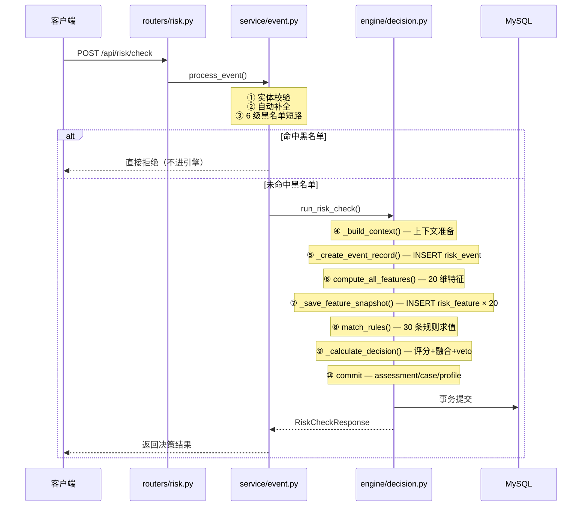

# AI_Risk — 教育风控系统

> FastAPI + MySQL + XGBoost + LangChain 构建的实时教育风控系统  
> 单次请求经历 **7 步决策流水线**，毫秒级输出 **通过 / 标记 / 人工审核 / 拒绝** 四档决策  
> 2026-08 从电商风控迁移为教育风控（10 张教育业务表 + 20 维教育特征 + 30 条教育规则）

---

## 快速开始

```bash
# 1. 安装依赖
pip install -r requirements.txt

# 2. 初始化数据库（19 张表 + 业务测试数据 + 30 条规则）
python scripts/init_db.py --drop --yes

# 3. 生成高风险用户（7 种风险模式，触发全四档决策）
python scripts/gen_risky_users.py --count 30 --reset

# 4. 生成带日期的评估数据（仪表盘趋势用）
python scripts/gen_risk_data_with_dates.py --days 15 --per-day 200 --force-pos-ratio 0.30 --clean

# 5. 训练 XGBoost 模型（从真实评估数据训练）
python scripts/train_xgb_model.py

# 6. 启动服务
python run_app.py
# → http://localhost:8000
```

---

## 系统架构

```
scripts/main.py — FastAPI 入口（10 个路由注册 + lifespan 调度器）
                    │
     ┌──────────────┼──────────────────┐
     │              │                   │
  pages (Jinja2)  api (10 routers)   agent/chat.py
     │              │             (LangChain + qwen-plus)
     │       service/event.py        agent/tools.py (8 tools)
     │              │
     │       engine/decision.py (7 步决策流水线)
     │     ┌───────┼───────┐
     │     │       │       │
     │  feature   rule  ml_model
     │  (20维)  (30条规则) (XGBoost)
     │     │       │       │
     └─────┴───────┴───────┘
                 │
          database.py (async SQLAlchemy + aiomysql)
                 │
          19 张表（10 教育业务 + 9 风控）
```

### 六层职责

| 层 | 目录 | 职责 |
|---|------|------|
| 🚪 入口 | `scripts/main.py` | FastAPI 创建、10 个路由注册、lifespan 调度器 |
| 🛣️ 路由 | `app/routers/`（10 模块） | HTTP 端点、Pydantic 校验，无业务逻辑 |
| 🧩 服务 | `app/service/`（5 模块） | 编排：实体校验→自动补全→黑名单→引擎 |
| ⚙️ 引擎 | `app/engine/`（4 模块） | 20 维特征、30 条规则、XGBoost、7 步流水线 |
| 🤖 Agent | `app/agent/`（2 模块） | LangChain Agent + 8 个工具 |
| 💾 数据 | `app/database.py` + models | 异步 SQLAlchemy，19 个 ORM 表 |

---

## 核心数据流



### 7 步决策流水线

| 步骤 | 函数 | 产出 |
|------|------|------|
| **Step 1** | `_build_context()` | Context Object（共享状态） |
| **Step 2** | `_create_event_record()` | `risk_event` 记录 |
| **Step 3** | `compute_all_features()` | 20 维教育特征字典 |
| **Step 4** | `_save_feature_snapshot()` | `risk_feature` × 20 行 |
| **Step 5** | `load_enabled_rules()` + `match_rules()` | 命中规则列表 |
| **Step 6** | `_calculate_decision()` | final_score + risk_level + decision |
| **Step 7** | `_save_assessment()` / `_maybe_create_case()` / `_update_user_profile()` + `commit()` | 事务落库 |

### 评分公式

```
final_score = max(各规则分) + 3 × (额外命中数), 上限 100

例：
  1 条命中 [70]              → 70 + 0 = 70          → 人工审核
  3 条命中 [70, 40, 20]      → 70 + 3×2 = 76        → 人工审核
  3 条命中 [95, 80, 70]      → 95 + 3×2 = 100       → 拒绝
  0 条命中 []                → 0                    → 通过
```

### 四档决策阈值

| 评分区间 | 风险等级 | 决策动作 | 说明 |
|:--------:|:--------:|:--------:|------|
| 0–29 | 低 | ✅ 通过 | 正常用户，放行 |
| 30–59 | 中 | 🔖 标记 | 需关注，放行但留痕 |
| 60–79 | 高 | 👤 人工审核 | 创建案件，人工介入 |
| 80–100 | 极高 | 🚫 拒绝 | 创建案件，自动拒绝 |

### 双轨融合（Rule + ML）

```
final = α × rule_score + β × ML_score

α = ML_WEIGHT_RULE（默认 0.5）
β = ML_WEIGHT_XGB（默认 0.5）

ML 校准：risk_score = 100 × (1 - e^(-3 × prob))
  0.1 → 26  |  0.3 → 59  |  0.5 → 78  |  0.7 → 90  |  0.9 → 97
```

- **规则分**：确定性强、完全可解释、0–100 整数
- **ML 分**：XGBoost P(拒绝) → sigmoid 校准到 0–100
- **兜底**：XGBoost 未加载 → 纯规则模式
- **一票否决**：任意 `risk_level="极高"` 规则命中 → 强制拒绝，ML 无法推翻

### 黑名单短路（6 级）

优先级：**用户 > 学号 > 身份证 > 设备指纹 > 支付账号 > 手机号**

命中任意一级 → **直接拒绝**，不进引擎、不写数据库。

---

## 20 维教育特征

| 维度 | 数量 | 特征列表 |
|:----:|:----:|----------|
| 👤 **用户特征** | 8 | `user_account_age_days`、`user_is_real_name`、`user_role_code`、`user_total_enrollments`、`user_enrollments_30d`、`user_avg_completion_rate`、`user_refund_rate`、`user_complaint_count` |
| 📚 **课程特征** | 4 | `course_price`、`course_category_code`、`course_total_hours`、`course_teacher_rating` |
| 💳 **订单特征** | 4 | `order_amount`、`order_pay_hour`、`user_multi_course_count`、`user_payment_account_count` |
| 📊 **行为特征** | 4 | `behavior_today_minutes`、`behavior_active_courses`、`behavior_night_session`、`behavior_device_count` |

---

## 30 条预置规则（ER001–ER030）

规则以 JSON 条件表达式存储，支持 9 种运算符 + `and`/`or` 逻辑嵌套。

| 场景 | 规则 ID | 数量 | 说明 |
|:----:|:-------:|:----:|------|
| 🔐 注册风险 | ER001–004 | 4 | 凌晨注册、批量设备注册、实名异常 |
| 📋 账号风险 | ER005–008 | 4 | 频繁换设备、投诉过多、大量报名不学习、新号高价课 |
| 🎯 营销作弊 | ER009–011 | 3 | 同设备多账号领券、凌晨领券、极速报名 |
| 📖 刷课行为 | ER012–015 | 4 | 凌晨看课、完成率异常、多课并行、多设备刷课 |
| 💰 退费欺诈 | ER016–019 | 4 | 高退费率、极端退费、学完即退、累计退费异常 |
| 💳 支付风险 | ER020–023 | 4 | 凌晨大额、深夜高价课、新用户凌晨大额、多支付账户 |
| 🚨 内容安全 | ER024–026 | 3 | 频繁投诉、投诉违规课程、投诉率异常 |
| 👨‍🏫 师资风险 | ER027–030 | 4 | 低评分教师课程、新教师高价课、教师综合高风险 |

### 规则条件示例

```json
// 简单条件（ER005：频繁更换设备）
{"field": "behavior_device_count", "op": ">=", "value": 4}

// AND 嵌套（ER023：新用户 + 凌晨 + 大额）
{"and": [
  {"field": "order_amount", "op": ">=", "value": 3000},
  {"field": "user_account_age_days", "op": "<=", "value": 3},
  {"field": "order_pay_hour", "op": ">=", "value": 22}
]}
```

---

## 数据库表结构

### 9 张风控表

| 表 | 用途 | 核心字段 |
|:---|:-----|:---------|
| `risk_rule` | 30 条预置规则 | `rule_id`, `rule_condition`(JSON), `risk_level`, `risk_score`, `action` |
| `risk_event` | 事件审计 | `event_id`, `event_type`, `user_id`, `event_source_id`, `event_data`(JSON) |
| `risk_feature` | 特征快照（宽表→行转列） | `event_id`, `feature_name`, `feature_value`, `entity_type` |
| `risk_assessment` | 评估结果 | `final_score`, `risk_level`, `decision`, `rule_results`(JSON), `ml_score` |
| `risk_case` | 案件（人工审核/拒绝时建） | `case_status`（状态机）, `source_id`, `event_type` |
| `risk_blacklist` | 6 级黑名单 | `blacklist_type`, `blacklist_value`, `expire_time`, 软删除 |
| `risk_user_profile` | 用户风险画像 | `risk_score`, `refund_rate`, `complaint_count`, `assessment_count` |
| `risk_action_log` | 审计日志 | `operator`, `action_type`, `before_value`, `after_value` |
| `risk_alert` | 系统告警 | `metric`, `value`, `threshold`, `alert_type` |

### 10 张教育业务表（ORM 只读）

`UserInfo` → `StudentProfile` → `TeacherInfo` → `Course` → `OrderInfo` → `LearningProgress` → `RefundRequest` → `Complaint` → `PaymentAccount` → `DeviceFingerprint`

---

## 网页功能

| 页面 | 路由 | 说明 |
|:----|:-----|:-----|
| 📊 **仪表盘** | `/` | 今日统计 + 7 天趋势 + TOP 规则命中排行 |
| ⚙️ **规则管理** | `/rules` | CRUD + 启停 + JSON 条件可视化 |
| 🔍 **风险检查** | `/risk-check` | 手动输入参数执行风控检查 |
| 📋 **案件管理** | `/cases` | 待审核工作台 + 重做检查 + 审核操作 |
| 📈 **评估历史** | `/assessments` | 全量评估审计，支持多维筛选 |
| 🤖 **AI 对话** | `/chat` | LangChain Agent 自然语言查询 |
| 🚫 **黑名单** | `/blacklist` | 6 级黑名单 CRUD + 统计 |

---

## API 端点参考

| 方法 | 路径 | 说明 |
|:----|:-----|:-----|
| `POST` | `/api/risk/check` | 核心：执行风控检查 |
| `GET` | `/api/rules` | 规则列表（分页 + 筛选） |
| `POST` | `/api/rules` | 创建规则 |
| `PUT` | `/api/rules/{id}` | 更新规则 |
| `DELETE` | `/api/rules/{id}` | 软删除规则 |
| `GET` | `/api/assessments` | 评估历史（分页 + 多维筛选） |
| `GET` | `/api/assessments/{id}` | 评估详情 |
| `GET` | `/api/cases` | 案件列表（active_only 筛选待办） |
| `GET` | `/api/cases/statistics` | 案件统计 |
| `GET` | `/api/cases/{id}` | 案件详情 |
| `POST` | `/api/cases/{id}/review` | 案件审核 |
| `GET` | `/api/blacklist` | 黑名单列表 |
| `POST` | `/api/blacklist` | 添加黑名单 |
| `POST` | `/api/chat` | AI Agent 对话 |
| `GET` | `/api/dashboard/stats` | 仪表盘统计 |
| `GET` | `/api/dashboard/trend` | 7 天趋势 |
| `GET` | `/api/alerts` | 告警列表 |

---

## 一键演示：特征计算 + 规则命中

演示特征计算和规则命中有 3 种方式：

### 方式 1：网页端（最直观）

1. 打开 `http://localhost:8000/risk-check`
2. 填入测试数据：
   - 事件类型：`complaint`（投诉）
   - 用户 ID：`RISK007`（低评分投诉用户）
   - 业务 ID：`CMP_LR_007_01`
3. 点击「执行检查」→ 右侧显示命中规则列表 + 最终决策
4. 仪表盘 `/` → 今日命中率 / 拒绝率 / TOP 规则排行

### 方式 2：API 调用（带全量 20 维特征）

```bash
curl -X POST http://localhost:8000/api/risk/check \
  -H "Content-Type: application/json" \
  -d '{"event_type":"complaint","user_id":"RISK007","source_id":"CMP_LR_007_01"}'
```

返回包含：`decision`、`final_score`、`triggered_rules`（含每条规则 ID/名称/分值/等级/动作）以及完整 20 维特征向量。

### 方式 3：引擎独立 Demo 模式（无需 DB、纯计算）

```bash
# 规则引擎 - 14 种运算符 + and/or 嵌套求值
python app/engine/rule.py

# 决策引擎 - 评分公式 + 一票否决 + 双轨融合
python app/engine/decision.py

# 特征工程 - 20 维特征向量化演示
python app/engine/feature.py

# XGBoost - 模型加载 + 生命周期 + 降级兜底
python app/engine/ml_model.py
```

### 方式 4：7 步流水线分步演示

```bash
# 查看某次评估的完整流水线数据
# 1. 查评估列表，拿到 assessment_id
curl http://localhost:8000/api/assessments?page=1&page_size=5

# 2. 查评估详情（含特征 + 命中规则 + ML 评分）
curl http://localhost:8000/api/assessments/{assessment_id}
```

---

## 项目结构

```
AI_Risk/
├── app/                          # 核心代码
│   ├── engine/                   # 决策引擎
│   │   ├── decision.py           #   7 步流水线 + 评分公式 + 双轨融合
│   │   ├── feature.py            #   20 维教育特征计算
│   │   ├── rule.py               #   JSON 条件规则引擎
│   │   ├── ml_model.py           #   XGBoost 加载/推理/训练
│   │   └── xgb_model.json        #   训练好的模型文件
│   ├── service/                  # 业务编排
│   │   ├── event.py              #   统一事件流水线
│   │   ├── case.py               #   案件/黑名单/画像 CRUD
│   │   ├── validator.py          #   实体校验 + 反越权
│   │   ├── action_log.py         #   审计日志
│   │   └── alert.py              #   告警引擎
│   ├── routers/                  # HTTP 路由（10 个模块）
│   │   ├── risk.py               #   风控检查
│   │   ├── rule.py               #   规则管理 CRUD
│   │   ├── case.py               #   案件管理
│   │   ├── assessment.py         #   评估历史
│   │   ├── dashboard.py          #   仪表盘
│   │   ├── blacklist.py          #   黑名单
│   │   ├── agent.py              #   AI Agent 对话
│   │   ├── alert.py              #   告警
│   │   ├── profile.py            #   用户画像
│   │   └── pages.py              #   页面路由
│   ├── agent/                    # LangChain 智能体
│   │   ├── chat.py               #   对话管理 + session 超时
│   │   └── tools.py              #   8 个工具
│   ├── config.py                 # 全局配置（pydantic-settings）
│   ├── schemas.py                # Pydantic 请求/响应模型
│   ├── database.py               # 异步引擎 + session DI
│   ├── models.py                 # ORM 表集合
│   ├── models_risk.py            # 9 张风控表 ORM
│   ├── models_business.py        # 10 张教育业务表 ORM
│   ├── scheduler.py              # 后台定时任务
│   └── logging_config.py         # 日志配置
├── scripts/                      # 命令行工具
│   ├── init_db.py                #   数据库初始化
│   ├── gen_risky_users.py        #   生成 RISK 高风险用户
│   ├── gen_risk_data_with_dates.py # 生成评估数据
│   ├── train_xgb_model.py        #   训练 XGBoost（基于真实 DB 数据）
│   ├── train_demo_model.py       #   教学演示训练（合成数据）
│   ├── gen_10w_data.py           #   大量随机业务数据
│   └── main.py                   #   FastAPI 直接启动
├── sql/                          # SQL 脚本
│   └── init_all.sql              #   全量初始化（19 表 + 数据 + 规则）
├── templates/                    # Jinja2 页面模板（8 个）
│   ├── base.html                 #   布局框架
│   ├── dashboard.html            #   仪表盘
│   ├── risk_check.html           #   风险检查
│   ├── rules.html                #   规则管理
│   ├── cases.html                #   案件管理
│   ├── assessments.html          #   评估历史
│   ├── chat.html                 #   AI 对话
│   ├── blacklist.html            #   黑名单
│   └── profile.html              #   用户画像
├── static/                       # 静态资源
│   └── (CSS/JS 由 CDN 加载)
├── tests/                        # 测试用例（pytest + asyncio）
├── docker/                       # Docker Compose 部署
│   ├── Dockerfile
│   ├── docker-compose.yml
│   └── nginx.conf
├── logs/                         # 运行日志
├── .env                          # 环境变量（本地配置）
├── requirements.txt              # Python 依赖
└── pyproject.toml                # 项目元数据
```

---

## 可用脚本速查

```bash
# ── 数据库 ──
python scripts/init_db.py                 # 全新安装
python scripts/init_db.py --drop          # 重置（先删后建）

# ── 测试数据 ──
python scripts/gen_risky_users.py --count 30 --reset  # 高风险用户
python scripts/gen_risk_data_with_dates.py --days 15 --per-day 200 --clean  # 评估数据
python scripts/gen_10w_data.py            # 10 万级业务数据

# ── XGBoost ──
python scripts/train_xgb_model.py         # 真实数据训练
python scripts/train_demo_model.py        # 演示训练

# ── 启动 ──
python run_app.py                         # 一键启动（含 6 步自检）

# ── 测试 ──
pytest tests/ -v                          # 全量测试
pytest tests/test_risk_decision.py -v     # 决策引擎单测

# ── Docker ──
cd docker && docker compose up -d         # MySQL + FastAPI + Nginx
```

---

## AI Agent

| 项目 | 说明 |
|:----|:-----|
| 🤖 **模型** | 阿里云百炼 `qwen-plus`（OpenAI 兼容接口） |
| 🧩 **框架** | LangChain + DeepAgents |
| 🔧 **8 个工具** | `risk_check`、`query_case`、`query_user_profile`、`manage_blacklist`、`query_dashboard_stats`、`query_trend`、`query_rule_effect`、`query_business_data` |
| ⌛ **会话管理** | 服务端 session_id（ulid）+ `asyncio.wait_for` 超时控制 |

---

## 环境变量（.env）

```ini
# 数据库
DB_HOST=localhost
DB_PORT=3306
DB_USER=root
DB_PASSWORD=123321
DB_NAME=ecs

# 阿里云百炼（Agent 功能用）
LLM_API_KEY=sk-xxx
LLM_BASE_URL=https://dashscope.aliyuncs.com/compatible-mode/v1
LLM_MODEL_NAME=qwen-plus

# ML 融合权重
ML_WEIGHT_RULE=0.5
ML_WEIGHT_XGB=0.5

# 决策阈值
RISK_PASS_THRESHOLD=30     # <30 → 通过
RISK_MARK_THRESHOLD=60     # 30-59 → 标记
RISK_REVIEW_THRESHOLD=80   # 60-79 → 人工审核, ≥80 → 拒绝
```

---

## 设计要点

| 模式 | 说明 |
|:----|:-----|
| 🎯 **Context Object** | `_RiskCheckContext` 贯穿 7 步流水线，共享请求参数/中间结果 |
| 🔒 **事务边界** | 7 步流水线写 4–5 张表 + `commit()` 原子提交，失败全回滚 |
| ⚡ **黑名单短路** | 6 级逐级检查，命中即拒，不进引擎 |
| 🛡️ **一票否决** | 极高风险规则命中 → 强制拒绝，ML 拉低无效 |
| 📐 **双轨融合** | 规则分（可解释）+ ML 分（XGBoost 概率校准）= 最终分 |
| 🧪 **条件建案** | 仅"人工审核"/"拒绝"创建案件，"通过"/"标记"不留案件 |
| 🔄 **状态机** | 案件状态严格流转：待审核→审核中→已通过/已拒绝/已关闭 |
| 📝 **审计日志** | 所有 CRUD 操作通过 `risk_action_log` 留痕 |