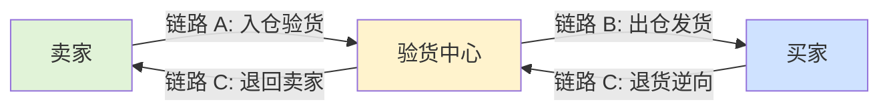

# 二手交易平台物流侧风控系统 · 项目文档

> **5 层架构 · 21 张表 · 38 维特征 · 30 条物流规则 · XGBoost 双轨融合**
> **三段式物流模型：A 卖家→验货中心 → B 验货中心→买家 → C 退货逆向**
> **核心能力：调包检测 / 验货质检 / 轨迹造假识别 / 恶意退货识别**

---




## 一、项目定位

从**电商风控系统**适配改造为**二手交易平台物流侧风控系统**（对标转转/闲鱼场景）。

**核心差异**：传统风控在交易环节下单/支付时拦截，二手平台的欺诈重灾区在**物流环节**——调包、空包、验货舞弊、退货时退回假货。本项目以**三段式物流模型**为主线，在每一个物流节点注入风控能力。

## 二、系统架构（5 层）

| 层 | 路径 | 职责 |
|---|---|---|
| **API 层** | `app/routers/` | 10 个路由文件，23 个 JSON API + 7 个 HTML 页面 |
| **Service 层** | `app/service/` | 事件编排、案件管理、黑名单、告警、审计日志 |
| **Engine 层** | `app/engine/` | 特征工程(38维)、规则引擎(30条)、XGBoost 双轨融合、决策流水线 |
| **Agent 层** | `app/agent/` | 8 个 LangChain @tool + ReAct Agent（Qwen-Plus） |
| **DB 层** | `app/models_*.py` | 12 张物流业务表 + 9 张风控表 = 21 张 |

## 三、三段式物流模型

```
链路 A（正向入仓）：卖家 → 平台验货中心    — 空包/虚假发货/成色虚报
链路 B（正向出仓）：验货中心 → 买家        — 调包/轨迹造假/恶意拒收
链路 C（退货逆向）：买家 → 验货中心 → 卖家 — 退回假货/调包退货/恶意退货
```

每条链路独立事件类型，共 **10 类物流事件**（卖家下单寄件/揽收入仓/验货完成/出仓发货/运输中/派送中/买家签收/买家拒收/买家退回寄件/退货入仓验货）。

## 四、核心能力矩阵

| 能力 | 技术手段 | 覆盖链路 |
|---|---|---|
| **调包检测** | IMEI/序列号三段式一致性比对 + 入出仓重量差 + 轨迹节点称重 | A→B→C |
| **空包/虚假发货检测** | 包裹重量阈值 + 声明价值/重量比 + 卖家历史空包率画像 | A |
| **验货质检风控** | 验货员成色差异率 + 验货耗时异常 + 功能检测异常 | 验货中心 |
| **轨迹造假识别** | 轨迹完整度 + 节点时间异常 + 路线偏离 | B |
| **退货欺诈识别** | 退货重量/序列号比对 + 退货成色降级 + 买家退货率 | C |
| **恶意退货/拒收识别** | 退货间隔（<2h 预谋退货 / >7d 用完即退）+ 高溢价品类集中退货 | B↔C |
| **卖家画像** | 历史空包率/序列号重复/深夜寄件/纠纷率/实名认证 | A |
| **买家画像** | 退货率/退货品类集中度/地址纠纷率/签收行为 | B/C |

## 五、数据资产

### 5.1 物流业务表（12 张）

| 表 | 说明 |
|---|---|
| `shipper_info` | 卖家信息+画像（交易量/纠纷数/空包率） |
| `consignee_info` | 买家信息+画像（签收次数/退货率） |
| `carrier_info` | 快递员信息+画像（配送量/拍照率/投诉数） |
| `waybill_info` | 运单主表（三段式核心实体，含封条ID/验货报告ID/COD/保价） |
| `waybill_detail` | 运单明细（品牌/型号/成色/IMEI） |
| `item_identity` | **调包检测核心** — IMEI/序列号唯一绑定，三段成色跟踪 |
| `inspection_record` | **验货环节核心** — 验货结果/功能检测/配件检测/封条绑定/耗时 |
| `tracking_event` | 轨迹事件表（10 类事件 + 节点称重） |
| `complaint_claim` | 投诉纠纷表（投诉方/类型/金额） |

### 5.2 风控表（9 张，复用现有架构）

`risk_rule` / `risk_event` / `risk_feature` / `risk_assessment` / `risk_case` / `risk_blacklist` / `risk_user_profile` / `risk_action_log` / `risk_alert`

### 5.3 特征体系（38 维）

| 分组 | 维度数 | 示例 |
|---|---|---|
| 卖家特征 | 9 | `shipper_empty_pkg_rate`, `shipper_imei_dup_count`, `shipper_waybills_7d` |
| 运单/货物特征 | 13 | `cargo_weight`, `declared_value`, `has_seal`, `cod_amount` |
| 买家特征 | 3 | `buyer_return_rate`, `buyer_high_value_return_rate` |
| 验货特征 | 5 | `grade_diff`, `inspect_duration_min`, `inspect_functional_abnormal` |
| 轨迹/逆向特征 | 8 | `track_completeness`, `return_weight_diff`, `return_imei_match` |

### 5.4 规则体系（30 条 L001-L030）

| 场景 | 数量 | 典型规则 |
|---|---|---|
| 空包/虚假发货 | 4 | L001 包裹重量≤0.1kg → 人工审核 |
| 物流调包 | 4 | L005 入出仓重量差≥0.3kg → 拒绝 |
| 验货质检舞弊 | 4 | L009 验货成色下调≥2级 → 人工审核 |
| 退回假货/调包退货 | 4 | L013 退货重量差≥0.3kg → 拒绝 |
| 恶意退货拒收 | 3 | L017 买家退货率≥80% → 拒绝 |
| 轨迹造假 | 3 | L020 轨迹完整度<50% → 人工审核 |
| 签收纠纷 | 3 | L024 买家电签高价值包裹 → 人工审核 |
| 刷单刷信誉 | 2 | L026 卖家7天寄件≥10单 → 人工审核 |
| 寄件信息异常 | 2 | L028 同一序列号出现在多个运单 → 人工审核 |
| 费用争议 | 1 | L030 保价金额≥10000 → 标记 |

## 六、XGBoost 双轨融合

**模型状态（2026-08-12 最新训练）**：

| 指标 | 值 | 评价 |
|---|---|---|
| 训练样本 | 2000 条 | ✅ |
| 正例比例 | 36.7%（734条） | ✅ > 30% 要求 |
| **AUC** | **0.9693** | 🔥 极好 |
| **验证集 AUC** | **0.9505** | 🔥 无过拟合 |
| **F1** | **0.9104** | 🔥 极高 |
| **精确率 P** | **0.8697** | ✅ 87% 的拦截准确 |
| **召回率 R** | **0.9550** | ✅ 96% 的高风险被抓住 |
| **最佳迭代** | 50 | ✅ 正常收敛 |

**特征重要性 TOP 3（解释 82.4% 决策）**：
1. `shipper_empty_pkg_rate`（空包率）— **42.4%**
2. `cargo_volume`（体积）— **34.1%**
3. `return_interval_hours`（退货间隔）— **5.8%**

**融合公式**：`final_score = 0.5 × rule_score + 0.5 × sigmoid(ml_prob)`

## 七、环境准备

```bash
# Python 依赖
python -m venv .venv
pip install -r requirements.txt

# MySQL（Docker 或本地）
docker run -d --name risk-mysql -e MYSQL_ROOT_PASSWORD=123456 -e MYSQL_DATABASE=ecs_logistics -p 3306:3306 mysql:8.0

# 复制 .env 配置
# DB_NAME=ecs_logistics
```

## 八、快速启动

```bash
# 1. 一键初始化数据库
python scripts/init_db.py

# 2. 生成高风险卖家数据（造正例）
python scripts/gen_risky_users.py --count 30

# 3. 生成评估数据
python scripts/gen_risk_data_with_dates.py --days 10 --per-day 200 --clean --force-pos-ratio 0.65

# 4. 训练 XGBoost 模型
python scripts/train_xgb_model.py

# 5. 启动服务
python scripts/main.py

# 6. 访问 http://localhost:8000/
```