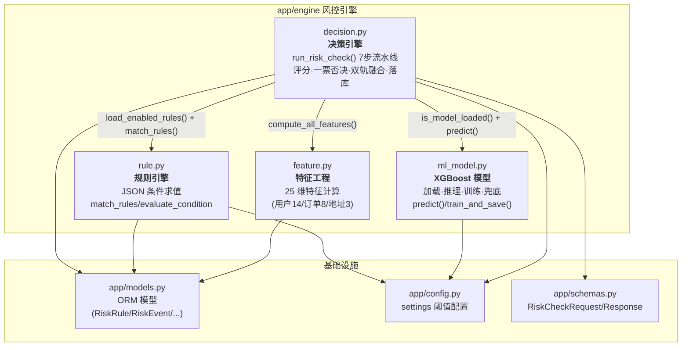
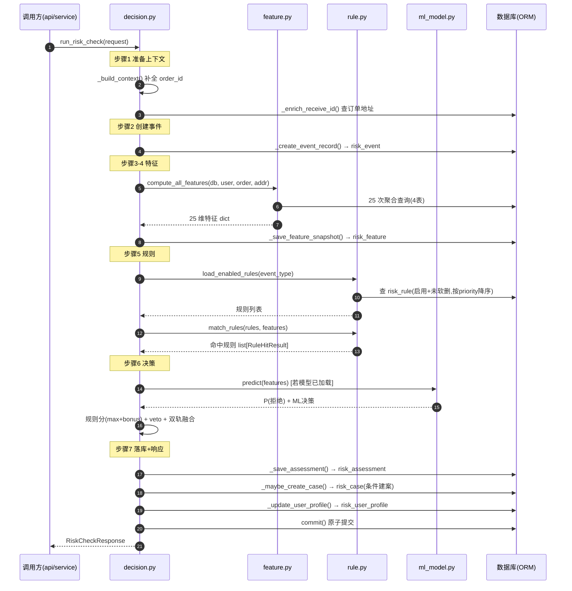
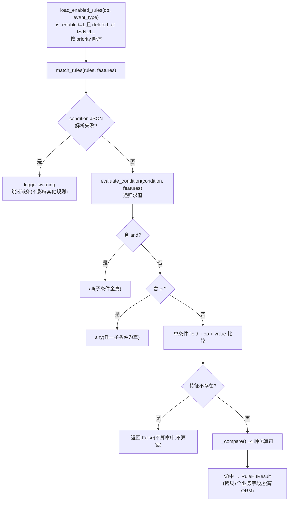
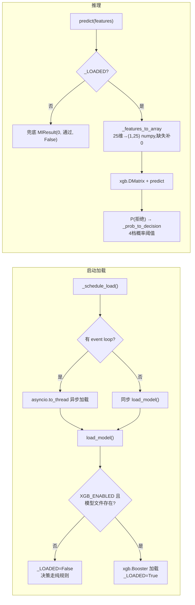
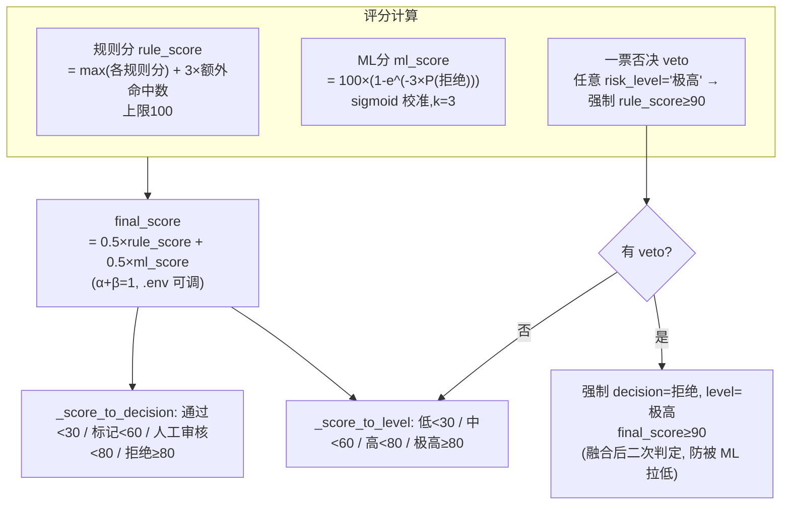

# AI_Risk `app/engine` 风控引擎分析

> 生成日期: 2026-08-10
> 分析范围: `app/engine/` 下全部 5 个文件（`feature.py` / `rule.py` / `ml_model.py` / `decision.py` / `__init__.py`）

---

## 一、模块总览

`app/engine` 是风控系统的**核心决策引擎**，采用「规则 + 机器学习」双轨融合架构。一次风控检查走完 7 步流水线：事件进来 → 算特征 → 匹配规则 → 算分 → 决策 → 落库。四个模块各司其职：

| 模块 | 职责 | 核心能力 |
|------|------|----------|
| `feature.py` | 特征工程 | 基于 ORM 查业务库，计算 **25 维风控特征**（用户 14 / 订单 8 / 地址 3） |
| `rule.py` | 规则引擎 | 对 **JSON 条件表达式** 递归求值，判断规则是否命中（14 种运算符 + and/or 嵌套） |
| `ml_model.py` | XGBoost 模型 | 加载 / 推理 / 训练 XGBoost 二分类器，输出 P(拒绝) 概率，含完整降级兜底 |
| `decision.py` | 决策引擎 | 串联 7 步流水线，汇总规则分 + ML 分，输出最终评分 / 等级 / 决策并落库 |
| `__init__.py` | 包标记 | 空文件，无逻辑 |

```
                     ┌──────────────────────────────────────────────┐
   业务事件(下单/支付/ ┤                                              │
   售后/物流投诉) ─────►  decision.py  ←─依赖─ feature.py  (25 维特征)  │
                     │   7步流水线     ←─依赖─ rule.py     (规则命中)   │
                     │   决策总控       ←─依赖─ ml_model.py (ML 打分)   │
                     └──────────────────────────────────────────────┘
```

---

## 二、整体架构与模块依赖



**依赖要点：**
- `decision.py` 是唯一「总控」，只依赖另外三者的**公开接口**（`compute_all_features` / `load_enabled_rules`+`match_rules` / `is_model_loaded`+`predict`），模块间解耦干净。
- 三个子模块（feature/rule/ml）**互不依赖**，只依赖 `app.models` / `app.config`。
- 外部（`run_app.py` / `app/api.py`）只需调 `decision.run_risk_check()`，细节被完全封装。

---

## 三、核心流程：7 步决策流水线

`decision.py::run_risk_check()` 是主入口，任一步失败 → 整个事务回滚（`db.rollback()` 由调用方事务控制），不留脏数据。



---

## 四、各组件作用分析

### 4.1 `feature.py` — 特征工程模块

**作用：** 通过 ORM 查询 4 张业务表（`OrderInfo`/`OrderDetail`/`Postsale`/`ReceiveInfo`/`LogisticsComplaintsRecord`），把业务数据加工成 25 维数值特征，供规则引擎和 XGBoost 共用。

**特征组成（前缀即实体维度，供 decision.py 分类落库）：**

```mermaid
flowchart LR
    subgraph USER["用户维度 (14)"]
        U1["total_orders / orders_30d / orders_7d<br/>total_amount / avg_amount / max_amount"]
        U2["refund_count / refund_rate / refund_amount<br/>postsale_count / postsale_rate"]
        U3["cancel_count / complaint_count / address_count"]
    end
    subgraph ORDER["订单维度 (8)"]
        O1["total_amount / item_count / sku_count"]
        O2["discount_amount / discount_rate"]
        O3["pay_interval_sec / is_night / category_count"]
    end
    subgraph ADDR["地址维度 (3)"]
        A1["total_count / province_count / is_new"]
    end
    USER + ORDER + ADDR --> FEATS["25 维特征 dict<br/>compute_all_features()"]
    FEATS --> DEC["decision.py<br/>(落库 risk_feature)"]
    FEATS --> ML["ml_model.py<br/>(XGBoost 推理)"]
    FEATS --> RULE["rule.py<br/>(规则条件求值)"]
```

**关键实现：**
- **通用 SQL 工具** `_count()` / `_sum()`：封装 `SELECT COUNT/SUM ... WHERE`，各特征函数复用，减少重复代码。
- **字典派发模式**：每个 `compute_*_features()` 用 `{特征名: 函数}` 字典遍历调用 —— **加新特征只加一行**，无需改流程代码。
- **派生特征复用优化（P5）**：`user_total_orders` 只查 1 次 SQL，预传给 `avg_order_amount` / `refund_rate` / `postsale_rate` 复用，4 个特征从 4 次查询降到 1 次。
- **缺失兜底**：所有聚合用 `COALESCE(..., 0)`，无数据时特征值为 0，不会抛异常。

### 4.2 `rule.py` — 规则引擎

**作用：** 对从 DB 加载的规则（`RiskRule.condition_dict` JSON 表达式），结合特征 dict 递归求值，返回所有命中的规则。

**核心流程：**



**支持的 14 种运算符：** `>` `>=` `<` `<=` `==` `!=` `in` `not_in` `between`（+ 顶层 `and` / `or` 递归组合）。

**容错设计（关键）：**
- 单条规则条件 JSON 损坏 → 跳过该条，**不中断**整批规则匹配。
- 特征算不出来（key 缺失）→ 条件算「未命中」，**不抛错**。
- 未知运算符 / 求值异常 → `logger.warning` + 返回 False 兜底。
- `RuleHitResult` 是纯值对象：从 ORM 拷出 7 个业务字段，后续逻辑不碰 ORM 对象（避免 ORM 游离态问题）。

### 4.3 `ml_model.py` — XGBoost 模型管理

**作用：** 管理 XGBoost 二分类模型的完整生命周期：加载 / 推理 / 训练 / 降级兜底。

**三个核心约定：**
1. **特征顺序固定**（`FEATURE_COLUMNS`，恰好 25 个，`assert` 强校验），与 `feature.py` 输出的 25 个 key 一一对应，防 dict 顺序不一致导致特征错位。
2. **标签二分类**：`0` = 通过/标记，`1` = 人工审核/拒绝。
3. **概率输出**：`predict_proba[:, 1]` 即 P(拒绝)。



**推理结果 4 档（`.env` 可调）：**

| 概率 P(拒绝) | 决策 |
|--------------|------|
| `< 0.30`     | 通过 |
| `< 0.60`     | 标记 |
| `< 0.80`     | 人工审核 |
| `≥ 0.80`     | 拒绝 |

**训练 `train_and_save()`（离线条带）：** 处理不平衡数据（`scale_pos_weight` 自动平衡 + 上限截断）、早停（`warmup` 前 N 轮不评估，监控 `auc`）、最佳 F1 阈值扫描、假收敛检测（`best_iter` / `val_auc` / `val_f1` 低于阈值 → 告警）。返回完整指标（`accuracy`/`auc`/`f1`/`val_*`/`best_iteration`/`scale_pos_weight`）。

**兜底哲学：** 模型文件不存在 / 加载失败 / 推理异常 → 一律 `score=0, decision="通过"`，**业务照常运行**，只是 ML 分支贡献 0，走纯规则路径。

### 4.4 `decision.py` — 决策引擎（总控）

**作用：** 串联 7 步流水线，是唯一对外暴露的业务入口（`run_risk_check`）。

**决策公式三件套：**



**7 步落库映射（每步写哪张表）：**

| 步骤 | 函数 | 写入表 | 说明 |
|------|------|--------|------|
| 1 | `_build_context` / `_enrich_receive_id` | - | 组装上下文，补全 order_id / receive_id |
| 2 | `_create_event_record` | `risk_event` | 事件记录，返回 event_id 供后续 FK 引用 |
| 3 | `_compute_features` | - | 调 feature.py 算 25 维 |
| 4 | `_save_feature_snapshot` | `risk_feature` | 按 `user_/order_/addr_` 前缀分类，25 条快照（审计回溯） |
| 5 | `_evaluate_rules` | - | 加载 + 匹配规则 |
| 6 | `_calculate_decision` | - | 纯计算：评分 + veto + 双轨融合 + 等级/决策映射 |
| 7a | `_save_assessment` | `risk_assessment` | 主评估记录，含规则命中 JSON |
| 7b | `_maybe_create_case` | `risk_case` | **条件建案**：仅「人工审核/拒绝」建案，自动拒绝直接关案 + 记 action_log |
| 7c | `_update_user_profile` | `risk_user_profile` | 用户风险画像 upsert |
| 7d | `_build_response` | - | 包装 Pydantic 响应 |

**关键设计点：**
- **Context Object 模式**：`_RiskCheckContext` 承载流水线中间数据，函数间不传散参数。
- **条件建案 + 去重**：同 `(source_id, event_type)` 已有未结案 → skip，防止重复建案。
- **自动拒绝审计**：veto 拒绝时写 `action_log`（operator=system），留完整审计链。
- **事务原子性**：`db.flush()` 先发 SQL 保证 FK 可引用，最后一次 `commit()` 原子写 4~5 张表，失败全回滚。

---

## 五、关键设计模式与容错机制汇总

| 模式/机制 | 位置 | 作用 |
|-----------|------|------|
| **字典派发** | feature.py | 加特征只加一行，流程零改动 |
| **值对象 (RuleHitResult)** | rule.py | 脱离 ORM，避免游离态；匹配结果纯数据化 |
| **全局单例 + 异步预加载** | ml_model.py | 启动时 `to_thread` 异步加载，不阻塞 import |
| **优雅降级兜底** | ml_model.py / decision.py | 模型不可用 → ML 贡献 0，纯规则路径照常 |
| **一票否决（veto）** | decision.py | 极高风险强制拒绝，融合后二次判定，ML 无法推翻 |
| **sigmoid 概率校准** | decision.py | 解决 P(拒绝) 与风险分「量纲错配」，避免伪融合 |
| **事务原子性** | decision.py | 7 步流水线失败全回滚，不留脏数据 |
| **单条容错** | rule.py | 坏 JSON / 未知 op / 缺特征 → 跳过不中断 |

---

## 六、关键配置与阈值（`app/config.py`）

| 配置项 | 默认值 | 用途 |
|--------|--------|------|
| `RISK_PASS_THRESHOLD` | 30 | 评分 < 30 → 低风险 / 通过 |
| `RISK_MARK_THRESHOLD` | 60 | 评分 < 60 → 中 / 标记 |
| `RISK_REVIEW_THRESHOLD` | 80 | 评分 < 80 → 高 / 人工审核 |
| `RISK_MULTI_RULE_BONUS` | 3 | 多规则命中，每条额外规则加分 |
| `RISK_VETO_MIN_SCORE` | 90 | 一票否决强制最低分 |
| `ML_WEIGHT_RULE` / `ML_WEIGHT_XGB` | 0.5 / 0.5 | 双轨融合权重 α / β |
| `ML_PASS/MARK/REVIEW_THRESHOLD` | 0.30/0.60/0.80 | ML 概率 → 4 档决策 |
| `XGB_ENABLED` | True | False = 纯规则模式 |
| `XGB_MODEL_PATH` | `app/engine/xgb_model.json` | 模型文件路径 |
| `RISK_FEATURES_FULL_RETURN` | True | 响应是否返回完整 25 维特征 |

---

## 七、总结

- **架构清晰**：决策总控 + 三子模块（特征 / 规则 / 模型），依赖单向、职责单一，各模块可独立测试。
- **双轨融合**：规则引擎（可解释、可运营）与 XGBoost（数据驱动）互补，权重可配；任一轨不可用都能降级。
- **工程健壮**：全链路容错（坏数据跳过、缺失兜底、模型降级）+ 事务原子性 + 审计留痕（event/feature/assessment/case 四层留底）。
- **业务闭环**：每次检查产出 4~5 张表记录，且更新用户风险画像，支持持续风控画像演化。
