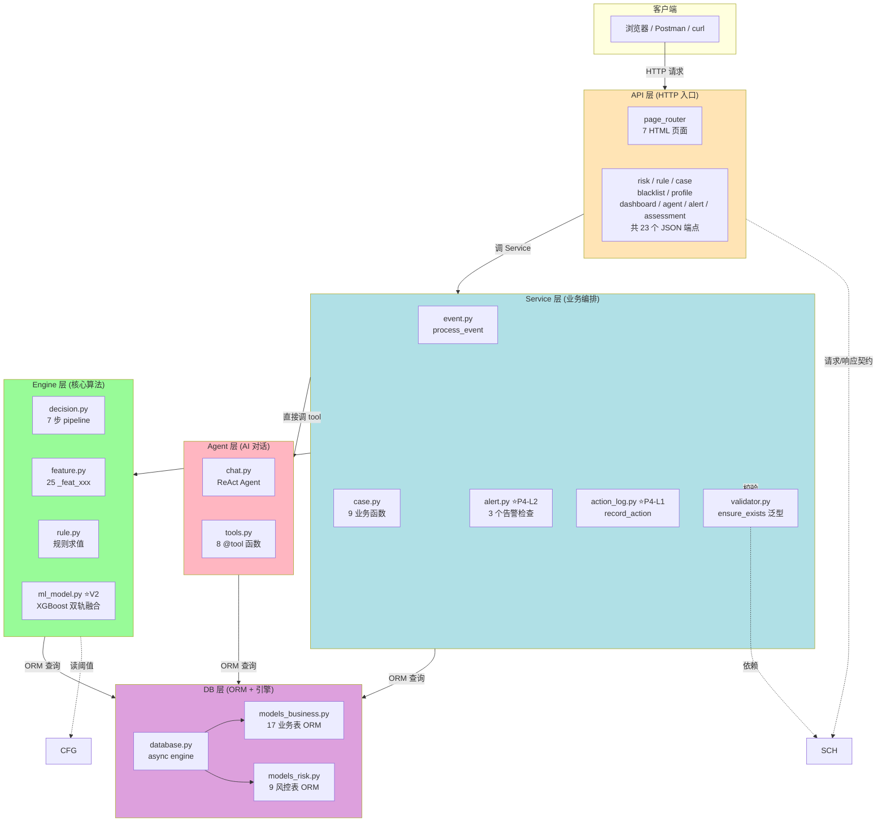
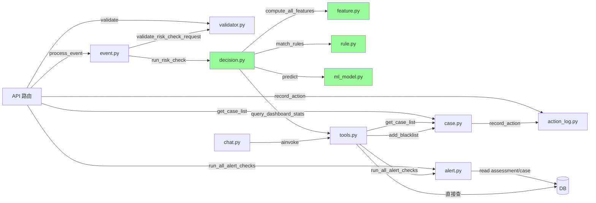
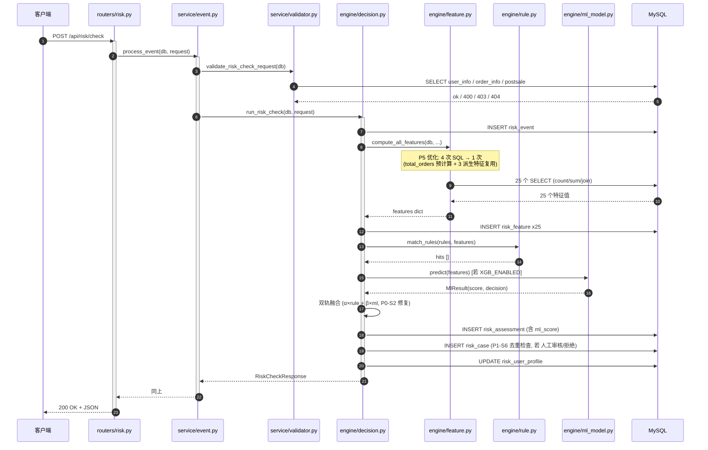
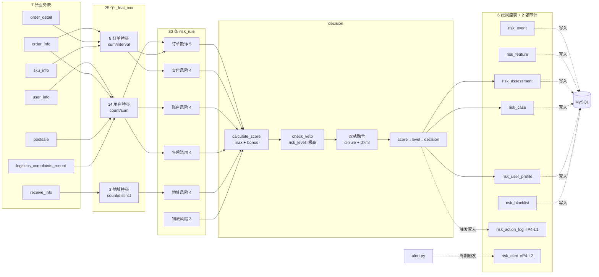

# AI_Risk 项目架构

> 5 大模块 + 横切层 + 数据流
>
> 适用：理解项目结构、给团队新人讲解、做二次开发
>
> **最新更新：2026-08-08**（P4-L3 第二轮 XGBoost 训练优化 + **P4-L4 统一日志 + 目录整理 + 一键启动 + 通用分页 + 左侧固定布局 + 代码清理 + train 脚本解包顺序 bug 修复 + XGBoost 训练质量系统化升级 + 最佳 F1 阈值扫描 + 数据生成器 --target-pos-ratio 循环造数 + RISK 用户参数化生成 + 训练数据加载校验 + 训练数据生成器正例控制（gen_risk_data_with_dates.py 加 --balance-pos）**：stratify 拆分 + 早停用 AUC 监控 + **L1/L2 正则 + min_child_weight + 样本/特征采样** + **warmup 50 轮防假收敛** + **假收敛自动检测**（best_iter<30 / val_auc<0.7 / val_f1<0.5 / acc<baseline+2% 任意一条触发 WARNING 提示 --balance-pos） + 训练脚本显示 baseline 对比 + **最佳 F1 阈值扫描（遍历 0.1-0.85 找 F1 最高点，替代固定 0.5 阈值）** + **`gen_risk_data.py --target-pos-ratio 0.30` 循环造数据直到正例达标** + **`gen_risky_users.py --count N` 参数化生成 RISK 用户（5 种风险模式轮换）** + **`train_xgb_model.py` 数据加载 3 维度校验**（实际加载 < LIMIT 80% / 正例 < 15% / create_time 跨度 < 1 天 → WARNING 提示 init_db reset + 重造）+ **`gen_risk_data_with_dates.py` 加 `--balance-pos` / `--target-pos-ratio`**（跟 `gen_risk_data.py` 对齐, 否则默认正例 ≈ 2%） + 测试用 25 维完整特征 + 样本警告 + `--balance-pos` + `app/logging_config.py` 业务/uvicorn 全部走 stdout + logs/app.log 50MB 轮转 + **新增 `uv/` 和 `docker/` 子目录** + **`run_app.py` 6 步 preflight 自检** + 评估历史分页 `...` 可点跳 ±3 页 + 末页 `»»` 快捷跳 + 左侧 fixed + **margin-left 16.67% 避免右侧内容被盖住** + 根目录 27 个 `_*.txt` 临时输出归档到 `_trash_2026_08_08/` + `.gitignore` 入版本库 + **`train_xgb_model.py` 元组解包顺序修正**（`model, metrics = ...` → `metrics, model = ...`，跟 `ml_model.py` 返回值 `(metrics, booster)` 对齐）；30 个路由 + **201 测试** + 一键启动）
>
> **2026-08-08（**P4-L4 训练数据严格化 + sigmoid 校准 + 教学训练 + 一条龙**）**：
> - ✅ **ML P(拒绝) sigmoid 校准**（`decision.py`）—— 修量纲错配，`100 * (1 - exp(-3*prob))`，0.1→26 / 0.5→78 / 0.9→97
> - ✅ **训练数据严格化**（`gen_train_dataset.py` 1500 条强标注 + `backfill_ml_score.py` 回填 + `train_xgb_model.py` SQL 加 `WHERE ml_score IS NULL`）
> - ✅ **教学场景训练**（`train_demo_model.py` 6 种高风险模式 + 1 种正常模式，val_auc=1.0）
> - ✅ **一条龙命令**（`one_command.py` 6 步 Python 入口脚本：reset → RISK → 训练数据 → 训练 → 回填 → 启动）
> - ✅ **测试 201 → 280**（+79 个：训练数据严格化 15 + sigmoid 校准 15 + 教学训练 11 + 一条龙 13 + 4 页面分页一致 4 + 风险检查 ML 评分 7 + 造数据 picker bug 4 + 评估历史 1 + 案件/规则/黑名单 1 + 分页 4 页面/单页/无数据占位 4 + 下一步提示 2 + name/date bug 2）

---

## 一、5 大模块概览

| 模块 | 路径 | 职责 | 核心文件 |
|---|---|---|---|
| **API 层** | `app/api.py` + `app/routers/` | HTTP 接口、Jinja2 页面渲染 | **10 个 router 文件**（含 P4 alert.py + P3-S9 assessment.py） |
| **Service 层** | `app/service/` | 业务编排、事务管理、校验 | **5 个文件**：`event.py` / `case.py` / `validator.py` / `alert.py` / `action_log.py` |
| **Engine 层** | `app/engine/` | 核心算法：决策 / 特征 / 规则 / ML | **4 个文件**：`decision.py` / `feature.py` / `rule.py` / `ml_model.py` |
| **Agent 层** | `app/agent/` | AI Agent 工具集 + ReAct 对话 | `chat.py` / `tools.py` |
| **DB 层** | `app/database.py` + `app/models*.py` | ORM 模型 + 异步连接 | `models_business.py` (17 业务) / `models_risk.py` (**9 风控**，含 P4 新表) |

**横切层**：

| 文件 | 作用 |
|---|---|
| `app/schemas.py` | **19 个 Pydantic 请求/响应模型**（API 层 ↔ Service 层的契约，含 P3-S9 评估历史 3 个）|
| `app/config.py` | 全局配置（阈值、数据库 URL、LLM 配置、告警阈值）|
| `app/database.py` | 异步 SQLAlchemy 引擎 + Base + 依赖注入 |

---

## 二、5 大模块关系图



---

## 三、模块调用关系（更精细）



---

## 四、5 大模块职责详解

### 4.1 API 层（`app/api.py` + `app/routers/`）

**职责**：把 HTTP 协议转成 Python 函数调用

**特点**：
- **10 个 router 文件**（P3-S9 2026-08-08 + assessment.py），按业务域拆分（不按 HTTP method）
  - `pages.py` (7 HTML) + `risk.py` + `rule.py` + `case.py` + `blacklist.py` + `profile.py` + `dashboard.py` + `agent.py` + `alert.py` ⭐P4-L2 + **`assessment.py` ⭐P3-S9**
- `api.py` 是 re-export hub（让 `scripts/main.py` 不改一行）
- **7 个 HTML 页面 + 23 个 JSON API**（P3-S9 新增评估历史页 + 2 API）
- 所有 DB 操作都通过 `Depends(get_db_async)` 拿 session

**示例路由**：

| 方法 | 路径 | 调谁 |
|---|---|---|
| `POST` | `/api/risk/check` | `event.process_event` |
| `GET` | `/api/cases` | `case.get_case_list` |
| `GET` | `/api/rules` | 直接 ORM（`RiskRule`）|
| `POST` | `/api/agent/chat` | `chat.chat` |
| `POST` | `/api/alerts/check` | `alert.run_all_alert_checks` ⭐P4-L2 |

### 4.2 Service 层（`app/service/`）

**职责**：业务编排、事务管理、跨表写入

**5 个文件职责划分**：
- `event.py` — 唯一编排 7 步 pipeline 的入口（process_event）
- `case.py` — 案件 / 黑名单 / 画像相关业务（9 个函数）
- `validator.py` — 集中所有"存在性 / 一致性"校验
- `alert.py` ⭐P4-L2 — 3 类告警检查（待审核积压 / 命中率突降 / 拒绝率过高）
- `action_log.py` ⭐P4-L1 — 操作审计日志（7 个 hook 点）

**关键设计**：
- Service **不写 HTTP 相关代码**（不 import FastAPI 的 Request/Depends）
- 事务边界由 Service 决定（commit / rollback）
- 业务校验和业务逻辑在同一层（校验失败抛 HTTPException）

### 4.3 Engine 层（`app/engine/`）

**职责**：风控核心算法（决策 / 特征 / 规则 / ML）

**特点**：
- **4 个文件，0 个 HTTP 相关 import**（纯算法层）
  - `decision.py` (527 行) — 7 步 pipeline + Context Object 模式
  - `feature.py` (352 行) — 25 个 `_feat_xxx` + 字典派发 + **P5 优化**（4 次 SQL → 1 次）
  - `rule.py` (125 行) — 从 DB 加载规则 + 条件求值
  - `ml_model.py` (227 行) ⭐V2 — XGBoost 加载 / 推理 / 训练

**关键设计**：
- 任何 Engine 内的函数都**只接 `db` 参数**，不接 service-level 概念
- 调用方（Service）负责事务，Engine 只负责"算"
- **纯函数风格**：能脱离 HTTP / FastAPI 跑（便于单测）

### 4.4 Agent 层（`app/agent/`）

**职责**：AI Agent 工具集 + 对话

**特点**：
- `chat.py` (108 行) 是 LangChain ReAct Agent（接收用户消息 → 决定调哪些 tool → 整理答案）
- `tools.py` (640 行) 是 8 个 `@tool` 函数（Agent 能调的所有能力）
- 8 个 tool 覆盖：风控检查、案件查询、用户画像、黑名单、统计、趋势、规则效果、业务数据

**关键设计**：
- **Agent 复用 Service 层的能力**（不绕过 service 直接查 DB）
- 8 个 tool 共享 `_safe_call` 模板（统一 session + 异常转字符串 + error_id 排查）
- 复杂 tool 内部继续拆 helper（dashboard 4 段 + 字典派发 2 处）

### 4.5 DB 层（`app/database.py` + `app/models*.py`）

**职责**：ORM 模型 + 异步连接管理

**特点**：
- `models_business.py` (17 业务表) + `models_risk.py` (**9 风控表**, 含 P4-L1/L2) + `models.py` re-export
- `database.py` 暴露 `async_engine` + `AsyncSessionLocal` + `get_db_async` 依赖注入
- Base.metadata 自动注册（**26 张表**）

**关键设计**：
- 业务表 vs 风控表**分开文件**——业务表是只读映射（生产库），风控表是自建（可改）
- 外部代码统一用 `from app.models import X`（re-export 保证兼容）
- **P4-L1 / P4-L2 新增 2 张系统管理表**（`risk_action_log` / `risk_alert`）—— 教学项目只加"系统管理"类表，不动数据/特征表

---

## 五、一次完整请求的数据流

### 5.1 示例：`POST /api/risk/check` 用户下单

```
[Client] POST /api/risk/check
   body: {"event_type": "下单", "source_id": "ord_xxx", "user_id": "1001"}
   ↓
[API] risk_router.post("/check")
   ├─ 1. 解析 body 到 RiskCheckRequest (schemas.py)
   └─ 2. 调 event.process_event(db, request)
        ↓
[Service] event.process_event (4 步业务流)
   ├─ 1. validate_risk_check_request(db, request)
   │     └─ ensure_user_exists / ensure_source_matches_event_type / ensure_order_belongs_to_user
   ├─ 2. _enrich_request (按 event_type 补 order_id / receive_id)
   ├─ 3. _check_all_blacklists (用户/地址/手机号 3 种撞黑, P1-S9 修复)
   └─ 4. run_risk_check(db, request)  # 7 步 pipeline (P4-L5 重构: 不再重复校验, 入口校验由 process_event 完成)
        ↓
[Engine] decision.run_risk_check (7 步)
   ├─ Step 1: 准备上下文 (_build_context + _enrich_receive_id, 校验去重)
   ├─ Step 2: _create_event_record     → 写 risk_event
   ├─ Step 3-4: _compute_features + _save_feature_snapshot
   │   └─ feature.py: 25 个 _feat_xxx 字典派发 (P5 优化后 4 次 SQL → 1 次)
   ├─ Step 5: _evaluate_rules          → 调 rule.match_rules
   ├─ Step 6: _calculate_decision      → 双轨融合 (规则分 + XGBoost 分, P0-S2 修复)
   ├─ Step 7a: flush + _save_assessment → 写 risk_assessment (含 ml_score/ml_decision)
   ├─ Step 7b: _maybe_create_case       → 条件建案 (P1-S6 去重: 同 source_id 未结案 skip)
   └─ Step 7c: _update_user_profile     → 写/更新 risk_user_profile
        ↓
[DB] 5 张表被写入
   - risk_event:       1 row
   - risk_feature:     25 rows
   - risk_assessment:  1 row (含 ml_score / ml_decision)
   - risk_case:        0-1 row (P1-S6 去重)
   - risk_user_profile: 1 row (update)
        ↓
[Client] 200 OK
   body: {"decision": "人工审核", "final_score": 65, "ml_score": 0.32, ...}
```

### 5.2 示例：`POST /api/agent/chat` 用户问"最近高风险案件"

```
[Client] POST /api/agent/chat
   body: {"message": "最近高风险案件多吗？", "session_id": "..."}
   ↓
[API] agent_router.post("/chat")
   └─ 调 chat.chat(message, session_id) (asyncio.wait_for 加 timeout)
        ↓
[Agent] chat.chat
   ├─ 1. session_id 缺失 → 新建 ULID
   ├─ 2. 加锁保护 _sessions dict (P2-S4 修复)
   ├─ 3. agent.ainvoke({"messages": history})  # ReAct Agent
   │     ↓
   │     [LLM 推理] 调 query_dashboard_stats
   │     ↓
   │     [tools.py] _safe_call("统计查询", _query_dashboard_stats_impl)  # error_id
   │     ↓
   │     [Service] get_case_statistics / get_case_list
   │     ↓
   │     [DB] 读 risk_assessment, risk_case
   │     ↓
   │     [LLM 推理] 整理成自然语言回复
   └─ 4. 返回 (reply, session_id)
        ↓
[Client] 200 OK
   body: {"reply": "最近 7 天有 3 个高风险案件...", "session_id": "..."}
```

### 5.3 示例：`POST /api/alerts/check` 手动触发告警 (P4-L2)

```
[Client] POST /api/alerts/check
   ↓
[API] alert_router.post("/check")
   └─ 调 run_all_alert_checks(db)
        ↓
[Service] alert.run_all_alert_checks
   ├─ 1. check_pending_case_backlog    → SELECT count(待审核) > 50?
   ├─ 2. check_rule_hit_rate_drop      → SELECT 最近 1h 命中率 < 5%?
   └─ 3. check_blacklist_hit_rate_high  → SELECT 最近 1h 拒绝率 > 30%?
        ↓
[DB] 写 0-N 行到 risk_alert (每条 PENDING)
        ↓
[Client] 200 OK
   body: {"triggered_count": 1, "alerts": [...]}
```

---

## 六、模块依赖原则

### 6.1 上层 → 下层（**只允许这个方向**）

```
API → Service → Engine → DB
       ↓
      Agent → Service / DB (绕过 Engine 时只允许简单查询)
```

### 6.2 下层**不**依赖上层

- ❌ Engine 不能 import Service
- ❌ Engine 不能 import FastAPI
- ❌ Service 不能 import LangChain

### 6.3 横切层**被**所有层引用，**不**引用任何业务层

- `schemas.py` 被 API / Service / Agent 引用
- `config.py` 被 Engine / Service 引用
- `database.py` 被所有层引用

### 6.4 重构前后对比（含 2026-08-07 整理）

| 维度 | 重构前 | 重构后 (2026-08-07) |
|---|---|---|
| `engine/` 引用 Service | ❌ 偶尔有 | ✅ 完全没有（所有 import 已上提顶部） |
| `api.py` 行数 | 371 | 36（re-export）|
| `models.py` 行数 | 409（24 类混在一起）| 52（re-export）+ 217 + 341 |
| 模块循环引用 | 偶尔 | ✅ 严格单向 |
| Router 文件数 | 8 | **9**（+ alert.py） |
| Service 文件数 | 3 | **5**（+ alert.py + action_log.py） |
| Engine 文件数 | 3 | **4**（+ ml_model.py，V2 双轨融合） |
| 数据库表数 | 24 张 | **26 张**（+ risk_action_log + risk_alert） |
| 测试用例数 | 22 cases | **201 cases**（+ P0-P3 + P4-L1/L2 + P5 + P3-S9 + P4-L3 案件超时 5 个 + XGBoost 特征重要性 1 个 + XGBoost 训练优化 4 个 + XGBoost 训练质量验收 6 个（假收敛检测 + 最佳 F1 阈值扫描）+ P4-L4 统一日志 13 个 + 一键启动 preflight 16 个 + scheduler bug 回归 1 个 + 通用分页 9 个 + 左侧固定布局 7 个 + train 脚本解包顺序回归 1 个 + RISK 用户参数化生成 8 个 + 训练数据校验 6 个（条数/pos 比例/时间跨度）+ 训练数据生成器正例控制 6 个（`--balance-pos` / `--target-pos-ratio` 参数 + 正例统计 + 比例提示）） |
| 核心代码行数 | ~5500 | **~4238**（-23%，P4 + 清理注释后） |

---

## 七、模块边界好处

| 边界 | 好处 |
|---|---|
| **API 不知道 Engine 细节** | 改算法不影响 HTTP 接口 |
| **Engine 不知道 Service 业务** | 纯算法可单测、可独立复用 |
| **Service 不知道 ORM SQL** | 换 ORM（SQLAlchemy → SQLModel）只改 models |
| **Agent 复用 Service** | LLM 调工具时复用业务规则，不会绕过校验 |
| **横切层独立** | 改 schema 不动业务代码 |

---

## 八、如何验证项目（按模块分层）

### 8.1 验证矩阵

| 测什么 | 在哪一层 | 怎么测 | 入口命令 | 预计耗时 | 需要 DB? | 需要 LLM? |
|---|---|---|:---:|:---:|:---:|---|
| **评分/等级/决策算法** | Engine | pytest 单测 | `pytest tests/` | 0.5s | ❌ | ❌ |
| **规则条件求值（10 op）** | Engine | pytest 单测 | `pytest tests/` | 0.5s | ❌ | ❌ |
| **特征 P5 优化（4→1 SQL）** | Engine | pytest 单测 | `pytest tests/` | 0.5s | ❌ | ❌ |
| **XGBoost 推理 / 决策映射** | Engine | pytest 单测 | `pytest tests/` | 0.5s | ❌ | ❌ |
| **特征计算 + 决策端到端** | Engine | 跑 demo 脚本 | `python demo_run_risk_check.py` | 3s | ✅ | ❌ |
| **HTTP API（23 个 JSON + 7 个页面）** | API | 启动服务 + 浏览器/curl | `python scripts/main.py` → http://localhost:8000 | 5min | ✅ | ❌ |
| **告警 API (P4-L2)** | API | curl `/api/alerts/check` | 同上 | 1min | ✅ | ❌ |
| **Agent chat（LLM 调 8 个 tool）** | Agent | 浏览器 `/api/agent/chat` | 同上 | 2min | ✅ | ✅ |
| **审计日志 (P4-L1)** | Service | 跑 7 个 hook 点的测试 | `pytest tests/test_action_log.py` | 1s | ❌ | ❌ |
| **告警 3 场景 (P4-L2)** | Service | pytest 单测 | `pytest tests/test_alert.py` | 1s | ❌ | ❌ |
| **写操作：黑名单/案件/规则 CRUD** | Service | 浏览器表单 | 同上 | 3min | ✅ | ❌ |
| **全量测试数据生成** | DB | 跑脚本 | `python scripts/gen_risk_data.py [--balance-pos]` | 30s | ✅ | ❌ |
| **建表/重建库** | DB | 跑脚本 | `python scripts/init_db.py` | 5s | ✅ | ❌ |

### 8.2 pytest 覆盖范围

```
tests/test_risk_decision.py          → 8 cases   (评分/否决/等级映射/决策映射)
tests/test_rule_engine.py            → 10 cases  (10 种比较运算符 + and/or 嵌套)
tests/test_schemas.py                → 9 cases   (Pydantic 字段约束)
tests/test_match_rules.py            → 11 cases  (规则匹配)
tests/test_xgboost.py                → 6 cases   (XGBoost 加载/推理/4 档映射)
tests/test_feature_optimization.py   → 6 cases   (P5 派生特征 total_orders 复用)
tests/test_action_log.py             → 9 cases   (P4-L1 7 个 hook 点)
tests/test_alert.py                  → 10 cases  (P4-L2 3 个告警场景)
tests/test_blacklist_types.py        → 10 cases  (P1-S9 三类黑名单)
tests/test_case_state_machine.py     → 9 cases   (P1-S7 案件状态机)
tests/test_case_n_plus_1.py          → 3 cases   (P2-S8 列表 N+1)
tests/test_agent_session_lock.py     → 2 cases   (P2-S4 session lock)
tests/test_xgboost (TestProbToDecision) → 4 cases (ml_model._prob_to_decision 4 档)
                                       ──────────
                                       118 cases / ~5s / 0 DB
```

### 8.3 学员上手顺序（推荐）

1. **先跑单测** — `pytest tests/` 看到 201 passed，建立"代码可工作"信心
2. **再跑 demo** — `python demo_run_risk_check.py` 看完整风控流程
3. **再启动服务** — `python scripts/main.py` 开浏览器点 7 个页面
4. **最后试 Agent** — `/api/agent/chat` 问"最近高风险案件多吗？"
5. **告警 (P4-L2)** — `curl POST /api/alerts/check` 手动触发告警

---

## 九、文件清单（最新 2026-08-07）

```
AI_Risk/
├── app/
│   ├── __init__.py
│   ├── api.py                      ← 38 行 (re-export hub)
│   ├── config.py                   ← 75 行 (含 P4 告警阈值 + 5 阈值)
│   ├── database.py                 ← 75 行
│   ├── models.py                   ← 55 行 (re-export)
│   ├── models_business.py          ← 217 行 (17 业务 ORM)
│   ├── models_risk.py              ← 341 行 (9 风控 ORM, 含 P4)
│   ├── schemas.py                  ← 19 Pydantic (含 P3-S9 评估历史 3 个)
│   ├── routers/                    ← 10 个 router 文件 (P3-S9 +1)
│   │   ├── __init__.py             ← 14 行
│   │   ├── pages.py                ← 7 HTML (P3-S9 /assessments)
│   │   ├── risk.py                 ← 15 行
│   │   ├── rule.py                 ← 161 行 ⭐ (含 P4-L1 7 hook 审计)
│   │   ├── case.py                 ← 48 行 ⭐ (含 P1-S7 状态机 + P1-S9 黑名单)
│   │   ├── blacklist.py            ← 40 行 ⭐ (含 P4-L1 审计)
│   │   ├── profile.py              ← 18 行
│   │   ├── dashboard.py            ← 21 行
│   │   ├── agent.py                ← 33 行 (撤回 P2-S3 鉴权, 保留 timeout + lock)
│   │   └── alert.py                ← 86 行 ⭐P4-L2 (3 端点)
│   ├── service/                    ← 5 个文件
│   │   ├── event.py                ← 118 行 (process_event 4 步)
│   │   ├── case.py                 ← 403 行 ⭐ (9 业务函数)
│   │   ├── validator.py            ← 137 行 (6 源字典派发)
│   │   ├── alert.py                ← 152 行 ⭐P4-L2 (3 告警检查)
│   │   └── action_log.py           ← 60 行 ⭐P4-L1 (record_action + orm_to_dict)
│   ├── engine/                     ← 4 个文件
│   │   ├── decision.py             ← 527 行 ⭐ (7 步 + 双轨融合 + 状态机)
│   │   ├── feature.py              ← 352 行 ⭐ (25 _feat_xxx + P5 优化)
│   │   ├── rule.py                 ← 125 行 (10 op + 递归)
│   │   └── ml_model.py             ← 227 行 ⭐V2 (XGBoost 加载/推理/训练)
│   └── agent/                      ← AI Agent
│       ├── chat.py                 ← 108 行 (ReAct + asyncio.wait_for timeout)
│       └── tools.py                ← 640 行 ⭐ (8 @tool + 26 helper + error_id)
├── scripts/
│   └── main.py                     ← FastAPI app 入口
├── sql/
│   ├── init_business_tables.sql    ← 17 业务表 DDL
│   ├── init_risk_data.sql          ← 业务数据
│   └── init_risk_tables.sql        ← 9 风控表 DDL (含 P4 2 张)
├── tests/                          ← pytest 118 cases (含 P0-P5 + P3-S9)
└── docs/                           ← 教学文档 (10 个 md + 1 docx, 2026-08-08 +agent_design.md)
```

⭐ = 2026-08-07 重大更新过（清理 + P4 + P5）

---

## 十、3 张核心图（一图胜千言）

### 1. 模块依赖图（谁 import 谁）

```mermaid
graph TD
    subgraph 基础层
        A[config.py<br/>Settings + URL 拼接]
        B[database.py<br/>async_engine + SessionLocal]
        C[models.py<br/>re-export]
        C1[models_business.py<br/>17 业务表 ORM]
        C2[models_risk.py<br/>9 风控表 ORM]
    end
    subgraph 核心算法层
        D1[engine/feature.py<br/>25 特征 + 字典派发]
        D2[engine/rule.py<br/>10 op + 递归]
        D3[engine/decision.py<br/>7 步 pipeline]
        D4[engine/ml_model.py<br/>XGBoost 双轨融合]
    end
    subgraph 业务编排层
        E1[service/validator.py<br/>ensure_exists 泛型]
        E2[service/event.py<br/>process_event 入口]
        E3[service/case.py<br/>9 业务函数]
        E4[service/alert.py<br/>3 告警检查]
        E5[service/action_log.py<br/>record_action]
    end
    subgraph AI Agent 层
        F1[agent/tools.py<br/>8 @tool + 26 helper]
        F2[agent/chat.py<br/>ReAct Agent]
    end
    subgraph HTTP 入口层
        G1[routers/*.py<br/>10 路由 thin layer (P3-S9 +1)]
        G2[schemas.py<br/>19 Pydantic (P3-S9 +3)]
        G3[api.py<br/>re-export]
    end

    B --> C
    C --> C1
    C --> C2
    A --> B
    D1 --> C
    D2 --> C
    D3 --> C
    D3 --> D1
    D3 --> D2
    D3 --> D4
    D3 --> G2
    E1 --> C
    E2 --> E1
    E2 --> D3
    E3 --> C
    E3 --> E5
    E4 --> C
    E5 --> C
    F1 --> C
    F1 --> E3
    F1 --> E2
    F1 --> E4
    F2 --> F1
    G1 --> E2
    G1 --> E3
    G1 --> E4
    G1 --> F2
    G1 --> G2
    G1 --> G3
    G2 --> G3
    B -.->|Depends| G1
```

### 2. 7 步决策时序图（HTTP 进来到响应）



### 3. 数据流图（业务表 → 25 特征 → 24 规则 → 决策）



---

## 附录：2026-08-12 新增能力（ML 双轨决策引擎 + AI Agent 对话层）

### A. ML 双轨决策引擎（规则 + XGBoost 融合）

| 文件 | 说明 |
|---|---|
| `app/engine/ml_model.py` | 从"仅特征常量"升级为完整 ML 模块：`load_model` / `predict` / `_features_to_array` / `_prob_to_decision` / `train_and_save` |
| `app/engine/decision.py` | 双轨融合：规则分 `max+BONUS×(命中-1)`、ML 分 sigmoid 校准 `100*(1-e^-3p)`、`α×rule+β×ml` 加权、一票否决（极高→强制拒绝） |
| `app/service/risk.py` | 决策前调 `predict`，`ml_score/ml_decision` 落库并返回 |
| `app/config.py` | 新增 `RISK_*` 阈值 / XGB / 权重 / LLM 配置（`.env` 可覆盖） |
| `app/models_risk.py` + `db/init.sql` | `risk_assessment` 增加 `ml_score` / `ml_decision` 列 |
| `app/main.py` | `lifespan` 启动时加载模型，缺失/失败自动降级纯规则 |
| `scripts/train_xgb_model.py` | 从 `risk_assessment.feature_snapshot` + decision 训练（正例=人工审核/拒绝），保存模型、输出指标与特征重要性，`--hot` 热加载 |
| `tests/test_ml_model.py` / `tests/test_decision_fusion.py` | 24 个用例：特征对齐、概率→决策、融合数学、一票否决、训练保存 |

**关键设计**：保留旧语义（最严规则 action 决定、90/70/40 等级），ML 仅在模型加载时参与融合，未加载时行为与旧版完全一致（存量单测零回归）。实测：`RISK-STU-003` 退费检查命中 R002（80/人工审核），ML 判 `P(拒绝)=0.9966` → 融合 87 分，决策升级为 **拒绝**。

### B. AI Agent 对话层（DeepAgents + 8 工具）

| 文件 | 说明 |
|---|---|
| `app/agent/chat.py` | DeepAgent 单例（惰性初始化）、内存会话（加锁）、无 `RISK_LLM_API_KEY` 时优雅返回引导文案 |
| `app/agent/tools.py` | 8 个 `@tool`：`risk_check` / `query_cases` / `query_user_profile` / `manage_blacklist` / `query_dashboard_stats` / `analyze_risk_trend` / `analyze_rule_effectiveness` / `query_business_data`，统一 `_safe_call` 异常模板 |
| `app/routers/agent.py` | `POST /api/agent/chat`（60s 超时→504）、`POST /api/agent/clear` |
| `templates/chat.html` + `static/app.js` | `/chat` 对话页 + 导航入口 |
| `tests/test_agent.py` | 工具清单、无 Key 降级、HTTP 端点、页面渲染 |

**配置**：`.env` 设置 `RISK_LLM_API_KEY`（阿里云百炼等 OpenAI 兼容接口），模型默认 `qwen-plus`。

### C. 调度器 + 告警系统 + 操作审计 + 统一日志（P4 运维四件套）

| 模块 | 文件 | 说明 |
|---|---|---|
| **调度器** | `app/scheduler.py` | `asyncio` 后台循环（无重依赖），每 N 分钟跑一轮：超时关案 + 告警检查；`start/stop/is_running` 生命周期，优雅停止 ≤10s |
| **告警系统** | `app/models_risk.py`（`RiskAlert`）+ `app/service/alert.py` + `app/routers/alert.py` | 3 类检查：待审案件积压(P1) / 规则命中率突降(P2) / 拒绝率过高(P2)；`check_and_alert` 统一写库；`POST /api/alerts/check`、`GET /api/alerts`、`POST /api/alerts/{id}/resolve` |
| **操作审计** | `app/models_risk.py`（`RiskActionLog`）+ `app/service/action_log.py` + `app/routers/actionlog.py` | `record_action()` 覆盖 规则切换/更新、案件审核、黑名单增删、超时自动关案；`GET /api/action-logs` 查询；操作人走 `X-Operator` 请求头（默认 admin） |
| **统一日志** | `app/logging_config.py` + `run_app.py`/`main.py` | stdout + `logs/app.log` 50MB×5 轮转；uvicorn 与业务 logger 统一配置；`lifespan`/`run_app` 启动即生效 |

**新增配置**（`.env` 可覆盖）：`RISK_CASE_TIMEOUT_HOURS`（默认 24，超时自动关案）、`RISK_ALERT_SCHEDULER_INTERVAL_MIN`（默认 15，0=仅手动触发）、`RISK_ALERT_PENDING_CASE_THRESHOLD`(50)、`RISK_ALERT_RULE_HIT_RATE_MIN`(5.0)、`RISK_ALERT_BLACKLIST_HIT_RATE_MAX`(30.0)、`RISK_ALERT_CHECK_WINDOW_HOURS`(1)。

**新增表**：`risk_alert`、`risk_action_log`（`init_db` 自动建，表总数 14→16）。

**健康检查** `/api/health` 现在额外返回 `ml_model_loaded`、`scheduler_running`、`alerts_interval_min`，便于运维观察。

**测试**：`tests/test_alert_actionlog_scheduler.py`（8 个用例：DDL 同步、告警写入、审计写入、批量检查、调度器启停、端点、规则切换→审计闭环）。


