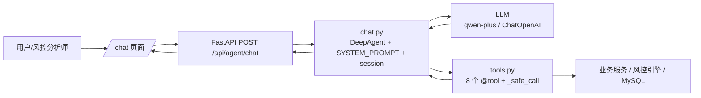
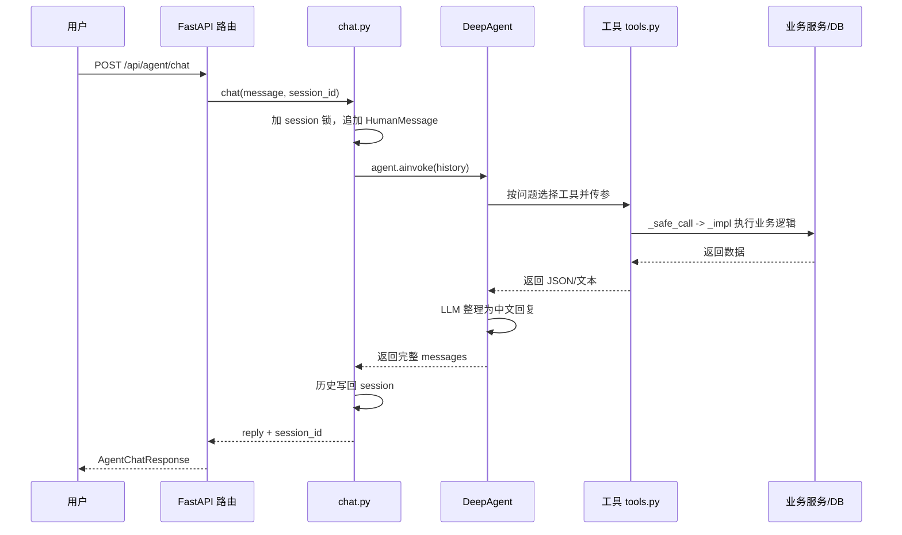

# AI Agent 设计说明：如何用 LLM 协作

## 1. 文档目标

本文说明物流风控系统中 AI Agent 的设计，以及它与 LLM 的协作方式：LLM 负责什么、工具负责什么、一次对话怎么跑、8 个工具怎么用、会话怎么管理、如何新增工具。

## 2. 整体架构



核心代码：

| 模块 | 职责 |
|---|---|
| `app/agent/chat.py` | Agent 创建、系统提示词、会话历史、对话入口 |
| `app/agent/tools.py` | 8 个工具的定义、参数说明、执行兜底 |
| `app/routers/agent.py` | `/api/agent/chat`、`/api/agent/clear` API |
| `app/config.py` | `LLM_*` 与超时配置 |
| `templates/chat.html` | 前端聊天页面 |

## 3. 分工：LLM 与工具各管什么

**LLM 负责：**

- 理解自然语言问题，例如“查一下 SND001 为什么是高危”
- 选择合适工具并生成参数
- 串联多个工具完成组合分析
- 把工具返回的数据整理成中文结论

**工具负责：**

- 确定性执行，例如查库、算特征、跑风控流水线
- 返回结构化 JSON 或文本，不让 LLM 猜业务数据
- 异常兜底，失败时返回带 `error_id` 的错误信息，不中断对话

协作原则：LLM 只做“理解、编排、解读”，所有业务结果都来自工具的真实执行。

## 4. 一次对话的协作流程



关键点：

- 历史记录在内存 `_sessions` 中，包含工具调用中间结果，所以 Agent 可以接着上一次的分析继续问
- 同一 session 并发写有 `asyncio.Lock` 保护，防止丢消息
- 请求整体有超时控制（默认 60 秒），LLM 卡住会返回 504 而不是挂死

## 5. 工具清单（8 个）

### 风控决策工具（4 个）

| 工具 | 参数 | 作用 |
|---|---|---|
| `risk_check` | `user_id, event_type, source_id` | 对寄件人和物流事件执行实时风控检查，返回评分、风险等级、决策、命中规则 |
| `query_cases` | `status, page` | 查询案件列表和统计，支持状态筛选 |
| `query_user_profile` | `user_id` | 查询寄件人风险画像；无画像时实时计算寄件人特征 |
| `manage_blacklist` | `action, blacklist_type, value, reason` | 黑名单 add / remove / check / list |

### 数据分析工具（4 个）

| 工具 | 参数 | 作用 |
|---|---|---|
| `query_dashboard_stats` | 无 | 今日评估、高风险数、待审案件、通过率、7 天趋势、规则 TOP5 |
| `analyze_risk_trend` | `days` | 指定天数内的评估量、风险分布、决策分布 |
| `analyze_rule_effectiveness` | 无 | 各启用规则的命中次数与命中率 |
| `query_business_data` | `query_type, user_id, waybill_no, limit` | 运单、投诉、理赔、COD、报关、地址等业务数据，共 11 种查询类型 |

工具描述里写明了参数、可选枚举值和返回结构，LLM 靠这些描述决定怎么调用。

## 6. 会话与状态

- `session_id` 由前端传入；不传时服务端自动生成 `sess_<ulid>`
- 会话历史存在内存字典中，进程重启即丢失
- `POST /api/agent/clear?session_id=xxx` 清空指定会话
- 同一 `session_id` 的并发请求由 `asyncio.Lock` 串行化

如果将来多实例部署，内存会话需要替换为 Redis 等外部存储。

## 7. LLM 配置

配置在 `.env` 中：

```text
LLM_API_KEY=sk-xxxx
LLM_BASE_URL=https://dashscope.aliyuncs.com/compatible-mode/v1
LLM_MODEL_NAME=qwen-plus
AI_AGENT_CHAT_TIMEOUT_SEC=60
```

Agent 创建时的关键设定（`app/agent/chat.py`）：

- 使用 `ChatOpenAI` 走 OpenAI 兼容接口，当前模型为阿里云百炼 `qwen-plus`
- `temperature=0.1`，业务场景下压低随机性，答案更稳定
- `SYSTEM_PROMPT` 定义角色：物流风控 AI 助手，负责风险检查、案件管理、寄件人画像、黑名单、数据分析、业务查询
- Agent 是进程内单例，第一次调用才创建，避免每次请求重复建连接

## 8. 如何新增一个工具

1. 在 `app/agent/tools.py` 中写业务实现函数 `_xxx_impl`，只负责拿到 DB 数据并返回字符串
2. 用 `@tool(description=...)` 包装，描述里写清参数、可选枚举值、返回内容
3. 挂到 `RISK_TOOLS` 或 `DATA_TOOLS`，最终加入 `ALL_TOOLS`
4. 需要时补充测试，覆盖正常返回和异常兜底
5. 重启服务后生效

示例：

```python
@tool(
    description=(
        "查询寄件人的风险画像信息。"
        "参数: user_id (寄件人ID, 如 'SND001')。"
        "返回: 风险评分、寄件量、COD拒收率、地址异常、实名信息等。"
    )
)
async def query_user_profile(user_id: str) -> str:
    return await _safe_call("用户画像查询", _query_user_profile_impl, user_id=user_id)
```

## 9. 最佳实践

- 工具 `description` 是 LLM 的“使用说明书”，参数和枚举值必须写全，否则模型会编参数
- 工具返回数据，不做风格化解释；解释交给 LLM，避免业务数据被二次加工失真
- 一个工具尽量一次返回完整结果，例如案件列表和统计合并调用
- 异常通过 `_safe_call` 转成带 `error_id` 的字符串，对话不中断，日志可回溯
- 业务场景使用低温生成，保持决策口径稳定
- 不要把密钥、完整地址、手机号等敏感信息直接塞进 prompt；生产环境按角色控制数据展示
- 内存会话只适合单实例；横向扩容时要把会话和 Agent 状态外部化

## 10. 调用示例

```bash
curl -X POST http://localhost:8000/api/agent/chat \
  -H "Content-Type: application/json" \
  -d '{"message": "查一下 SND001 的风险画像并简要解读", "session_id": ""}'
```

响应：

```json
{
  "reply": "SND001 当前风险画像显示...",
  "session_id": "sess_01hxxxxxxxxx"
}
```

后续提问带上同一个 `session_id`，Agent 会基于历史继续分析。
