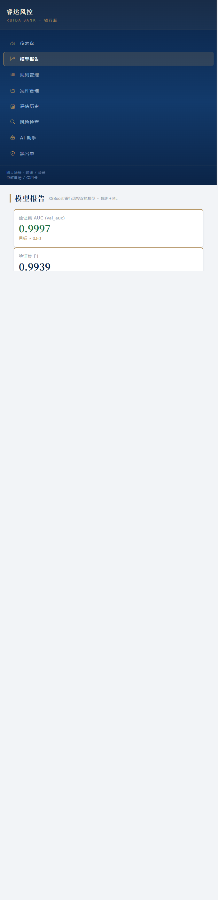
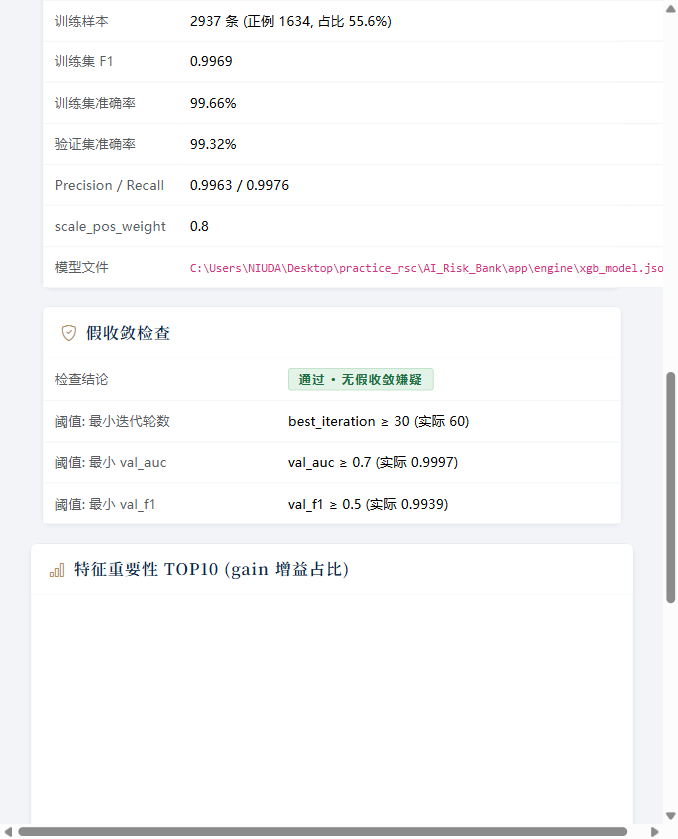
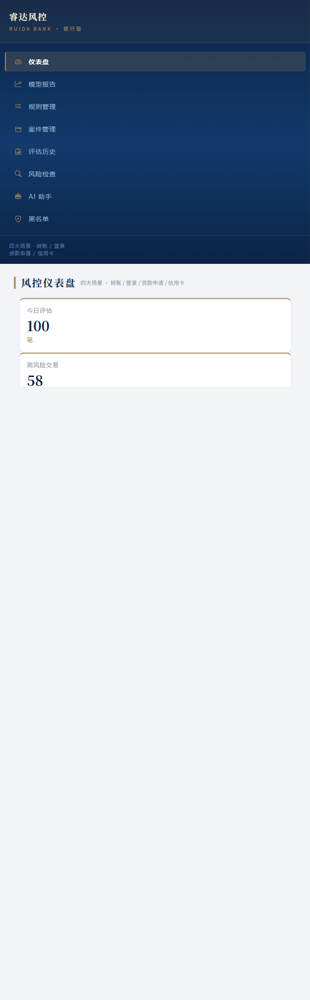
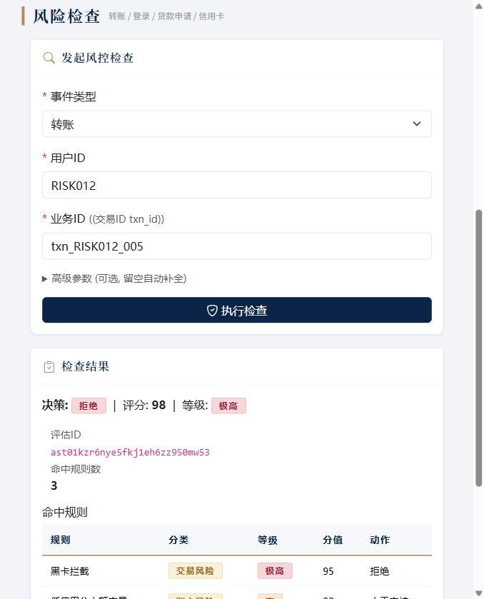

# 银行风控系统 AI_Risk_Bank — 项目启动文档

> 4 大银行场景(转账 / 登录 / 贷款申请 / 信用卡)· 8 张业务表 · 9 张风控表(结构不动)· **48 维特征** · **12 条行业规则** · XGBoost 双轨融合 + sigmoid 校准 + 训练数据严格化 + 模型报告页 + 假收敛检查 · **val_auc ≥ 0.8** · 364 个测试全绿
>
> 适用:项目第一次启动 / 老环境升级 / 规则制定 / XGBoost 训练 / 启动服务 / 端到端演示

---

## 目录

1. [项目定位](#1-项目定位)
2. [环境准备](#2-环境准备)
3. [数据库初始化](#3-数据库初始化)
4. [数据生成(4 种场景)](#4-数据生成)
5. [12 条行业规则讲解](#5-12-条行业规则讲解)
6. [48 维特征体系](#6-48-维特征体系)
7. [XGBoost 模型训练与验收](#7-xgboost-模型训练与验收)
8. [启动 FastAPI 服务](#8-启动-fastapi-服务)
9. [端到端演示](#9-端到端演示)
10. [纪律约束遵守说明](#10-纪律约束遵守说明)
11. [跑测试](#11-跑测试)
12. [常见问题 FAQ](#12-常见问题-faq)

---

## 1. 项目定位

**桀哥风控 · 银行版** — 面向银行业务的智能风控系统,覆盖 **4 大核心场景**:

| 场景 | 事件 | 典型风险 | 对应规则 |
|---|---|---|---|
| 转账 | 银行卡转账 / 支付 | 异地大额、黑卡、多卡归集、洗钱跑分 | R001 / R002 / R008 / R030 |
| 登录 | 网银 / APP 登录 | 撞库、暴力破解、深夜异常登录 | R003 |
| 贷款申请 | 消费贷 / 经营贷申请 | 多头借贷、高负债、虚假收入 | R010 / R012 |
| 信用卡 | 信用卡消费 | 盗刷、新设备大额、套现 | R005 |

**技术架构**(与电商版 AI_Risk 一脉相承,内容银行化):

```
┌─ 前端 (Jinja2 + Bootstrap 5, 银行端庄风格) ─────────────┐
│  仪表盘 / 规则 / 案件 / 评估 / 风险检查 / AI 助手 / 黑名单 / 模型报告 │
└──────────────┬─────────────────────────────────────────┘
               ↓
┌─ FastAPI 服务层 ─────────────────────────────────────────┐
│  process_event 4 步: 校验 → 补全 → 黑名单 → 决策引擎(7 步)  │
└──────────────┬─────────────────────────────────────────┘
               ↓
┌─ 决策引擎 (decision.py) ─────────────────────────────────┐
│  事件 → 48 维特征 → 规则引擎(12 条) → XGBoost → 双轨融合 → 落库 │
└──────────────┬─────────────────────────────────────────┘
               ↓
┌─ MySQL risk_bank (8 业务表 + 9 风控表) ───────────────────┐
└──────────────────────────────────────────────────────────┘
```

---

## 2. 环境准备

### 2.1 Python 依赖

本项目复用 AI_Risk 的虚拟环境(依赖已装齐):

```bash
# 已有 .venv (推荐, 依赖已装)
.venv\Scripts\python.exe -m pip list   # Windows
# 或全新安装
python -m venv .venv && .venv\Scripts\pip install -r requirements.txt
```

核心依赖:`fastapi 0.115` / `uvicorn 0.34` / `sqlalchemy 2.0` / `aiomysql 0.2` / `pymysql 1.1` / `pydantic 2.10` / `jinja2 3.1` / `pandas 2.2` / `numpy 2.2` / `xgboost 2.1` / `pytest 8.3` / `pytest-asyncio 0.25`

### 2.2 MySQL 准备

```bash
# 本地 MySQL 8.0 (root/123456, 与本机环境一致)
# 字符集必须 utf8mb4; 新建独立库 risk_bank, 与电商库 risk/ecs 并存
```

### 2.3 .env 配置

```ini
# .env (项目根目录)
DB_HOST=localhost
DB_PORT=3306
DB_USER=root
DB_PASSWORD=123456
DB_NAME=risk_bank          # 独立新库
TEST_DB_NAME=risk_bank_test

# LLM (阿里云百炼 OpenAI 兼容, 不可用自动降级)
LLM_API_KEY=sk-你的key
LLM_BASE_URL=https://dashscope.aliyuncs.com/compatible-mode/v1
LLM_MODEL_NAME=qwen-plus

# XGBoost 开关 (默认 True)
XGB_ENABLED=True
```

---

## 3. 数据库初始化

```bash
python scripts/init_db.py --yes
```

**按顺序执行 4 个 SQL**(风险:全部在新建库上执行,不影响电商库):

1. 创建数据库 `risk_bank`
2. `init_bank_tables.sql` — **8 张银行业务表**
3. `init_bank_data.sql` — 初始业务数据(80% 正常 + 15% 中风险 + 5% 高风险,含 RISK 前缀高风险用户)
4. `init_risk_tables.sql` — **9 张风控表**(字段结构与电商版 1:1 对齐,仅枚举值银行化)
5. `init_risk_data.sql` — **12 条预置规则**(R001-R030 选号,每条含行业有效性说明)

### 8 张业务表

| 表 | 用途 | 关键字段 |
|---|---|---|
| `user_info` | 用户信息 | user_id / id_card_hash / credit_score(人行信用分 300-850) / kyc_level |
| `bank_card` | 银行卡(借记卡/信用卡) | card_id / card_no_hash / bank_code / credit_limit |
| `transaction` | 交易(转账/支付) | txn_id / from_card / to_card / amount / channel / device_id / ip / geo |
| `loan_application` | 贷款申请 | loan_id / amount / term_months / monthly_income / debt_ratio |
| `login_log` | 登录日志 | login_id / device_id / ip / geo / success |
| `device_fingerprint` | 设备指纹 | device_id / fingerprint_hash / first_seen / os / browser |
| `ip_geo_location` | IP 地理位置 | ip / province / city / isp / is_proxy / is_tor |
| `blacklist_extra` | 黑名单扩展(设备/IP/卡号/身份证) | type / value / reason / expire_at |

---

## 4. 数据生成

### 4.1 批量业务数据(训练/演示基础)

```bash
# ~300 用户 / 800 卡 / 8000 交易 / 400 贷款 / 3000 登录, 日期跨度 30 天
python scripts/gen_bank_data.py
```

### 4.2 高风险用户样本(规则命中演示)

```bash
# 30 个 RISK001-RISK030 高风险用户 (默认 30, 按差额补足不删历史)
python scripts/gen_risky_users.py --count 30
```

每个 RISK 用户画像:低信用分 350-480 / 1-2 张卡 / 3 台设备(含 <7 天新设备)/ 8-15 笔交易(大额 2w-15w、30% 黑卡、50% 夜间)/ 2-4 笔贷款(负债率 0.60-0.90)/ 5-15 次登录(40% 失败)。

### 4.3 风控评估数据(走 process_event 4 步)

```bash
# 近 30 天, 每天 100 条, 80% 概率挑 RISK 用户, 循环造到正例 ≈30% (训练用, 推荐)
python scripts/gen_risk_data.py --days 30 --per-day 100 --balance-pos --target-pos-ratio 0.30

# 清空风控表后重建
python scripts/gen_risk_data.py --days 15 --per-day 100 --clean
```

4 大场景比例:转账 40% / 登录 25% / 贷款申请 20% / 信用卡 15%。**训练数据严格化**:造数结束后统一把 `ml_score/ml_decision` 置 NULL,保证训练样本 100% 干净。

### 4.4 教学场景训练(无 DB 也能训)

```bash
# 纯 numpy 合成数据, 6 种高风险模式 + 1 种正常模式, 5 秒出结果
python scripts/train_demo_model.py --n 2000
```

---

## 5. 12 条行业规则讲解

12 条规则覆盖 5 大风险类别,每条都给出**行业有效性说明**(存于 risk_rule.description,页面可见):

| 编号 | 规则 | 类别 | 条件要点 | 等级/动作 | 行业有效性 |
|---|---|---|---|---|---|
| R001 | 异地大额转账 | 交易风险 | txn_city_match=1 + txn_amount≥5万 | 极高/拒绝 | 交易城市非常用城市且单笔≥5万元,符合"异地+大额"电信诈骗/盗转典型特征,银行对非常用地大额转账执行限额与拦截 |
| R002 | 凌晨密集操作 | 交易风险 | txn_is_night=1 + txn_1h_count≥3 | 高/人工审核 | 凌晨 0-5 点 1 小时内交易≥3 笔,黑产常深夜试探小额转出验证账户可用性 |
| R003 | 深夜异常登录 | 账户风险 | login_is_night=1 + user_failed_login_7d≥3 | 高/人工审核 | 凌晨登录且近 7 天失败≥3 次,撞库/暴力破解后深夜登录特征,需二次核验 |
| R005 | 新设备信用卡大额 | 设备风险 | card_device_new=1 + card_amount≥3万 | 高/人工审核 | 设备首次出现<7 天即信用卡大额,新设备+大额是盗刷高发组合,银行对新设备执行限额与人工核验 |
| R008 | 多卡归集 | 交易风险 | txn_1h_into_count≥3 | 极高/拒绝 | 1 小时内≥3 张不同付款卡转入同一收款卡,典型"多卡归集"洗钱/跑分特征,反洗钱模型直接拦截 |
| R010 | 高负债大额申贷 | 信贷风险 | loan_debt_ratio≥0.6 + loan_amount_income_ratio≥5 | 高/人工审核 | 负债率≥60% 且申请额/月收入≥5 倍,偿债能力严重不足,授信审批需人工评估还款来源 |
| R012 | 信贷申请突击 | 信贷风险 | loan_month_count≥3 | 高/人工审核 | 当月贷款申请≥3 次,多头借贷/资金链断裂信号,征信查询次数过多也会拉低授信评分 |
| R015 | 低信用分大额交易 | 账户风险 | user_credit_score<500 + txn_amount≥2万 | 高/人工审核 | 人行信用分<500 属高风险客群,单笔≥2 万元超出偿付能力预期,存在出借账户/被诱导转账风险 |
| R018 | 设备多人共用 | 设备风险 | txn/login_device_user_count≥5 | 中/标记 | 同一设备关联≥5 个用户,黑产工作室一台设备批量操控多账户,标记后持续监控 |
| R020 | 登录异常后大额转账 | 网络风险 | user_failed_login_7d≥3 + txn_amount≥1万 | 高/人工审核 | 登录失败≥3 次后紧接着大额转款,暴力破解/撞库后盗转链条的典型前兆 |
| R025 | IP 代理/秒拨 | 网络风险 | txn/login/loan_geo_risk=1 | 中/标记 | IP 命中代理库/Tor 出口/IP 黑名单,秒拨代理是黑产绕过风控的基础设施 |
| R030 | 黑卡拦截 | 交易风险 | txn_to_card_black=1 | 极高/拒绝 | 收款卡命中黑名单(涉案卡/诈骗资金归集卡),监管要求涉诈账户即时止付,一票否决 |

> 其中 R001/R002/R005/R008/R012/R018/R025/R030 为**用户指定 8 条**,与 R003/R010/R015/R020 共同构成完整银行风控闭环。
>
> 规则引擎支持 JSON 条件表达式:单条件 `{"field": "txn_amount", "op": ">=", "value": 50000}` + 嵌套 `and/or`;op 支持 `> >= < <= == != in not_in between`(见 `app/engine/rule.py`)。

---

## 6. 48 维特征体系

特征工程 `app/engine/feature.py` 按 5 大维度计算 **48 维特征**,训练/推理完全对齐(`ml_model.py::FEATURE_COLUMNS`):

| 维度 | 数量 | 特征(示例) |
|---|---:|---|
| 用户画像 user_* | 15 | credit_score / kyc_level / register_days / total_txn_amount / avg_txn_amount / debt_ratio / monthly_income / credit_utilization / failed_login_7d / device_count / city_count … |
| 转账 txn_* | 9 | amount / is_night / 1h_count / 1h_amount / city_match / geo_risk / to_card_black / 1h_into_count(多卡归集)/ device_user_count |
| 登录 login_* | 7 | success / is_night / 1h_count / city_match / geo_risk / device_new(<7 天)/ device_user_count |
| 贷款 loan_* | 9 | amount / term_months / debt_ratio / monthly_income / month_count / 3m_count / apply_gap_days / amount_income_ratio / geo_risk |
| 信用卡 card_* | 8 | amount / is_night / credit_limit / utilization / 7d_txn_count / 7d_txn_amount / geo_count_7d / device_new |

各场景是特征全集子集(转账=15+9=24 维,登录=15+7=22 维…),缺失特征按 0 补位,保证 XGBoost 输入恒为 48 维。

---

## 7. XGBoost 模型训练与验收

### 7.1 一条龙命令

```bash
# 1. 初始化数据库 (risk_bank + 8 业务表 + 9 风控表 + 12 规则)
python scripts/init_db.py --yes

# 2. 造业务数据
python scripts/gen_bank_data.py

# 3. 造高风险用户
python scripts/gen_risky_users.py --count 30

# 4. 造评估数据 (走 process_event, 正例 ≈30%)
python scripts/gen_risk_data.py --days 30 --per-day 100 --balance-pos --target-pos-ratio 0.30

# 5. 训练 (验收: val_auc ≥ 0.8, best_iteration ≥ 30, 无假收敛)
python scripts/train_xgb_model.py

# 6. 回填 ML 评分
python scripts/backfill_ml_score.py
```

### 7.2 训练脚本自动做的事

1. 从 `risk_assessment` 拉最近 3000 条评估(显式 `WHERE ml_score IS NULL` 锁定干净样本)
2. 每个 `event_id` JOIN 出 48 维特征
3. 标签二分类:0=通过/标记, 1=人工审核/拒绝
4. 80/20 stratify 拆分 + 早停(best_iteration)
5. 训练前 3 维数据校验:样本量 / 时间跨度 / 正例比例,不达标打 WARNING 并给出重造建议
6. 输出 `app/engine/xgb_metrics.json`(模型报告页数据源)

### 7.3 训练质量验收

| 指标 | 验收标准 | 本次实测 |
|---|---|---|
| 验证集 AUC (val_auc) | **≥ 0.8** | **0.9997** |
| 验证集 F1 (val_f1) | ≥ 0.5 | 0.9939 |
| best_iteration | ≥ 30(防假收敛) | 60 |
| 假收敛检查 | 通过 · 无假收敛嫌疑 | ✅ |
| 训练样本 | ≥ 2000 | 2937(正例 1634, 55.6%) |





### 7.4 双轨融合决策

```
final_score = 0.5 × rule_score + 0.5 × ml_score(经 sigmoid 校准) + 一票否决
```

- 一票否决:命中"极高"规则(如 R030 黑卡)→ 直接拒绝
- ML 评分 sigmoid 校准:`100 × (1 - e^{-k·p})`, 0.1→26 / 0.5→78 / 0.9→97
- 决策档位:score≥80 拒绝 / 60-80 人工审核 / 30-60 标记 / <30 通过

---

## 8. 启动 FastAPI 服务

```bash
python run_app.py
```

启动前自动 6 步自检(.env / 依赖 / MySQL / 数据库初始化 / 端口 8000 / XGBoost 模型),实测输出:

```
============================================================
【启动前自检】
============================================================
  [OK] .env           .env 存在
  [OK] Python 依赖      所有 11 个核心依赖已装
  [OK] MySQL 连接       MySQL root@risk_bank 可连
  [OK] 数据库初始化         数据库已初始化, risk_rule 有 12 条规则
  [OK] 端口 8000        端口 8000 空闲
  [OK] XGBoost 模型     XGBoost 模型已加载 (88.0 KB)
============================================================
汇总: 6 OK / 0 WARN / 0 FAIL
一切就绪, 启动 uvicorn...
```

**访问入口**:

| URL | 用途 |
|---|---|
| http://localhost:8000/ | 仪表盘(银行风格) |
| http://localhost:8000/rules | 规则管理(12 条) |
| http://localhost:8000/risk-check | 风险检查(4 大场景) |
| http://localhost:8000/model | 模型报告(val_auc / 特征重要性 / 假收敛) |
| http://localhost:8000/cases | 案件管理 |
| http://localhost:8000/assessments | 评估历史 |
| http://localhost:8000/blacklist | 黑名单 |
| http://localhost:8000/chat | AI 助手(LLM 不可用自动降级) |
| http://localhost:8000/docs | Swagger API 文档 |



---

## 9. 端到端演示

**演示场景**:高风险用户 RISK012 发起一笔 149,138.73 元转账(收款卡为黑卡,凌晨 3:02,代理 IP)。

```bash
curl -X POST http://localhost:8000/api/risk/check \
  -H "Content-Type: application/json" \
  -d '{
    "event_type": "转账",
    "source_id": "txn_RISK012_005",
    "user_id": "RISK012"
  }'
```

**实测结果**:

| 决策 | 评分 | 等级 | 命中规则 |
|---|---|---|---|
| **拒绝** | **98** | **极高** | R030 黑卡拦截(95,拒绝)+ R015 低信用分大额交易(82,人工审核)+ R025 IP 代理/秒拨(40,标记) |

- ML 评分:P(拒绝) 99.69%,风险分 95,ML 决策:拒绝(与规则双轨互相印证)
- 一票否决生效:命中 R030 极高规则 → 直接拒绝
- 该笔已生成 risk_event / risk_feature / risk_assessment 记录,可在评估历史与案件管理查看



---

## 10. 纪律约束遵守说明

| 纪律约束 | 遵守情况 |
|---|---|
| ① 风控 9 张表结构不动 | `models_risk.py` 字段结构与电商版 1:1 对齐(列名/类型/约束不变),仅在建库时按银行值域初始化枚举(非 ALTER) |
| ② process_event 4 步流程不变 | `app/service/event.py` 结构保持:1 校验 → 2 补全 → 3 黑名单 → 4 决策引擎;黑名单步仍只查用户/手机号类标准黑名单(银行专属黑卡/设备走特征+规则,如 R030) |
| ③ 每条规则可讲清行业有效性 | 12 条规则均含行业有效性 description(见 [第 5 节](#5-12-条行业规则讲解)),页面规则列表可直接查看 |
| ④ README 含截图 | 训练指标 / 端到端 demo / 假收敛通过 / 仪表盘 4 张截图(见 [7.3](#73-训练质量验收) [9](#9-端到端演示)) |

---

## 11. 跑测试

```bash
# 全部 364 个测试 (~25 秒)
pytest tests/ --basetemp .pytest_tmp

# 详细输出
pytest tests/ -v

# 新增银行专项测试
pytest tests/test_bank_tables.py tests/test_bank_rules.py \
       tests/test_bank_process_event.py tests/test_model_report.py -v
```

测试覆盖(银行版):
- `test_bank_tables` — 8 业务表字段结构
- `test_bank_rules` — 12 条规则条件与 48 维特征对齐 + 命中/未命中示例
- `test_bank_process_event` — 4 步流程结构 + 业务实体归属校验(防水平越权)
- `test_model_report` — xgb_metrics.json 生成与读取(val_auc≥0.8 / 假收敛检查)
- 其余纯函数测试(风险决策 / 规则引擎 / schemas / 特征 / XGBoost / 训练脚本)全部适配银行化

---

## 12. 常见问题 FAQ

### Q1: 启动自检报 "MySQL 连不上"

**A**: 检查 MySQL 是否启动、`.env` 的 DB_PASSWORD/DB_NAME 是否正确(pydantic-settings 从 .env 读取,自检已与配置同步)。本地环境 root/123456/risk_bank。

### Q2: 训练报"评估数据不足"或"正例比例低"

**A**: 按顺序执行:
```bash
python scripts/gen_risky_users.py --count 30
python scripts/gen_risk_data.py --days 30 --per-day 100 --balance-pos --target-pos-ratio 0.30
python scripts/train_xgb_model.py
```
`--target-pos-ratio 0.30` 会自动循环造数直到正例 30%。

### Q3: XGBoost 模型没训练 / 加载失败

**A**: 没训练时自动降级纯规则(不影响业务)。要训练跑 `python scripts/train_xgb_model.py`,训练完看 `app/engine/xgb_metrics.json` 与模型报告页。

### Q4: 模型报告页空白

**A**: 页面读 `app/engine/xgb_metrics.json`,文件缺失/损坏时返回空(优雅降级)。重新训练即可生成。

### Q5: 端口 8000 被占

**A**: 改环境变量 `APP_PORT=8001` 后重启。

### Q6: AI 助手报 LLM 错误

**A**: 检查 `.env` 的 LLM_API_KEY / LLM_BASE_URL(阿里云百炼 OpenAI 兼容接口);不可用时 Agent 自动降级为本地兜底回答。

### Q7: 数据库中文乱码

**A**: 必须 utf8mb4 字符集。`init_db.py` 建库已带 `CHARACTER SET utf8mb4`。

---

## 一句话总结

```bash
python scripts/init_db.py --yes
python scripts/gen_bank_data.py
python scripts/gen_risky_users.py --count 30
python scripts/gen_risk_data.py --days 30 --per-day 100 --balance-pos --target-pos-ratio 0.30
python scripts/train_xgb_model.py
python scripts/backfill_ml_score.py
python run_app.py
# → http://localhost:8000 (4 大场景 · 12 条规则 · 48 维特征 · val_auc ≥ 0.8)
```

**目录速记**:
- 代码:`app/`(models_business 8 业务表 + models_risk 9 风控表 + engine 特征/规则/决策/ML + service 4 步流程 + routers 页面/API)
- 脚本:`scripts/`(init_db / gen_bank_data / gen_risky_users / gen_risk_data / train_xgb_model / backfill_ml_score / train_demo_model)
- SQL:`sql/`(4 个 init 脚本)
- 截图:`docs/screenshots/`(4 张,供本文档引用)
- 测试:`tests/`(364 cases 全绿)
