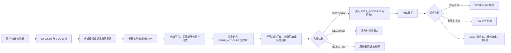
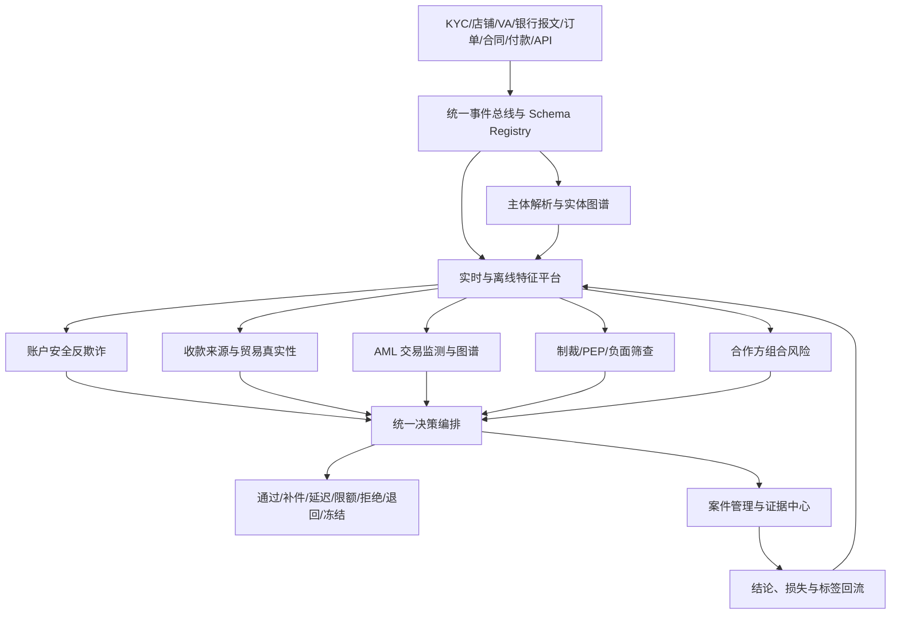

# PingPong 跨境收款风控业务说明

> 版本：v2.0（基于 PingPong 公开业务重写）
> 调研日期：2026-08-11
> 适用对象：跨境收款风控产品、合规、数据、研发、运营和案件调查团队
> 信息边界：只使用 PingPong 官网、开放平台公开文档和国际/中国监管公开资料，不代表 PingPong 现有内部系统、内部规则或未公开业务
> 文档用途：业务建模与系统设计参考，不替代公司内部制度或特定司法辖区的法律意见

## 1. 本次重写的结论

上一版把业务抽象成了通用跨境收款。结合 PingPong 公开资料后，风控系统应围绕下面这条实际产品链路重新建模：



这意味着 PingPong 风控的核心不是单一“支付交易评分”，而是四个一致性验证：

1. **客户主体一致性**：注册主体、法人、UBO、实际经营者和操作人是否一致；
2. **收款来源一致性**：来账付款人、店铺/买家、合同订单和申报业务是否一致；
3. **资金用途一致性**：入账业务类型、结汇贸易编码、受益账户和最终用途是否一致；
4. **全链路行为一致性**：客户申报画像、账户使用方式、换汇和提现/付款行为是否一致。

## 2. PingPong 公开业务理解

### 2.1 公司和平台定位

根据 PingPong 官方介绍，公司面向中小企业、大型品牌、科技企业及机构，提供跨境“收、付、汇、管”全链路支付服务和 API 嵌入式解决方案。[PingPong 公司简介](https://www.pingpongx.com/zh/companyProfile?cb=&channel=fseo&type=channel)

PingPong 开放平台公开说明，其能力包括跨境支付、外贸收款、全球收单、金融服务、全球分发和汇兑服务，并通过 API 向合作伙伴开放。[PingPong 开放平台简介](https://open.pingpongx.com/docs/developer/guide/platform-introduce/)

本文重点覆盖“跨境收款及收款后资金使用”，将全球收单、发卡和供应链金融视为相邻风险域，不展开完整卡支付规则。

不同官网页面因产品、地区和更新时间不同，对覆盖国家、币种、账户和牌照数量的表述可能不同。系统不得把营销页数字硬编码为产品能力，应以实时产品配置、渠道合同和合规准入矩阵为准。

### 2.2 客户与合作模式

根据公开产品页面和 API，可识别以下客户/接入模式：

| 模式 | 典型主体 | 主要入账来源 | 主要证明材料 |
| --- | --- | --- | --- |
| 电商平台收款 | Amazon、Wish、eBay、Shopee 等平台商户 | 平台结算款 | 店铺授权、seller ID、平台订单、打款记录 |
| 独立站收款 | 品牌商、自建站商户 | 支付服务商、收单机构或买家 | 店铺 URL、支付服务商绑定关系、交易订单 |
| 一般贸易/B2B 外贸收款 | 出口工厂、外贸公司、工贸一体企业 | 境外企业买家 | 合同订单、发票、报关、买家、贸易条款 |
| 服务贸易收款 | 应用、游戏、广告、物流、教育、商旅、创作者等 | 平台、企业客户或消费者 | 服务合同、平台结算、交付/履约记录 |
| 平台/机构嵌入式接入 | 物流平台、SaaS、金融科技、行业平台 | 其下级客户或合作方资金 | 合作方客户 KYC、底层账户、底层订单和资金明细 |
| 全球收单 | 独立站、平台、线下/线上商户 | 卡及本地替代支付方式 | 商户网站、商品、支付订单、履约和退款证据 |

PingPong 的公开 VA 申请文档列出的账户用途包括：电商收款、一般贸易收款、充值收款、代扣付款，以及应用平台、国际物流、广告营销、在线教育、留学缴费、交通出行和创作者出海等服务贸易场景。[PingPong：账号申请](https://open.pingpongx.com/docs/developer/api/va/apply/)

### 2.3 核心产品对象

| 产品对象 | 公开业务含义 | 风控关注点 |
| --- | --- | --- |
| `client_id` | PingPong 客户唯一标识 | 客户、合作方租户和关联主体隔离 |
| KYC/KYB | 企业/个人认证，企业包含 UBO 信息 | 主体真实性、冒名、空壳、控制人风险 |
| Store | 电商平台或独立站店铺 | 店铺权属、授权有效性、订单真实性 |
| VA/收款账户 | 提供给买家或绑定到平台的收款账户 | 用途、币种、地区、客户绑定及资金来源 |
| Contract Order | 一般贸易/独立站入账审核使用的合同订单 | 买卖双方、金额、贸易编码、报关和交货逻辑 |
| Inbound Transaction | 收到的来账资金 | 付款人、金额、币种、来源和业务类型 |
| `TEMP_ACCOUNT` | 已收到但尚未通过风控审核的资金暂存户 | 禁止提前可用、材料补充和退回 |
| `AVAIL_ACCOUNT` | 审核通过后的可用账户 | 换汇、提现、付款、冻结余额 |
| Beneficiary Card | 提现或付款的目标银行账户 | 同名/非同名、权属、收款人风险 |
| Payout | 同名提现 `WITHDRAW` 或非同名付款 `PAY` | ATO、收款人替换、用途和贸易编码 |
| FX | 多币种持有和兑换 | 镜像换汇、无业务目的高频兑换、制裁走廊 |
| Partner/Open API | 第三方合作方批量接入客户和交易 | 租户隔离、代理风险、密钥和回调安全 |

### 2.4 公开的入账审核状态

PingPong 公开文档描述：来账先进入暂存账户，随后按交易类型审核；通过后进入可用账户，需要补充材料时可再次提交，拒绝后资金原路退回。[PingPong：跨境收款产品流程](https://open.pingpongx.com/docs/product/%E8%B7%A8%E5%A2%83%E6%94%B6%E6%AC%BE/inbound/)

| 状态 | 公开语义 | 系统动作建议 |
| --- | --- | --- |
| `PROCESSING` | 入账审核中 | 保持暂存，不允许支用 |
| `APPROVED` | 已通过并入账 | 暂存转可用，触发持续监测 |
| `DECLINED` | 需要补充材料，可重新提交 | 记录缺件原因、补件版本和重审次数 |
| `REJECTED` | 审核不通过，需要退款 | 锁定资金并进入原路退回流程 |
| `REFUNDED` | 已退款 | 对账、确认退款目标和最终状态 |

### 2.5 公开 API 中容易造成系统错误的语义冲突

这是新系统设计必须特别处理的地方：

1. **`DECLINED` 不能做全局统一枚举**：KYC 文档中的 `DECLINED` 表示认证未通过；入账审核中的 `DECLINED` 表示可补件重审；
2. **`business_type` 在不同接口值域不同**：KYC 使用 `B2B_COMMERCE`、`ECOMMERCE_PLATFORM`、`SELF_STATION`，合同订单使用 `SELF_STATION`、`T_TRADE`；
3. **“提现”和“付款”必须按受益主体判断**：公开文档定义同名同主体为 `WITHDRAW`，非同名主体为 `PAY`；
4. **账面余额不能等同可支用资金**：`TEMP_ACCOUNT` 是已到资但未审核资金，`AVAIL_ACCOUNT` 才是可用账户；
5. **同步受理不等同业务成功**：KYC、绑卡、付款、入账审核均可能同步受理、异步回调最终结果。

因此内部模型应使用带领域前缀的状态，如：

```text
kyc.declined
inbound.declined_resubmittable
inbound.rejected_return_required
payout.accepted_processing
payout.succeeded
```

## 3. PingPong 场景下的风险域

| 风险域 | 主要问题 | 主要控制阶段 |
| --- | --- | --- |
| 客户准入风险 | 客户、法人、UBO、实际经营是否真实 | 注册、KYC/KYB、周期复审 |
| 店铺与渠道风险 | 店铺是否真实归属客户，授权和订单是否可信 | 店铺创建、授权、订单同步 |
| 贸易真实性风险 | 来账是否对应真实货物或服务贸易 | 合同订单、材料、入账审核 |
| 资金来源风险 | 付款人是否合理，是否存在第三方、涉诈或资金骡 | 来账、付款报文、图谱监测 |
| 账户安全风险 | 客户账号、API 密钥或店铺授权是否被接管 | 登录、凭证、敏感变更、付款 |
| 资金用途风险 | 提现/付款是否符合主体、贸易类型和申报用途 | 绑卡、换汇、付款、结汇 |
| AML/制裁风险 | 是否存在分层、地下钱庄、赌博、电诈或制裁关联 | 全生命周期和资金网络 |
| 合作方风险 | 嵌入式合作方是否批量引入高风险客户或隐藏底层交易 | Partner 准入、API、组合监测 |
| 运营/技术风险 | 异步状态、重放、重复记账和人工 override | API、回调、账本、案件运营 |

风险域应分别评分和处置。不能因为 KYC 通过就认为交易真实，也不能因为登录认证成功就认为付款不是 APP/BEC 欺诈。

## 4. 典型风险场景

### 4.1 冒名企业、空壳企业或买壳开户

**业务表现**

- 盗用真实企业营业执照、法人或香港公司资料提交认证；
- 名义股东/董事代持，真实控制人未披露；
- 收购存续较久但无经营的公司后立即开通高额收款；
- 多个客户共用法人、UBO、地址、设备、电话、邮箱或银行卡。

**PingPong 相关字段**

- `customer_location`、`customer_type`、公司名称和证件；
- `legal_person_info`、`ubo_info_list`；
- `company_url`、`export_country_list`、`business_type`；
- `client_id`、注册渠道、设备、IP、绑定收款卡。

**检测重点**

- 企业登记、存续状态、成立时间和法定代表人一致性；
- UBO 穿透后与其他客户的复用关系；
- 公司网站、出口国家、业务类型与公开经营痕迹的逻辑性；
- KYC 被拒后更换局部材料重复提交；
- 同一证件、设备或卡号跨合作方/跨 `client_id` 重复出现。

### 4.2 UBO、法人或授权代理人隐瞒与替换

**业务表现**

- 仅申报达到固定持股比例的股东，但通过协议控制、亲属或代持隐藏实际控制人；
- 开户后短期变更法人、董事、UBO、手机号、邮箱和管理员；
- 授权代理人实际控制多个无业务关系企业。

**检测重点**

- 所有权百分比、控制方式和完整所有权路径；
- 法人/UBO/操作员变更前后差异及变更原因；
- 共享设备、地址、受益账户和客户经理；
- 高风险变更后的 VA 申请、入账和付款行为。

FATF 强调应获得充分、准确和及时更新的真实受益所有权信息，以防匿名公司被用于隐藏非法活动。[FATF：法人受益所有权指引](https://www.fatf-gafi.org/content/fatf-gafi/en/publications/Fatfrecommendations/Guidance-Beneficial-Ownership-Legal-Persons.html)

### 4.3 电商店铺冒用、买卖和授权劫持

**业务表现**

- 使用不属于当前 KYC 主体的店铺申请平台收款；
- 买卖、租赁店铺后仍沿用原主体或原授权资料；
- 同一 `seller_id`、token、API key 被绑定到多个客户或店铺；
- 盗取平台 OAuth/token，篡改收款账户或拉取订单；
- 授权到期后使用截图伪造仍在经营。

**关键字段**

- `store_id`、`platform`、`seller_id`、`store_url`、`category`；
- `auth_type`、`auth_status`、授权主体、token 指纹、权限范围和到期时间；
- 平台后台绑定 VA、支付服务商和实际打款账户；
- 店铺历史名称、法人、地区、类目和结算模式。

**检测策略**

- 同一授权信息不得跨店铺复用；公开接口本身也明确限制相同 `auth_info` 绑定多个店铺；
- 店铺授权主体、KYC 企业和平台结算主体做三方一致性校验；
- 将 seller ID、域名、授权凭证指纹、VA 和设备纳入图谱；
- 授权过期、店铺转让或类目突变时暂停自动订单采信。

PingPong 公开店铺管理文档说明，授权后可自动拉取平台订单供结汇申报使用，因此授权真实性直接影响贸易背景数据可信度。[PingPong：店铺管理](https://open.pingpongx.com/docs/product/store/)

### 4.4 电商平台结算款伪造或错配

**业务表现**

- 冒充平台或 PSP 向 VA 付款；
- 将 A 店铺打款认领到 B 店铺或另一个客户；
- 通过伪造平台后台截图、支付服务商页面补件；
- 平台结算金额、币种、周期与订单数据严重不一致；
- 将非销售资金伪装成平台结算款。

**检测重点**

- 付款人银行账户是否属于已知平台/PSP；
- 平台、seller ID、VA、币种、站点和客户的绑定关系；
- 订单销售额、退款、平台费用与净结算金额的可解释差额；
- 截图 OCR、文件元数据、重复哈希和模板复用；
- 首次付款人、付款人名称变更、平台结算路径变更。

### 4.5 独立站虚假交易与交易洗白

**业务表现**

- 无真实买家的自买自卖或关联方循环付款；
- 将赌博、虚拟资产、侵权、假药、成人或诈骗收入包装为普通商品销售；
- 网站前台展示低风险商品，实际通过隐藏链接销售禁限品；
- 订单、网站商品、支付附言和申报类目不一致。

**检测重点**

- 网站域名年龄、实际控制、跳转链、隐藏页面和商品内容；
- 付款人集中度、IP/设备、账单国家和履约国家；
- 商品价格、退款率、投诉率和收单拒付；
- 独立站订单与 VA/收单入账金额匹配；
- 同一商品图片、域名模板或受益账户关联的商户网络。

### 4.6 一般贸易合同订单伪造

PingPong 公开合同订单接口包含贸易订单号、业务类型、结汇类型、贸易编码、金额、币种、订单时间、付款方式、国际贸易条款、报关单号、新老买家、商品类目、收货国和买家等字段。[PingPong：合同订单创建](https://open.pingpongx.com/docs/developer/api/material/contract-order-add/)

**风险表现**

- 伪造合同、发票、报关单或物流单据；
- 同一合同订单、报关单或发票向多个客户/机构重复使用；
- 合同买家与来账付款人不一致且无第三方付款证明；
- 一笔来账关联多笔订单时故意重复占用或超额使用订单余额；
- 使用不匹配的贸易编码完成结汇。

**检测重点**

- `trade_order_no` 全局及合作方内唯一性；
- 来账金额与关联订单可用金额之和严格相等或在明确容差内；
- `buyer_name`、`buyer_country` 与付款人、付款银行国家的关系；
- `declaration_no` 的真实性、唯一性和金额/商品匹配；
- 订单金额、已关联金额、释放金额采用不可变明细账管理；
- `trade_code`、商品类目、报关状态和结汇类型一致。

### 4.7 预付款、尾款和订单余额滥用

**业务表现**

- 把全款订单伪装成多次预付款/尾款，重复收取或重复结汇；
- 已取消订单仍接收尾款；
- 一笔来账被拆到多个合同订单后，在审核失败回退余额时出现重复释放；
- 并发提交导致订单可关联金额被多笔来账同时占用。

**控制建议**

- 合同订单维护 `total_amount`、`reserved_amount`、`approved_amount`、`released_amount`；
- 使用原子预占和唯一业务流水，禁止仅更新一个“剩余金额”字段；
- `DECLINED/REJECTED` 后释放订单额度必须幂等；
- 建立预付款比例、尾款时间和发货/报关状态的行业基线。

### 4.8 高报、低报、多开票和幽灵贸易（TBML）

**风险表现**

- 商品单价显著偏离市场或客户历史；
- 同一货物多次开票、重复付款；
- 报关数量、重量、金额与合同不一致；
- 无真实货物，仅用合同和报关外观转移资金；
- 付款国家、买家国家、收货国家和货物路线无商业合理性。

**检测重点**

- 商品、HS Code、数量、单位、单价、重量和运费；
- Incoterms 与承担费用、物流证据的匹配；
- 买家、收货人、付款人、最终受益人的关系；
- 同一报关单/提单/发票在全平台的重复使用；
- 高风险商品、转口路径及关联企业交易。

FATF 将 TBML 风险指标分为企业结构、贸易活动、贸易单据/商品以及账户交易四类。[FATF/Egmont：贸易型洗钱风险指标](https://www.fatf-gafi.org/en/publications/Methodsandtrends/Trade-based-money-laundering-indicators.html)

### 4.9 服务贸易虚构和难以验证的履约

服务贸易比货物贸易更难以通过报关和物流验证，是 PingPong 风控与传统电商订单风控差异最大的区域之一。

| 场景 | 典型风险 | 关键证据 |
| --- | --- | --- |
| 应用/游戏 | 伪造平台收入、关联方充值、收入地区异常 | 开发者后台、下载/活跃、平台结算、应用权属 |
| 国际物流 | 虚构运单、关联企业循环结算、代收货款混入 | 运单、客户清单、路线、承运证明、费用明细 |
| 广告营销 | 虚假投放、无交付、以服务费转移资金 | 广告账户、投放报表、素材、客户验收 |
| 在线教育/留学缴费 | 假学生、假录取、退款转第三方 | 学生、学校、课程/录取、缴费和退款路径 |
| 交通出行/商旅 | 虚假票务、批量退款、代理层级不透明 | PNR/票号、旅客、供应商、行程和退票记录 |
| 创作者出海 | 虚假流量、买量刷流水、账号买卖 | 平台账号权属、内容、粉丝/流量、结算报告 |

**通用检测重点**

- 服务提供方、合同客户、付款人和最终使用者关系；
- 服务期间、交付成果、验收和付款节点；
- 金额与流量、用户、里程、曝光、课程或票务数量的比例；
- 大量自然人付款是否符合申报商业模式；
- 服务取消后的退款是否原路退回。

### 4.10 第三方付款和最终付款人不透明

**业务表现**

- 来账付款人不是合同买家或平台；
- 集团公司、采购代理、物流商或个人替买家付款；
- 聚合支付机构只显示自身名称，底层付款人缺失；
- 多个不相关付款人向同一客户持续汇款。

**控制建议**

- 明确 `debtor`、`ultimate_debtor`、合同买家和实际付款账户四个对象；
- 建立第三方付款原因码：集团代付、代理采购、平台归集、债权转让等；
- 要求关系证明、代理协议和底层付款明细；
- 对长期第三方付款客户做组合级增强尽调，而非逐笔机械补件。

### 4.11 资金骡、漏斗账户和快速过账

**业务表现**

- 新客户或休眠客户突然接收大量付款；
- 入账通过后立即换汇并近全额提现/付款；
- 多付款人汇入后向少数银行卡或供应商账户归集；
- 客户余额长期接近零，只把 PingPong 账户当资金通道；
- 多个无关企业共用操作员、设备或收款卡。

**必备特征**

- 入账至首次换汇、提现和付款的时间；
- 1h/24h/7d 入账后转出比例；
- 付款人数量、国家和集中度；
- 受益账户扇出度、共享客户数；
- `TEMP_ACCOUNT` 转 `AVAIL_ACCOUNT` 后的余额清空率；
- 企业申报月流水与实际流水偏离。

FCA 指出，新开或休眠账户高额入账后以相似金额迅速转出，是资金骡监测的重要特征。[FCA：Detecting and preventing money mules](https://www.fca.org.uk/publications/multi-firm-reviews/proceeds-fraud-detecting-preventing-money-mules)

### 4.12 拆分来账和审核阈值规避

**业务表现**

- 将大额款项拆到审核阈值下；
- 同一买家通过多个银行账户、币种或关联企业付款；
- `DECLINED` 后更换业务类型、合同订单或金额重新提交；
- `REJECTED` 后通过另一个 VA、客户或合作方重试。

**控制建议**

- 按客户、UBO、买家、付款账户、订单和关联群组聚合；
- 保存每次审核提交的完整版本，识别补件中的关键字段变化；
- 对拒绝后变形重试建立跨 `transaction_id` 关联；
- 不把单笔金额作为唯一审核门槛。

### 4.13 VA 用途错配和账户滥用

**业务表现**

- 以电商用途申请 VA，却接收一般贸易或服务贸易资金；
- 一个 VA 被多个无关联店铺、买家或企业使用；
- 客户把收款账户公开用于个人汇款、充值或资金归集；
- VA 申请币种、银行地区与实际经营国家不合理。

**检测重点**

- `purpose` 与每笔来账 `business_type`、付款人类型、材料类型一致；
- VA—客户—店铺—买家是一对一、一对多还是允许的多对多；
- 自然人付款占比和小额高频结构；
- 同一 VA 在网站、社交媒体或多个商户页面的公开使用情况；
- VA 长期无对应店铺/合同但持续入账。

### 4.14 账户接管（ATO）与敏感操作串联

**业务表现**

- 钓鱼、凭证填充、邮箱接管、SIM 换卡；
- 新设备登录后重置 MFA、新增收款卡并大额提现；
- API 密钥泄露后批量申请付款或修改客户资料；
- 客服社工绕过身份校验。

**高危事件链**

```text
新国家/新设备登录
  -> 密码或 MFA 重置
  -> 新增/修改 Beneficiary Card
  -> 发起 FX
  -> 近全额 WITHDRAW/PAY
```

**控制建议**

- 安全要素变更与付款风控共享实时状态；
- 新受益账户设置冷静期并通知旧联系方式；
- 高额付款启用双人审批和独立回拨；
- 合作方 API 使用请求签名、nonce、时间窗、IP/mTLS 和密钥轮换。

### 4.15 BEC、受益账户替换和非同名付款欺诈

公开付款接口区分同名 `WITHDRAW` 与非同名 `PAY`，并允许指定付款人或代付款人名称；这使受益主体、付款抬头和贸易用途成为关键风险对象。[PingPong：申请提现/付款](https://open.pingpongx.com/docs/developer/api/payout/pay/)

**风险表现**

- 冒充供应商要求将款项付到新账户；
- 接管客户后将同名提现改为非同名付款；
- 使用虚假 `payer_name` 误导收款人或掩盖真实付款关系；
- 付款贸易编码与资金来源或合同类型不一致；
- 把个人账户包装为企业供应商收款账户。

**检测重点**

- Beneficiary Card 名称匹配、账户国家、企业/个人类型；
- 首次受益人、受益人变更和历史付款关系；
- `payout_type` 是否由主体比对自动判定，禁止仅信任前端传值；
- `payer_name` 与实际付款法律实体、客户要求和渠道规则；
- 付款申请会话与近期安全事件；
- 非同名付款的合同、发票、供应商关系和贸易编码。

FinCEN 将“已知受益人更换账户”“付款给无历史关系的新受益人”和“紧急付款指令”列为商业邮件欺诈红旗。[FinCEN：Email Compromise Fraud Advisory](https://www.fincen.gov/resources/statutes-regulations/guidance/advisory-financial-institutions-e-mail-compromise-fraud)

### 4.16 换汇、镜像交易与非法资金对敲

**业务表现**

- 无真实业务需求的高频买卖币种；
- 多个关联客户在相近时间做反向、相似金额换汇；
- 境外收外币、境内由另一个资金池支付人民币；
- 入账—换汇—付款形成闭环或回到关联企业；
- 使用多币种账户增加资金路径复杂度。

**检测重点**

- 客户申报币种、买家国家与换汇对；
- 换汇后资金去向和停留时长；
- UBO 关联客户的反向流、镜像金额和时间配对；
- FX 报价请求、取消、成交和付款的组合行为；
- 无贸易利润或经营目的的循环资金。

### 4.17 退款、退汇和召回套利

**业务表现**

- 尚未具有清算最终性的资金进入可用余额并被提现；
- 付款后发起银行召回或声称误付；
- 要求退款到非原付款账户；
- 入账审核 `REJECTED` 后利用状态差异重复退款；
- 合同订单额度释放与退款同时发生，造成余额重复可用。

**控制建议**

- 区分账面到账、渠道结算最终、风控通过和可提现四个时间点；
- 原路退回并校验原付款路径；
- 退款、合同额度释放和账本冲正使用同一幂等业务链；
- 按客户、付款人、走廊监测召回和退汇率；
- 高风险客户动态延长可用时间或保留准备金。

### 4.18 合作方批量引流和嵌入式支付风险

**业务表现**

- 合作方 KYC 质量低，批量引入空壳或资金骡客户；
- 合作方隐藏下级客户、底层店铺和订单；
- 多个合作方为同一主体重复开户；
- 合作方擅自改变产品用途、费率或客户资金路径；
- 某合作方异常集中触发 `DECLINED/REJECTED/REFUNDED`。

**控制建议**

- 建立 `partner_id -> client_id -> store/VA -> transaction` 完整层级；
- 按合作方监控 KYC 通过率、补件率、拒绝率、退汇率和案件率；
- 高风险合作方降低自动化权限、提高抽检率和资金限额；
- 禁止合作方覆盖 PingPong 的最终风控状态；
- 对合作方操作员、API 客户端和客户群做关联图谱。

### 4.19 开放 API 重放、越权和异步状态欺诈

**风险表现**

- 重放付款、绑卡、合同订单或审核提交请求；
- 伪造 webhook，把失败状态改成成功；
- 使用 A 合作方 token 查询或操作 B 合作方 `client_id`；
- `partner_order_id` 或 `transaction_id` 幂等失效导致重复付款；
- 长时间未收到回调时，错误地把“受理成功”当作“交易成功”；
- 回调乱序使旧状态覆盖新状态。

**控制建议**

- 签名、时间戳、nonce、幂等键和请求体摘要；
- 所有资源校验 `partner_id/tenant_id` 所有权；
- 状态机只允许合法单向迁移，终态不可被普通回调覆盖；
- 回调验签、事件去重、乱序处理和主动查询兜底；
- 原始请求、响应、回调及状态变更保留审计链。

### 4.20 全球收单相邻风险

PingPong 官网还公开全球收单能力，支持卡和本地替代支付方式。这类风险与 VA/银行转账收款不同，应使用独立风险域：

- 盗卡、卡测试、机器人攻击；
- 商户自刷、虚假交易和交易洗白；
- 友好欺诈、拒付和退款套利；
- 商品/服务不交付；
- 支付页面、收单 MID 和申报网站不一致；
- 高风险 MCC、跨地区获客和异常授权率。

收单事件、卡数据和拒付指标不应直接塞入银行转账的 `inbound` 状态机，但可以在客户级风险画像中汇总。

### 4.21 制裁、赌博、电诈和地下钱庄

**风险表现**

- 客户、UBO、买家、付款人、供应商或银行触及制裁/限制措施；
- 通过拼写变体、第三国中间公司和多跳银行隐藏真实主体；
- 赌博、电信诈骗或虚拟资产高风险资金进入 VA；
- 多个资金骡客户汇总后付款给少数受益人；
- 使用虚假贸易或服务背景完成非法换汇。

**控制建议**

- 对客户、UBO、操作员、付款人、买家、受益人和金融机构分层筛查；
- 名单更新时重筛存量关系和未完成交易；
- 关联公安、银行、支付联盟和内部案件情报；
- 高风险事件扩散到共享设备、卡、VA、UBO 和合作方；
- 区分“可能匹配”“确认命中”“欺诈标签”和“可疑活动”，避免错误定性。

## 5. 关键业务字段

### 5.1 客户、KYC/KYB 和 UBO

| 字段 | 来源 | 风控用途 |
| --- | --- | --- |
| `partner_id` | 建议增加 | 合作方组合风险、租户隔离 |
| `client_id` | 公开 API | 客户唯一主键 |
| `customer_location` | 公开 API | 中国大陆/香港等主体所在地 |
| `customer_type` | 公开 API | 企业/个人 |
| `legal_name`, `full_name_en` | 公开 API/建议标准化 | 主体核验、名单和账户名匹配 |
| `registration_number` | KYC 材料 | 登记唯一性、重复开户 |
| `legal_person_info` | 公开 API | 法人身份和关联关系 |
| `ubo_info_list` | 公开 API | 受益所有人和控制网络 |
| `ownership_percent`, `control_type` | 建议增加 | 穿透识别协议控制/代持 |
| `certificate_info_list` | 公开 API | 证件类型、号码、有效期和材料 |
| `company_url` | 公开 API | 经营真实性、禁限业务 |
| `export_country_list` | 公开 API | 预期国家画像 |
| `business_type` | 公开 API | 一般贸易、电商平台、独立站 |
| `expected_volume/count/currencies` | 建议增加 | 实际行为偏离 |
| `source_of_funds` | 建议增加 | 资金来源合理性 |
| `kyc_status`, `kyc_reason` | 公开 API/建议扩充 | 审核状态和原因 |
| `risk_tier`, `edd_status` | 建议增加 | 产品、限额、复审周期 |
| `verified_source`, `verified_at` | 建议增加 | 数据来源可信度和时效 |

### 5.2 店铺和平台授权

| 字段 | 风控用途 |
| --- | --- |
| `store_id`, `platform`, `seller_id` | 店铺唯一性和平台身份 |
| `store_name`, `store_url`, `category` | 网站真实性和类目一致性 |
| `auth_type`, `auth_status`, `auth_scopes` | 授权方式、状态和数据可见范围 |
| `auth_credential_fingerprint` | 识别凭证跨店铺复用，不保存明文密钥 |
| `authorized_subject_name/id` | 店铺授权主体与 KYC 主体匹配 |
| `authorized_at`, `expires_at`, `last_sync_at` | 授权过期和数据新鲜度 |
| `platform_payout_accounts[]` | 平台打款账户白名单/历史变化 |
| `bound_va_ids[]` | 店铺与 VA 的绑定关系 |
| `order_count/gmv/refund_rolling_*` | 结算金额和店铺经营基线 |
| `ownership_change_signal` | 店铺买卖、主体变化 |

### 5.3 VA/收款账户

| 字段 | 风控用途 |
| --- | --- |
| `va_id`, `client_id`, `partner_id` | 所有权和租户隔离 |
| `purpose_code` | 01-11 等公开用途的内部映射 |
| `purpose_domain` | ecommerce / general_trade / service_trade / top_up / debit |
| `currency`, `bank_country`, `rail` | 币种、账户地区和支付路径 |
| `account_holder_name`, `account_number_token` | 权属和重复使用 |
| `linked_store_ids[]` | 电商来源约束 |
| `approved_buyer_ids[]` | B2B 已知买家 |
| `opened_at`, `first_credit_at`, `last_credit_at` | 新账户和休眠唤醒 |
| `status`, `status_reason` | 正常、限制、关闭及原因 |
| `payer_count_1d/30d`, `natural_person_ratio` | 漏斗账户和用途错配 |
| `public_exposure_urls[]` | VA 是否被多个网站公开使用 |

### 5.4 来账和支付报文

| 字段组 | 必备字段 |
| --- | --- |
| 标识 | `transaction_id`, `partner_reference`, `end_to_end_id`, `uetr`, `bank_reference` |
| 金额 | `amount`, `currency`, `settlement_amount`, `settlement_currency`, `fee_amount` |
| 时间 | `received_at`, `value_date`, `settled_at`, `audit_submitted_at`, `available_at` |
| 付款人 | `debtor_name`, `debtor_account_token`, `debtor_bank`, `debtor_country`, `debtor_address` |
| 最终付款人 | `ultimate_debtor_name/id/country` |
| 收款账户 | `va_id`, `creditor_name`, `creditor_account_token`, `creditor_bank` |
| 路径 | `rail`, `intermediary_agents[]`, `origin_country`, `corridor` |
| 用途 | `purpose_code`, `remittance_text`, `invoice_refs[]`, `platform_reference` |
| 业务分类 | `business_type`, `store_id`, `trade_order_refs[]`, `third_party_payment_reason` |
| 状态 | `inbound_status`, `fail_reason`, `refund_reference` |
| 数据质量 | `raw_message_ref`, `missing_fields[]`, `normalization_version` |

### 5.5 合同订单和贸易证据

| 字段 | 公开/建议 | 风控用途 |
| --- | --- | --- |
| `trade_order_no` | 公开 | 订单幂等和重复使用 |
| `business_type` | 公开 | `SELF_STATION` / `T_TRADE` |
| `settlement_type` | 公开 | 是否结汇 |
| `trade_code` | 公开 | 贸易申报逻辑 |
| `amount`, `currency` | 公开 | 与来账匹配 |
| `order_time` | 公开 | 时间逻辑 |
| `store_url` | 公开条件字段 | 独立站真实性 |
| `payment_method` | 公开 | 全款/预付款+尾款 |
| `trading_terms` | 公开 | Incoterms 与物流/费用匹配 |
| `declaration_no` | 公开条件字段 | 报关真实性和重复使用 |
| `new_buyer` | 公开条件字段 | 首次买家风险 |
| `category` | 公开 | 商品和行业风险 |
| `consignee_country_code` | 公开 | 收货国家和路线 |
| `buyer_name`, `buyer_country` | 公开 | 买家—付款人匹配 |
| `invoice_number`, `invoice_hash` | 建议增加 | 发票重复和单据篡改 |
| `goods_lines[]` | 建议增加 | HS Code、数量、单价、原产地 |
| `shipment_refs[]` | 建议增加 | 提单、运单、承运人和时间 |
| `total/reserved/approved_amount` | 建议增加 | 订单余额并发控制 |
| `document_metadata/tamper_score` | 建议增加 | 补件反欺诈 |

### 5.6 入账审核

| 字段 | 风控用途 |
| --- | --- |
| `audit_id`, `transaction_id`, `attempt_no` | 多次补件重审的版本管理 |
| `submitted_business_type` | 识别变更业务类型绕过 |
| `store_url`, `file_id_list` | 电商/独立站补充证据 |
| `relate_order_list[]` | 多订单关联及金额占用 |
| `status` | PROCESSING/APPROVED/DECLINED/REJECTED/REFUNDED |
| `reason_code`, `fail_reason` | 可解释决策和运营统计 |
| `submitted_by`, `reviewed_by` | 合作方、客户、系统或人工 |
| `rule_hits[]`, `screening_hits[]` | 审核依据 |
| `evidence_snapshot_ref` | 保留当时材料版本 |
| `decision_at`, `finish_time` | SLA 和状态乱序判断 |
| `refund_required`, `refund_id` | 拒绝后的退款闭环 |

### 5.7 账户余额、账本和冻结

| 字段 | 风控用途 |
| --- | --- |
| `account_type` | `TEMP_ACCOUNT` / `AVAIL_ACCOUNT` |
| `currency`, `avail_balance`, `frozen_balance` | 余额和冻结资金 |
| `account_status` | NORMAL/ABNORMAL/CLOSED |
| `ledger_entry_id`, `debit_credit`, `business_ref` | 不可变账务分录 |
| `fund_source_transaction_ids[]` | 提现/付款追溯到具体来账 |
| `finality_status` | 银行资金最终性 |
| `reserve_reason`, `reserve_expiry` | 风险保留/准备金 |
| `reconciliation_status`, `bank_statement_ref` | 账实一致性 |

PingPong 公开账户查询文档明确区分暂存户和可用账户，并说明账户异常时禁止交易。[PingPong：账户信息查询](https://open.pingpongx.com/docs/developer/api/account/balance-query/)

### 5.8 受益账户、提现和付款

| 字段 | 风控用途 |
| --- | --- |
| `beneficiary_card_id`, `holder_name`, `holder_type` | 账户权属和企业/个人类型 |
| `bank_country`, `bank_name`, `account_number_token` | 国家、银行和共享账户图谱 |
| `ownership_check_result`, `name_match_score` | 同名验证 |
| `added_by`, `added_session_id`, `approved_by` | ATO 和内部授权 |
| `first_used_at`, `cooling_off_until` | 新收款人和冷静期 |
| `payout_type` | `WITHDRAW` / `PAY`，由服务端判定 |
| `partner_order_id` | 付款请求唯一性 |
| `pay_currency`, `pay_amount`, `fee_amount` | 资金支出 |
| `target_currency`, `target_amount` | 目标到账金额 |
| `fx_rate_id`, `fx_rate` | 换汇关联和参数防篡改 |
| `payer_name` | 指定付款抬头的真实性 |
| `charges_indicator` | OUR/SHA/BEN 与实际到账核对 |
| `trade_code`, `remark`, `extend_info` | 用途、申报和补充信息 |
| `recent_security_event_flags[]` | 近期登录/MFA/联系方式变化 |
| `time_since_inbound`, `balance_drain_ratio` | 快速过账 |

### 5.9 合作方与 API 安全

| 字段 | 风控用途 |
| --- | --- |
| `partner_id`, `api_client_id`, `key_id` | 合作方和密钥主体 |
| `request_id`, `idempotency_key`, `nonce` | 防重放和去重 |
| `signature_valid`, `timestamp_skew_ms` | 请求真实性 |
| `source_ip`, `mtls_identity`, `device_or_service_id` | 调用源可信度 |
| `endpoint`, `http_method`, `payload_hash` | 敏感操作审计 |
| `resource_owner_partner_id` | 防跨租户越权 |
| `webhook_event_id`, `webhook_signature_valid` | 回调安全 |
| `callback_attempt`, `callback_received_at` | 重试和乱序 |
| `partner_risk_tier`, `partner_limits` | 组合级控制 |

### 5.10 必备衍生特征

| 特征族 | 示例 |
| --- | --- |
| 主体关联 | 每个 UBO/法人/设备/卡号关联客户数、跨合作方复用数 |
| 店铺权属 | seller ID 复用、授权凭证复用、KYC—店铺名称匹配分 |
| 订单匹配 | 来账/订单金额比、订单占用率、报关单重复数、买家匹配分 |
| 资金速度 | 1h/24h 入账转出率、暂存转可用后提现时长、余额清空率 |
| 付款人结构 | 付款人数量、自然人占比、首次付款人占比、国家集中度 |
| 场景一致性 | VA 用途—业务类型—材料—付款人类型一致性 |
| 重审行为 | 审核尝试次数、关键字段变更数、DECLINED 后换订单/店铺次数 |
| 受益人风险 | 新受益人、名称不匹配、共享客户数、涉诈/投诉标签 |
| API 行为 | 签名失败率、重复请求率、状态查询频率、异常来源 IP |
| 合作方组合 | KYC 拒绝率、入账补件率、REJECTED 率、退汇率、案件率 |
| 图谱 | 扇入扇出、共享节点、循环路径、社区风险率、最短风险距离 |

## 6. 事件体系

### 6.1 统一命名

内部事件建议使用：

```text
<domain>.<object>.<past-tense-action>.v<major>
```

事件必须描述已经发生的事实。风控决策和执行命令分离。

### 6.2 统一事件信封

```json
{
  "event_id": "evt_...",
  "event_type": "inbound.audit.completed.v1",
  "event_version": 1,
  "occurred_at": "2026-08-11T10:20:30.123Z",
  "received_at": "2026-08-11T10:20:30.456Z",
  "producer": "inbound-service",
  "partner_id": "partner_...",
  "client_id": "client_...",
  "actor": {"type": "system", "id": "risk-engine"},
  "subject": {"type": "inbound_transaction", "id": "tx_..."},
  "correlation_id": "fund_flow_...",
  "causation_id": "evt_previous_...",
  "idempotency_key": "source_event_...",
  "trace_id": "trace_...",
  "schema_ref": "schema://inbound.audit.completed/v1",
  "data_classification": "restricted",
  "payload": {}
}
```

### 6.3 客户与 KYC/KYB 事件

| 事件类型 | 触发时点 | 风控用途 |
| --- | --- | --- |
| `customer.registration.started.v1` | 开始注册 | 设备、IP、渠道批量注册 |
| `customer.registered.v1` | 获取 `client_id` | 客户主实体创建 |
| `kyc.application.submitted.v1` | 提交认证 | 主体、网站、出口国家、业务类型 |
| `kyc.document.uploaded.v1` | 上传证件/授权材料 | 文件重复、篡改和冒用 |
| `kyc.ubo.declared.v1` | 提交 UBO | 穿透和关联图谱 |
| `kyc.screening.completed.v1` | 名单/PEP 筛查完成 | 可能/确认命中 |
| `kyc.application.approved.v1` | 认证通过 | 初始等级和产品权限 |
| `kyc.application.declined.v1` | 认证拒绝 | 重复申请和关联扩散 |
| `kyc.application.resubmitted.v1` | 更新材料重提 | 变更字段和绕过检测 |
| `customer.profile.changed.v1` | 客户资料变化 | 主体接管和持续尽调 |
| `customer.controller.changed.v1` | 法人/UBO 变化 | 控制权风险 |
| `customer.periodic_review.completed.v1` | 周期复审 | 风险等级和限额调整 |

### 6.4 店铺与授权事件

| 事件类型 | 触发时点 | 风控用途 |
| --- | --- | --- |
| `store.created.v1` | 创建店铺 | 店铺、平台、URL、类目 |
| `store.authorization.requested.v1` | 发起 KEY/OAuth 授权 | 凭证主体和调用来源 |
| `store.authorization.succeeded.v1` | 授权成功 | seller ID、权限范围、绑定主体 |
| `store.authorization.failed.v1` | 授权失败 | 暴力尝试、冒用 |
| `store.authorization.expired.v1` | token 过期 | 停止采信旧订单 |
| `store.authorization.revoked.v1` | 撤销授权 | 店铺转让/账号安全 |
| `store.profile.changed.v1` | 名称、类目、seller ID 变化 | 交易洗白、店铺买卖 |
| `store.orders.synced.v1` | 拉取订单完成 | 数据新鲜度和结算匹配 |
| `store.payout_account.changed.v1` | 平台打款账户变化 | 账户替换和错配 |

### 6.5 VA 和收款账户事件

| 事件类型 | 触发时点 | 风控用途 |
| --- | --- | --- |
| `va.application.submitted.v1` | 申请 VA | 用途、币种、地区合理性 |
| `va.application.approved.v1` | VA 开通 | 客户、用途和限制固化 |
| `va.application.declined.v1` | VA 申请拒绝 | 重试和产品绕过 |
| `va.store.linked.v1` | 绑定店铺 | 平台来源约束 |
| `va.store.unlinked.v1` | 解除店铺 | 后续来账异常 |
| `va.status.restricted.v1` | 限制账户 | 风险处置 |
| `va.status.closed.v1` | 关闭账户 | 存量资金和来账处理 |
| `va.unexpected_purpose.detected.v1` | 识别用途错配 | 转人工或退回 |

### 6.6 合同订单和贸易材料事件

| 事件类型 | 触发时点 | 风控用途 |
| --- | --- | --- |
| `trade.order.submitted.v1` | 提交合同订单 | 唯一性、主体、金额和贸易编码 |
| `trade.order.reserved.v1` | 为来账预占订单额度 | 并发防超额 |
| `trade.order.approved.v1` | 订单审核通过 | 可用于入账匹配 |
| `trade.order.declined.v1` | 订单需修改 | 原因和重提 |
| `trade.order.changed.v1` | 修改订单 | 关键字段差异 |
| `trade.order.amount.released.v1` | 审核失败释放额度 | 幂等和重复释放 |
| `trade.document.uploaded.v1` | 上传合同/发票/报关/物流 | OCR、篡改和重复 |
| `trade.document.verified.v1` | 外部核验完成 | 证据可信度 |
| `trade.document.duplicate_detected.v1` | 跨客户发现重复 | 团伙和假贸易 |

### 6.7 来账与入账审核事件

| 事件类型 | PingPong 业务映射 | 风控用途 |
| --- | --- | --- |
| `inbound.payment.received.v1` | 收到来账通知 | 付款人、金额、币种、路径 |
| `inbound.payment.deduplicated.v1` | 唯一流水校验 | 防重复记账 |
| `inbound.funds.posted_to_temp.v1` | 进入 `TEMP_ACCOUNT` | 暂存资金不可支用 |
| `inbound.source.classified.v1` | 判定电商/贸易/服务类型 | 选择材料和策略 |
| `inbound.evidence.requested.v1` | 要求补充材料 | 请求原因、截止时间 |
| `inbound.audit.submitted.v1` | 调用入账审核 | 尝试次数、关联材料版本 |
| `inbound.audit.processing.v1` | 状态 PROCESSING | SLA 和重复提交控制 |
| `inbound.audit.approved.v1` | 状态 APPROVED | 暂存转可用 |
| `inbound.audit.declined.v1` | 状态 DECLINED | 可补件重审，不能当终态 |
| `inbound.audit.resubmitted.v1` | 补件再次提交 | 字段变化和规避检测 |
| `inbound.audit.rejected.v1` | 状态 REJECTED | 锁定并原路退回 |
| `inbound.refund.initiated.v1` | 发起退款 | 目标、金额、幂等 |
| `inbound.refund.completed.v1` | 状态 REFUNDED | 账务和渠道对账 |
| `inbound.funds.posted_to_available.v1` | 进入 `AVAIL_ACCOUNT` | 启动资金使用监控 |
| `inbound.payment.recall_requested.v1` | 银行召回 | 余额冻结和追回 |

公开 webhook `OPEN_INBOUND_AUDIT_RESULT` 可映射为上述领域事件，而不建议把外部事件名直接作为内部唯一事件模型。[PingPong：入账审核结果通知](https://open.pingpongx.com/docs/developer/webhook/event/inbound-audit-result-notify/)

### 6.8 余额、换汇、受益账户和付款事件

| 事件类型 | 触发时点 | 风控用途 |
| --- | --- | --- |
| `balance.funds.frozen.v1` | 冻结余额 | 案件、召回、名单处置 |
| `balance.funds.unfrozen.v1` | 解冻 | 审批和依据 |
| `fx.quote.requested.v1` | 请求汇率 | 高频询价和币种异常 |
| `fx.order.created.v1` | 创建换汇 | 资金来源和用途 |
| `fx.order.executed.v1` | 换汇成交 | 后续资金去向 |
| `beneficiary.card.submitted.v1` | 新增收款卡 | 权属、账户国家、共享关系 |
| `beneficiary.card.approved.v1` | 绑卡通过 | 可付款范围和冷静期 |
| `beneficiary.card.declined.v1` | 绑卡失败 | 账户欺诈或信息错误 |
| `beneficiary.card.changed.v1` | 修改收款卡 | ATO/BEC 高危事件 |
| `payout.requested.v1` | 请求提现/付款 | 同名判定、用途、会话风险 |
| `payout.accepted.v1` | 同步受理 | 不等同最终成功 |
| `payout.risk_hold.created.v1` | 风控延迟 | 原因和释放条件 |
| `payout.submitted_to_channel.v1` | 提交渠道 | 最终筛查和幂等 |
| `payout.succeeded.v1` | 异步成功 | 资金链闭环 |
| `payout.failed.v1` | 异步失败 | 失败原因和变形重试 |
| `payout.returned.v1` | 付款退回 | 受益账户和用途风险 |

### 6.9 账号安全、API 和合作方事件

| 事件类型 | 触发时点 | 风控用途 |
| --- | --- | --- |
| `auth.login.succeeded.v1` | 登录成功 | 新设备、IP、国家 |
| `auth.login.failed.v1` | 登录失败 | 暴力破解和凭证填充 |
| `auth.mfa.reset.v1` | MFA 重置 | ATO 高危前置事件 |
| `auth.contact.changed.v1` | 手机/邮箱变更 | 冷静期和旧渠道通知 |
| `auth.role.changed.v1` | 权限变化 | 非法提权和职责分离 |
| `api.credential.created.v1` | 新建 API 密钥 | 权限、IP 和创建人 |
| `api.credential.rotated.v1` | 密钥轮换 | 旧密钥失效 |
| `api.request.signature_failed.v1` | 验签失败 | 攻击或配置错误 |
| `api.request.replay_detected.v1` | 重放请求 | 自动阻断 |
| `api.request.tenant_violation.v1` | 跨租户访问 | 高优先级安全案件 |
| `webhook.signature_failed.v1` | 回调验签失败 | 伪造状态 |
| `webhook.out_of_order_detected.v1` | 回调乱序 | 防旧状态覆盖 |
| `partner.risk_tier.changed.v1` | 合作方等级变化 | 限额和抽检率调整 |
| `partner.portfolio.anomaly_detected.v1` | 组合异常 | 批量客户/交易风险 |

### 6.10 风险、案件和处置事件

| 事件类型 | 触发时点 | 风控用途 |
| --- | --- | --- |
| `risk.assessment.completed.v1` | 分域风险计算完成 | 分数、规则和模型版本 |
| `risk.rule.hit.v1` | 规则命中 | 输入、阈值和解释 |
| `risk.decision.created.v1` | 形成决策 | allow/review/hold/reject/return/freeze |
| `screening.possible_match.v1` | 名单可能匹配 | 人工消歧 |
| `screening.confirmed_match.v1` | 确认命中 | 法定处置 |
| `case.created.v1` | 创建调查案件 | SLA、队列、关联事件 |
| `case.evidence.added.v1` | 新证据 | 来源和保全链 |
| `case.dispositioned.v1` | 调查结案 | 欺诈/可疑/误报标签 |
| `account.restricted.v1` | 产品/额度限制 | 范围和有效期 |
| `account.frozen.v1` | 账户或资金冻结 | 金额、币种、依据 |
| `complaint.received.v1` | 投诉 | 付款人、金额、欺诈类型 |
| `external.intelligence.received.v1` | 银行/司法/联盟情报 | 标签扩散 |
| `regulatory.report.filed.v1` | 提交监管报告 | 严格权限和审计 |

## 7. 重点规则与模型建议

### 7.1 P0 实时规则

| 规则 | 触发条件示例 | 动作 |
| --- | --- | --- |
| KYC 主体重复 | 同证件/注册号跨客户重复 | 阻断并关联调查 |
| UBO/设备批量开户 | 同 UBO、设备或卡关联多个无关企业 | EDD/人工审核 |
| 店铺授权复用 | seller ID 或凭证指纹绑定多个客户 | 阻断授权 |
| VA 用途错配 | 电商 VA 收到不明企业/个人汇款 | 暂存并补件 |
| 平台付款人异常 | 平台店铺来账付款人非平台/已知 PSP | 暂存并核验 |
| 订单金额不足 | 关联订单可用金额小于来账 | 拒绝提交或补件 |
| 合同单据重复 | 发票/报关/文件哈希跨客户重复 | 高风险案件 |
| 第三方付款 | 付款人不等于买家且无有效原因 | 补充关系证明 |
| 资金快速清空 | 入账可用后短时近全额转出 | 延迟/人工审核 |
| 敏感变更后付款 | MFA/联系方式/卡变更后大额付款 | 冷静期+二次认证 |
| 非同名付款缺证据 | `PAY` 无合同/供应商关系 | 阻断或补件 |
| 变形重试 | REJECTED/失败后换金额、订单或卡重试 | 聚合阻断 |
| API 重放 | 重复幂等键/nonce/partner order | 幂等返回并告警 |
| 名单确认命中 | 主体或资金链确认命中 | 按法定流程冻结/拒绝 |

### 7.2 P1 组合与图谱模型

- `client -> UBO -> device -> store -> VA -> payer -> beneficiary` 图谱；
- 店铺结算预测：订单、退款、费用和历史周期预测应收净额；
- 客户行为画像：国家、币种、付款人、金额、时段和资金停留；
- 服务贸易合理性模型：收入与用户、曝光、票务、运单等业务量匹配；
- TBML 模型：商品价格、数量、路线、买家、报关和单据重复；
- 合作方组合异常：与同类合作方基线比较拒绝率、退汇率和风险网络密度。

### 7.3 不建议直接使用的规则

- “高风险国家直接拒绝所有交易”；
- “单笔超过固定金额即欺诈”；
- “第三方付款一律非法”；
- “KYC 通过后永久免审”；
- “使用 VPN 一律账户接管”；
- “名单名称相似即确认命中”；
- “DECLINED 都是终态”；
- “同步接口返回成功即付款成功”。

这些信号应与客户画像、业务模式、其他证据和具体法律要求组合判断。

## 8. 决策与处置

| 决策 | 适用场景 | PingPong 链路动作 |
| --- | --- | --- |
| `ALLOW` | 低风险且一致性充分 | 自动通过 |
| `CHALLENGE` | 账号安全可验证风险 | MFA、回拨、双人审批 |
| `REQUEST_EVIDENCE` | 贸易/店铺/付款关系不足 | 保持 TEMP，发起补件 |
| `MANUAL_REVIEW` | 高额、新模式或多信号组合 | 进入专业队列 |
| `HOLD` | 需要等待核验或清算最终性 | 暂存/冻结，不允许支用 |
| `LIMIT` | 客户/合作方组合风险上升 | 降低国家、币种、额度、产品权限 |
| `REJECT` | 不符合产品、渠道或准入要求 | 拒绝请求 |
| `RETURN` | 来账不能接受 | 原路退回并对账 |
| `FREEZE` | 涉诈情报、确认名单或法定要求 | 冻结相关余额/账户 |
| `EXIT` | 持续或重大不可接受风险 | 有序退出客户关系 |

处置系统必须保留：决策域、原因码、规则/模型版本、输入快照、人工审批、适用对象、金额币种、有效期、解除条件和申诉渠道。

## 9. 推荐系统架构



### 9.1 状态机与账本约束

1. `TEMP_ACCOUNT -> AVAIL_ACCOUNT` 必须由已落库的 APPROVED 决策驱动；
2. 审核状态更新与账本过账要有同一业务关联 ID，但不能依赖分布式强耦合事务；
3. `REJECTED -> REFUNDED` 应走独立退款状态机；
4. 订单金额预占、释放和批准必须有不可变明细；
5. 异步回调只能触发允许的状态迁移；
6. 终态冲突进入对账/异常队列，不自动选择“最后一个回调”；
7. 付款同步受理后，在异步成功前不得当作最终出账成功；
8. 原始报文、外部回调和内部标准事件同时保存引用。

### 9.2 数据质量指标

- 付款人、买家、最终付款人、用途和唯一流水完整率；
- 店铺授权有效率、订单同步时延和 seller ID 缺失率；
- 来账与订单/合同自动匹配率；
- `DECLINED` 补件原因结构化率；
- API 重复率、回调乱序率、签名失败率；
- TEMP 平均停留时长和异常超时资金量；
- 账本与合作银行/渠道对账一致率；
- 受益账户名称匹配覆盖率；
- 合作方底层客户和底层交易穿透率。

## 10. MVP 建设顺序

### P0：先把资金链路做正确

1. 客户、UBO、店铺、VA、付款人、合同订单和受益账户统一实体模型；
2. KYC、店铺授权、VA 申请、来账、入账审核、余额、换汇、付款全事件化；
3. 正确区分 TEMP/AVAIL、WITHDRAW/PAY 和各领域 DECLINED；
4. 来账—材料—审核—退款的完整状态机；
5. 同步受理/异步终态、幂等、回调验签、乱序和主动查询兜底；
6. 店铺权属、平台付款人、订单余额、第三方付款、受益账户和快速转出规则；
7. 不可变账本、订单金额预占明细和日终对账；
8. 决策原因码、案件、证据版本和申诉闭环。

### P1：提高真实性判断能力

1. 平台订单自动拉取与净结算预测；
2. 合同、发票、报关、物流和服务交付结构化；
3. OCR、文件篡改、重复单据和跨客户复用；
4. 主体/设备/店铺/VA/付款人/受益账户图谱；
5. 多时间窗资金停留、快速转出和漏斗账户模型；
6. 合作方组合级风险分层和动态限额。

### P2：形成业务专业壁垒

1. 分行业服务贸易真实性模型；
2. TBML 价格、商品、路线和贸易网络模型；
3. 跨币种镜像交易、闭环和地下钱庄网络检测；
4. 动态可用时间、准备金、限额和结算周期；
5. 案件调查辅助和跨机构快速召回；
6. 规则/模型对客户体验、资金时效和损失的联合优化。

## 11. 效果指标

| 维度 | 指标 |
| --- | --- |
| 入账质量 | 自动审核率、DECLINED 率、REJECTED 率、补件通过率、误拒率 |
| 资金风险 | 涉诈入账率、快速转出率、退汇/召回率、损失率、追回率 |
| 真实性 | 店铺授权覆盖、订单匹配率、合同/报关核验率、第三方付款解释率 |
| 客户体验 | TEMP 停留 P50/P95、正常资金可用时间、补件次数、申诉成功率 |
| 合作方 | KYC 通过率、入账拒绝率、风险案件率、数据完整率、API 错误率 |
| 系统 | 决策 P95/P99、事件丢失/重复率、回调乱序率、账实一致率 |
| 调查 | 告警转案率、确认风险率、平均调查时长、证据完整率 |

指标必须按业务类型、合作方、国家、币种、平台、客户年龄和金额分层，不能只看全局均值。

## 12. 仍需内部确认的关键问题

公开资料无法回答以下内部设计事实，正式落地前必须由业务/合规确认：

1. 目前各 `purpose`、国家、币种和客户类型的真实准入矩阵；
2. 平台收款、一般贸易和每类服务贸易的材料清单及自动审核条件；
3. 支持哪些第三方付款关系，哪些必须拒绝；
4. TEMP 到 AVAIL 的账务、清算最终性和风险持有期；
5. 同名主体的名称匹配规则、企业集团和个体工商户等例外；
6. `payer_name` 指定抬头的适用范围和合规审核；
7. 不同合作方可见字段、可执行动作和最终风控责任边界；
8. 是否已有全局客户/UBO/银行卡/设备图谱及跨业务线共享限制；
9. 收单、Card、供应链金融与收款账户风险如何共享；
10. 司法协查、名单命中、可疑交易报告和客户申诉的内部流程。

## 13. 主要公开资料

### PingPong 业务与开放平台

- [PingPong 公司简介](https://www.pingpongx.com/zh/companyProfile?cb=&channel=fseo&type=channel)
- [PingPong 中文官网与产品版图](https://www.pingpongx.com/zh)
- [PingPong 开放平台简介](https://open.pingpongx.com/docs/developer/guide/platform-introduce/)
- [跨境收款产品和入账流程](https://open.pingpongx.com/docs/product/%E8%B7%A8%E5%A2%83%E6%94%B6%E6%AC%BE/inbound/)
- [账号/VA 申请及业务用途](https://open.pingpongx.com/docs/developer/api/va/apply/)
- [店铺管理和平台订单授权](https://open.pingpongx.com/docs/product/store/)
- [客户 KYC 提交](https://open.pingpongx.com/docs/developer/api/user/kyc-submit/)
- [合同订单创建](https://open.pingpongx.com/docs/developer/api/material/contract-order-add/)
- [入账审核](https://open.pingpongx.com/docs/developer/api/receive/inbound-audit/)
- [入账审核结果通知](https://open.pingpongx.com/docs/developer/webhook/event/inbound-audit-result-notify/)
- [账户信息及 TEMP/AVAIL 定义](https://open.pingpongx.com/docs/developer/api/account/balance-query/)
- [新增提现/付款收款卡](https://open.pingpongx.com/docs/developer/api/beneficiary/card-create/)
- [申请提现/付款](https://open.pingpongx.com/docs/developer/api/payout/pay/)
- [PingPong 国际站支付基础设施](https://www.international.pingpongx.com/)
- [全球收单产品](https://www.international.pingpongx.com/acquiring)
- [牌照与监管公开页](https://www.international.pingpongx.com/licencing-and-regulation)

### 行业和监管参考

- [国家外汇管理局：《支付机构外汇业务管理办法》](https://www.safe.gov.cn/safe/2019/0429/13114.html)
- [中国人民银行：《非银行支付机构监督管理条例》](https://www.pbc.gov.cn/tiaofasi/144941/144953/5174993/index.html)
- [FATF：Recommendation 16 Payment Transparency Update](https://www.fatf-gafi.org/en/publications/Fatfrecommendations/update-Recommendation-16-payment-transparency-june-2025.html)
- [FATF/Egmont：Trade-Based Money Laundering Risk Indicators](https://www.fatf-gafi.org/en/publications/Methodsandtrends/Trade-based-money-laundering-indicators.html)
- [FATF：Guidance on Beneficial Ownership of Legal Persons](https://www.fatf-gafi.org/content/fatf-gafi/en/publications/Fatfrecommendations/Guidance-Beneficial-Ownership-Legal-Persons.html)
- [BIS/CPMI：Harmonised ISO 20022 Data Requirements, 2026 Update](https://www.bis.org/cpmi/publ/d230.htm)
- [FinCEN：Advisory on Email Compromise Fraud](https://www.fincen.gov/resources/statutes-regulations/guidance/advisory-financial-institutions-e-mail-compromise-fraud)
- [FCA：Detecting and Preventing Money Mules](https://www.fca.org.uk/publications/multi-firm-reviews/proceeds-fraud-detecting-preventing-money-mules)

## 14. 最终结论

针对 PingPong 公开业务，风控系统应以“客户与 UBO—店铺/贸易场景—VA—来账—TEMP 入账审核—AVAIL 余额—FX—WITHDRAW/PAY”为核心主链路。系统价值不只是拦截异常付款，而是确保每一笔资金都能回答：

> 谁开的户、用什么业务用途申请账户、谁付的钱、对应哪个店铺或贸易订单、为什么可以从暂存变为可用、最后由谁以什么身份把钱提走或付给谁。

只有把这些对象、状态和证据做成可追溯的一致性链路，才能形成真正适合 PingPong 跨境收款业务的风控底座。
