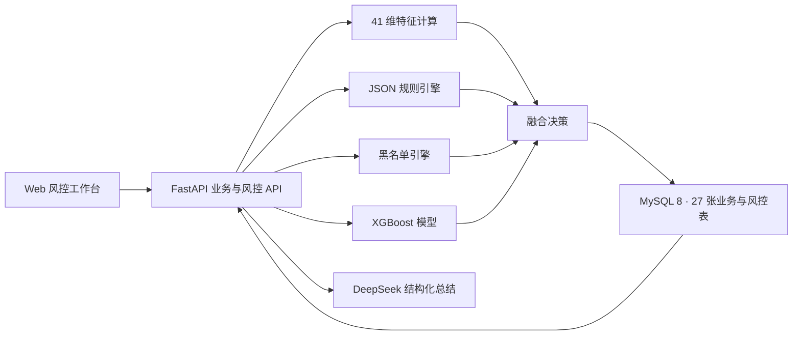

# Risk Payment · 跨境收款风控系统

面向跨境收款、贸易真实性审核、换汇与出款链路的可运行风控演示项目。系统以 Python 为主要语言，将业务数据、JSON 规则、黑名单和 XGBoost 模型统一到一条可解释、可回溯的实时决策链路中。

> 声明：项目中的商户、交易、账户、规则命中和模型标签均为合成数据，不包含 PingPong 客户或生产数据；评估结果仅用于技术验证。

## 核心能力

- **风险总览**：展示入账规模、风险分布、案件积压、黑名单与模型指标。
- **实时风险检查**：支持入账和出款事件的规则命中、模型打分、黑名单一票否决与决策落库。
- **跨境业务规则**：36 条规则覆盖主体准入、入账、换汇、出款与退款阶段。
- **贸易真实性审核**：联动贸易订单、单据、付款人、店铺和虚拟账户，识别三方付款、单据复用、金额错配等风险。
- **黑名单管理**：支持主体、银行账户、设备、IP 和地址等对象的增加、查询、软删除和决策拦截。
- **案件调查与审计**：保存风险事件、特征快照、规则依据、决策结果和案件关联实体。
- **AI 风控助手**：先在本地检索 MySQL 证据，再由 DeepSeek 生成结构化总结；外部服务不可用时自动回退到本地分析。

## 系统架构



入账决策默认将规则分与模型分按 `55% / 45%` 融合。黑名单或一票否决规则优先执行，决策结果为 `PASS`、`MANUAL_REVIEW` 或 `REJECT`。

## 数据与特征

| 领域 | 主要数据表 |
| --- | --- |
| 合作方与客户 | `partners`, `customers`, `persons`, `customer_person_roles` |
| 账号与设备 | `devices`, `auth_events` |
| 店铺与收款账户 | `stores`, `virtual_accounts`, `store_virtual_account_links` |
| 交易对手 | `counterparties`, `bank_accounts` |
| 贸易真实性 | `trade_orders`, `trade_documents`, `inbound_order_allocations` |
| 跨境收款 | `inbound_payments`, `inbound_audits` |
| 资金链路 | `ledger_accounts`, `ledger_entries`, `fx_orders`, `payouts` |
| 风控与调查 | `risk_rules`, `risk_blacklist`, `risk_events`, `risk_decisions`, `risk_cases`, `case_entities` |
| 关系图谱 | `entity_relations` |

默认造数包含 80 个客户、300 个交易对手、600 笔贸易订单和 800 笔跨境入账。入账模型使用 41 维 point-in-time 特征，覆盖付款人、贸易真实性、行为速度、关联图谱和账号安全。

完整字段映射与规则说明见 [`docs/跨境收款字段映射与规则说明.md`](docs/%E8%B7%A8%E5%A2%83%E6%94%B6%E6%AC%BE%E5%AD%97%E6%AE%B5%E6%98%A0%E5%B0%84%E4%B8%8E%E8%A7%84%E5%88%99%E8%AF%B4%E6%98%8E.md)。

## 技术栈

- Python 3.12、FastAPI、Pydantic Settings
- SQLAlchemy 2.0、PyMySQL、MySQL 8
- XGBoost、scikit-learn、pandas、NumPy
- Jinja2、Bootstrap 5、Chart.js、Phosphor Icons
- DeepSeek Chat Completion API
- pytest、Docker

## 快速开始

### 1. 安装依赖

```bash
python3 -m venv .venv
.venv/bin/python -m pip install -r requirements.txt
npm ci
```

### 2. 准备 MySQL

默认连接 `127.0.0.1:9999` 的 MySQL 8，数据库名为 `pingpong`。先复制环境变量模板：

```bash
cp .env.example .env
```

编辑 `.env` 中的 `PINGPONG_DB_PASSWORD`，然后初始化数据：

```bash
.venv/bin/python seed_data.py --host 127.0.0.1 --port 9999 --reset
```

> `--reset` 会删除并重建本项目的数据表，仅在确认不需要保留现有演示数据时使用。

### 3. 训练模型

```bash
.venv/bin/python scripts/train_xgboost.py
```

训练产物保存到 `artifacts/`，包含 XGBoost 模型、数据划分清单和可机读评估指标。

### 4. 配置 AI 助手（可选）

在 `.env` 中配置：

```dotenv
DEEPSEEK_API_KEY=replace_with_your_key
DEEPSEEK_BASE_URL=https://api.deepseek.com
DEEPSEEK_MODEL=deepseek-v4-flash
DEEPSEEK_TIMEOUT_SECONDS=45
```

不配置 API Key 时，AI 助手会使用本地证据分析模式。`.env` 已被 Git 忽略，请不要将真实密钥写入代码或提交记录。

### 5. 启动服务

```bash
.venv/bin/python run_app.py
```

| 入口 | 地址 |
| --- | --- |
| 风控工作台 | <http://127.0.0.1:8000/> |
| 风险检查 | <http://127.0.0.1:8000/risk-check> |
| AI 助手 | <http://127.0.0.1:8000/assistant> |
| 黑名单 | <http://127.0.0.1:8000/blacklist> |
| OpenAPI | <http://127.0.0.1:8000/docs> |
| 健康检查 | <http://127.0.0.1:8000/api/health> |

## 模型评估

数据按时间顺序划分为 70% 训练集、15% 阈值校准集和 15% 未参与调参的验证集。当前合成样本结果：

| 指标 | 结果 |
| --- | ---: |
| 数据集 | 669 |
| 特征数 | 41 |
| `val_auc` | 0.773092 |
| `val_f1` | 0.533333 |
| `val_precision` | 0.666667 |
| `val_recall` | 0.444444 |
| 决策阈值 | 0.375 |

标签由合成的 `REJECTED / REFUNDED` 结果弱监督构造，不是已确认的真实欺诈标签。生产上线前必须重新定义观察窗、成熟窗、标签回流和成本矩阵。

## 测试

```bash
.venv/bin/pytest -q
.venv/bin/python generate_ddl.py
```

## 目录结构

```text
app/                    FastAPI 应用、风控服务、模型加载与 Web 界面
artifacts/              XGBoost 模型与评估产物
docs/                   跨境收款字段映射与规则说明
rules/                  JSON 规则初始化源
scripts/                模型训练、规则和黑名单同步脚本
tests/                  API、规则、模型产物与新功能测试
models.py               SQLAlchemy 2.0 模型
schema.sql              MySQL 8 DDL
seed_data.py            可重放的合成数据脚本
feature_queries.sql     风控特征 SQL 示例
```

## 许可说明

本项目当前用于内部研究和技术演示，未附带开源许可证。
