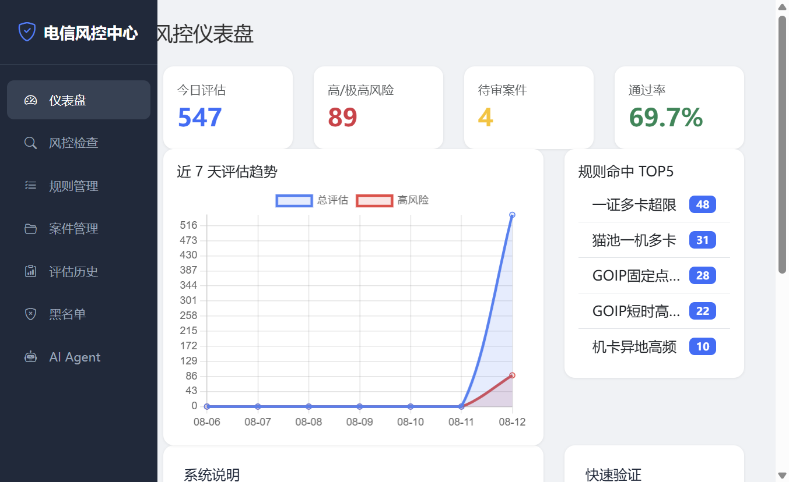
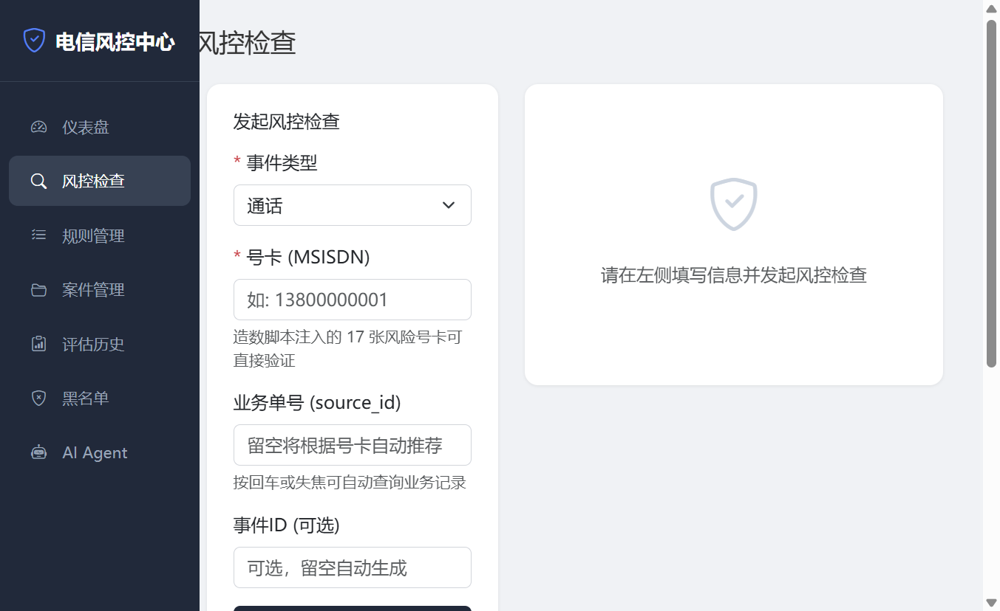
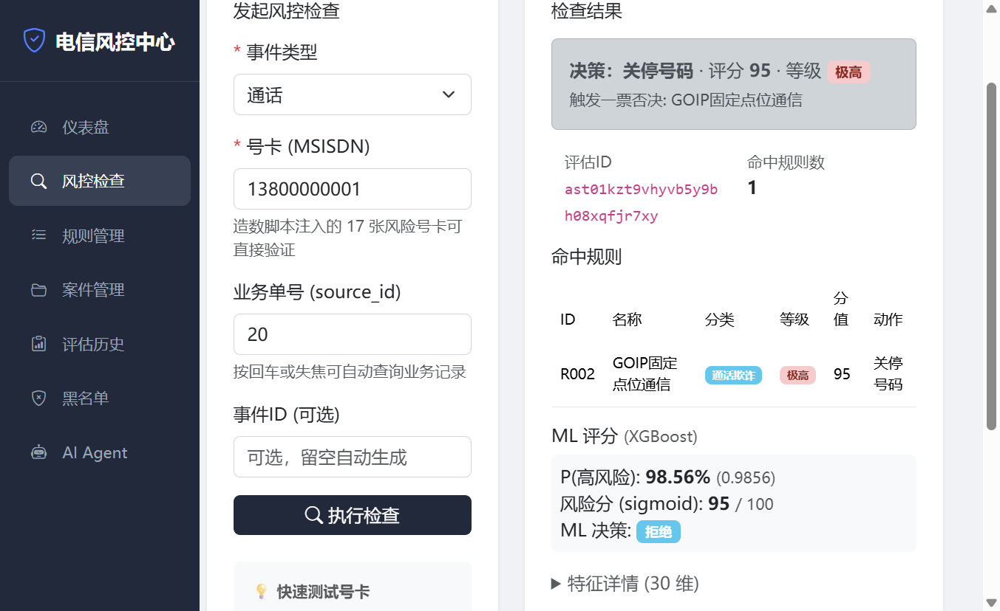
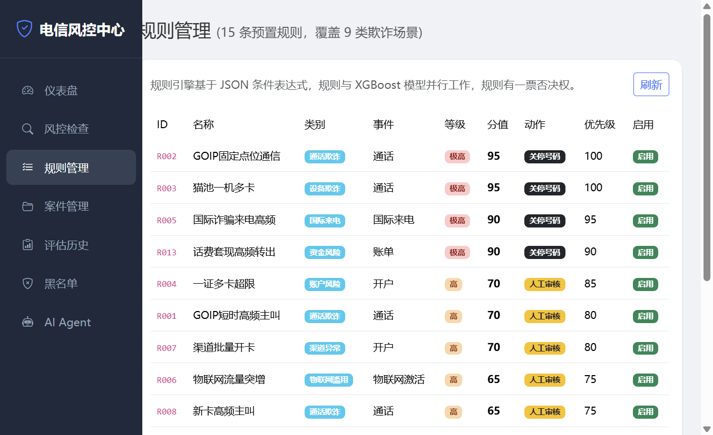
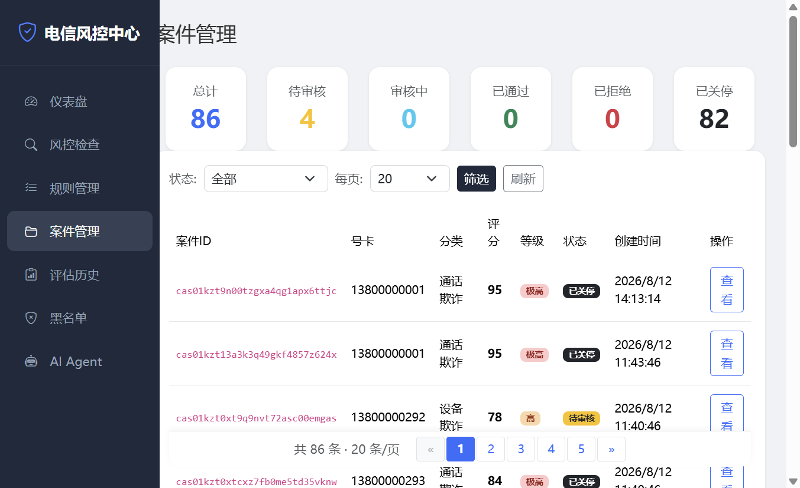
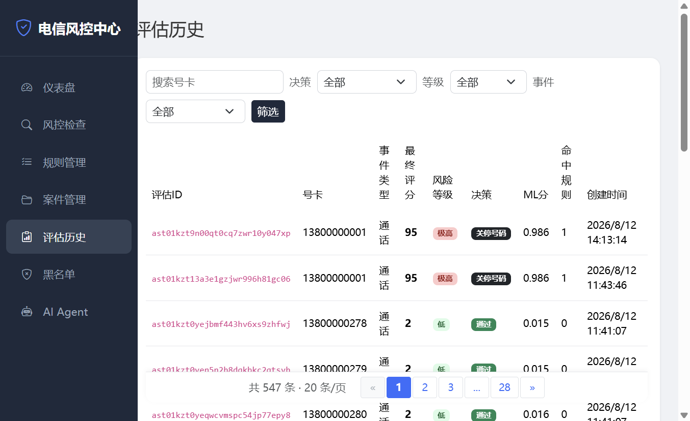
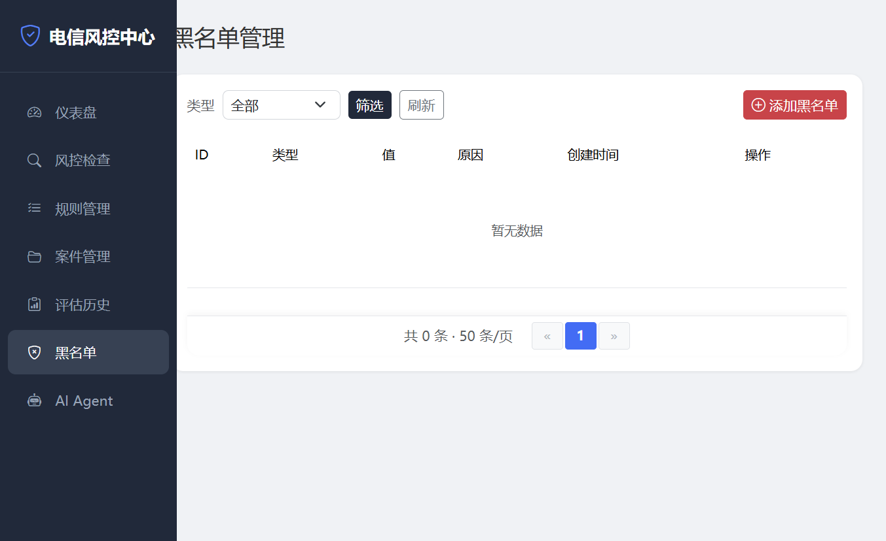
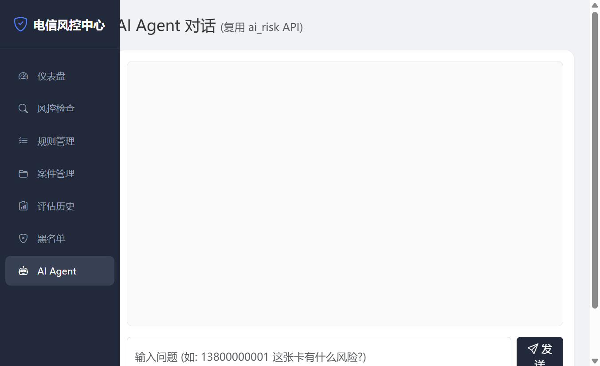

# 电信风控系统 - 一条龙演示指南

> 从建库到启动服务，5 步全流程演示（\~5 分钟）

***

## 一、环境准备

### 前置条件

- Python 3.12+
- MySQL 8.0+（默认 root\@localhost:3306，密码 `123321`）
- uv 虚拟环境已创建

### 安装依赖

```bash
cd tele-risk
uv sync
```

***

## 二、一条龙命令（⭐ 最快方式）

```bash
python scripts/one_command.py
```

自动完成 5 步：

| 步骤 | 脚本                    | 说明                              | 耗时    |
| -- | --------------------- | ------------------------------- | ----- |
| 1  | `init_db.py --yes`    | 建库建表（24 张表 + 15 条规则）            | \~5s  |
| 2  | `gen_telecom_data.py` | 造数（299 张号卡，6493 条业务数据）          | \~10s |
| 3  | `train_xgb_model.py`  | 训练 XGBoost（30 维特征，val\_auc=1.0） | \~10s |
| 4  | `batch_risk_check.py` | 批量风控检查（299 次评估）                 | \~60s |
| 5  | `run_app.py`          | 启动 Web 服务（端口 8001）              | 持续运行  |

### 可选参数

```bash
python scripts/one_command.py --skip-init      # 跳过建库+造数
python scripts/one_command.py --skip-train     # 跳过训练
python scripts/one_command.py --skip-batch     # 跳过批量检查
python scripts/one_command.py --skip-server    # 不启服务
```

***

## 三、分步演示

### 第 1 步：建库建表

```bash
python scripts/init_db.py --yes
```

**输出**：

```
============================================================
电信风控系统 - 建库建表
  MySQL: root@localhost:3306
============================================================
  处理 init_telecom_tables.sql: 35 条语句
  处理 init_risk_tables.sql: 11 条语句
[OK] 执行完成 (44 条 DDL)
[OK] telecom 库现有 24 张表
```

**24 张表清单**：

| 类别     | 表名                             | 说明        |
| ------ | ------------------------------ | --------- |
| 业务     | telecom\_card                  | 号卡表       |
| <br /> | telecom\_customer              | 客户表       |
| <br /> | telecom\_cdr                   | 通话记录（CDR） |
| <br /> | telecom\_sms                   | 短信记录      |
| <br /> | telecom\_data\_usage           | 流量使用      |
| <br /> | telecom\_device                | 设备指纹      |
| <br /> | telecom\_channel               | 渠道表       |
| <br /> | telecom\_service\_order        | 业务办理单     |
| <br /> | telecom\_iot\_card             | 物联网卡      |
| <br /> | telecom\_plan                  | 套餐表       |
| <br /> | telecom\_cell                  | 基站表       |
| <br /> | telecom\_region                | 地区表       |
| <br /> | telecom\_billing\_record       | 话费账单 ⭐    |
| <br /> | telecom\_group\_customer       | 集团客户 ⭐    |
| <br /> | telecom\_card\_device\_binding | 号卡-设备绑定   |
| 风控     | telecom\_risk\_rule            | 15 条规则    |
| <br /> | telecom\_risk\_event           | 事件记录      |
| <br /> | telecom\_risk\_feature         | 特征快照      |
| <br /> | telecom\_risk\_assessment      | 评估结果      |
| <br /> | telecom\_risk\_case            | 风险案件      |
| <br /> | telecom\_risk\_blacklist       | 黑名单       |
| <br /> | telecom\_card\_profile         | 号卡画像      |
| <br /> | telecom\_risk\_action\_log     | 操作日志 ⭐    |
| <br /> | telecom\_risk\_alert           | 告警记录 ⭐    |

***

### 第 2 步：造业务数据

```bash
python scripts/gen_telecom_data.py
```

**输出**：

```
============================================================
电信风控系统 - 业务数据造数
============================================================
[0/2] 清空旧数据...
[1/2] 生成数据...
[2/2] 写入数据库...
  telecom_card                     299 条
  telecom_cdr                    1936 条
  telecom_sms                     452 条
  telecom_data_usage             2093 条
  telecom_billing_record          1185 条
  ...
[OK] 造数完成, 共 6493 条业务数据
  号卡总数: 299 张 (风险 60 + 正常 239)
```

**风险样本分布**：

| 号段               | 数量  | 欺诈类型      |
| ---------------- | --- | --------- |
| 13800000001-008  | 8   | GOIP 虚拟拨号 |
| 13800000009-018  | 10  | 猫池养卡      |
| 13800000019-028  | 10  | 一证多卡      |
| 13800000029-035  | 7   | 国际诈骗来电    |
| 13800000036-050  | 15  | 物联网滥用     |
| 13800000290-294  | 5   | 集团子号异常    |
| 13800000295-299  | 5   | 话费套现      |
| 13800000051-0289 | 239 | 正常卡       |

***

### 第 3 步：训练 XGBoost

```bash
python scripts/train_xgb_model.py
```

**输出**：

```
============================================================
电信风控 XGBoost 训练 (对齐 ai_risk 范式)
============================================================
  风险样本: idx 1-50 + 290-299 (共 60 张)
  原始样本: n=299, pos=60 (20.1%), neg=239
  训练参数: num_boost_round=200, early_stopping_rounds=10

[验证集] n=60, val_auc=1.0000, val_f1=1.0000 (阈值=0.15)
[质量检查] ✓ 通过 (无假收敛迹象)

[特征重要性 TOP 7] (XGBoost gain)
  1. cust_risk_tag_high_flag           72.3   51.4%
  2. dev_cards_on_imei                 37.0   26.3%
  3. cust_open_channel_count           22.4   15.9%
  4. card_age_days                      3.4    2.4%
  5. cdr_avg_duration_sec               2.8    2.0%
  6. cust_card_count                    2.7    1.9%
  7. channel_is_agent_flag             0.1    0.1%
```

**30 维特征清单**：

| 特征族    | 特征名                              | 说明         |
| ------ | -------------------------------- | ---------- |
| 号卡(5)  | card\_age\_days                  | 号卡龄（天）     |
| <br /> | card\_is\_iot                    | 是否物联网卡     |
| <br /> | card\_intl\_enabled              | 是否开通国际     |
| <br /> | card\_roam\_type\_code           | 漫游类型编码     |
| <br /> | card\_status\_normal             | 状态是否正常     |
| 客户(5)  | cust\_card\_count                | 客户名下卡数     |
| <br /> | cust\_id\_multi\_card\_flag      | 一证多卡标记     |
| <br /> | cust\_face\_verify\_passed       | 是否实名通过     |
| <br /> | cust\_risk\_tag\_high\_flag      | 高风险标签      |
| <br /> | cust\_open\_channel\_count       | 办理渠道数      |
| 通信(9)  | cdr\_out\_count\_1h              | 1h 主叫次数    |
| <br /> | cdr\_out\_count\_24h             | 24h 主叫次数   |
| <br /> | cdr\_in\_count\_24h              | 24h 被叫次数   |
| <br /> | cdr\_distinct\_cell\_1h          | 1h 不同基站数   |
| <br /> | cdr\_short\_call\_ratio          | 短通话占比      |
| <br /> | cdr\_intl\_incoming\_24h         | 24h 国际来电   |
| <br /> | cdr\_night\_call\_ratio          | 夜间通话占比     |
| <br /> | cdr\_avg\_duration\_sec          | 平均通话时长     |
| <br /> | cdr\_night\_call\_count          | 凌晨 1h 主叫次数 |
| 设备(3)  | dev\_cards\_on\_imei             | IMEI 关联卡数  |
| <br /> | dev\_card\_imei\_mismatch\_flag  | 机卡分离标记     |
| <br /> | dev\_binding\_changes\_30d       | 30d 绑定变更次数 |
| 渠道(2)  | channel\_open\_count\_1h         | 1h 开卡数     |
| <br /> | channel\_is\_agent\_flag         | 是否代理商      |
| 物联网(2) | iot\_data\_burst\_ratio          | 流量突增比      |
| <br /> | iot\_card\_device\_unbound\_flag | 机卡分离标记     |
| 账单(2)  | bill\_recharge\_count\_1h        | 1h 充值次数    |
| <br /> | bill\_outflow\_ratio             | 转出金额占比     |
| 集团(2)  | grp\_sub\_count                  | 集团子号数      |
| <br /> | grp\_sub\_abnormal\_flag         | 子号异常标记     |

***

### 第 4 步：批量风控检查

```bash
python scripts/batch_risk_check.py
```

**输出**：

```
共 299 张号卡
  风险号卡: 60
  正常号卡: 239

将对 299 张号卡跑风控检查
============================================================
  [  1] 13800000001 | 通话       | score= 95 | 关停号码     | hit=['R002']
  [  2] 13800000002 | 通话       | score= 96 | 关停号码     | hit=['R002', 'R001']
  ...
  [ 299] 13800000289 | 通话       | score=  2 | 通过       | no_hit

============================================================
[完成] 风控检查统计:
  通过: 239
  标记: 20
  人工审核: 4
  关停号码: 36
  总计: 299 次评估, 0 次错误
```

**决策分布**：

```
通过 (239)  ████████████████████████████████████  80.0%
标记  (20)  ██                                    6.7%
人工  ( 4)  █                                     1.3%
关停  (36)  ████                                  12.0%
```

***

### 第 5 步：启动 Web 服务

```bash
python run_app.py
```

访问 `http://localhost:8001`

**仪表盘**：



仪表盘展示系统核心指标，采用统计卡片 + 趋势图 + 规则排行布局：

- **统计卡片**（顶部一排）：今日评估数、高/极高风险数、待审案件数、通过率
- **近 7 天评估趋势**（左侧折线图）：Chart.js 动态渲染每日评估量与高风险量
- **规则命中 TOP5**（右侧列表）：按命中次数降序展示最活跃的规则
- **系统说明 + 快速验证**：底部卡片列出 9 类欺诈场景和风险号卡速查

***

## 四、前端页面演示

### 4.1 风控检查



左侧表单支持事件类型选择、号卡输入、业务单号自动推荐（失焦后自动查询对应业务记录填充 source_id），底部附快速测试号卡速查表。

**快速验证卡**：

| 号卡          | 事件类型  | 预期命中              | 决策   |
| ----------- | ----- | ----------------- | ---- |
| 13800000001 | 通话    | R002 (固定点位高频)     | 关停号码 |
| 13800000002 | 通话    | R001+R002 (短时+固定) | 关停号码 |
| 13800000009 | 通话    | R003 (一机多卡)       | 关停号码 |
| 13800000019 | 开户    | R004 (一证多卡)       | 人工审核 |
| 13800000029 | 国际来电  | R005 (国际诈骗)       | 关停号码 |
| 13800000036 | 物联网激活 | R006 (流量突增)       | 人工审核 |
| 13800000295 | 通话    | R013 (话费套现)       | 关停号码 |
| 13800000290 | 通话    | R014 (集团异常)       | 人工审核 |
| 13800000051 | 通话    | 无规则命中             | 通过   |

**风控检查结果**：



展示完整的风控评估结果：

- **决策 Alert**：彩色告警条显示最终决策（通过/标记/人工审核/拒绝/关停号码）、评分、风险等级
- **命中规则表格**：规则 ID、名称、分类、等级、分值、动作
- **ML 评分块**：XGBoost 预测 P(高风险) 概率、sigmoid 校准风险分、ML 决策
- **特征详情折叠面板**：30 维特征值 JSON（可展开/收起）

### 4.2 规则管理



15 条规则分 5 类展示：

- **通话欺诈**：R001-R002, R015
- **设备风险**：R003, R011
- **账户风险**：R004, R014
- **资金风险**：R005, R013
- **物联网风险**：R006
- **渠道风险**：R007

每条规则展示：ID、名称、类型、风险等级、触发条件表达式、建议处置。

### 4.3 案件管理



顶部统计卡片展示各状态案件数量，下方表格展示案件列表，底部粘底分页栏支持翻页：

- 案件编号、号卡、客户、风险等级
- 命中规则、触发时间
- 审核状态（待审核/已审核/已关闭）
- 点击详情可弹出模态框进行审核操作（标记/通过/关停）

### 4.4 评估历史



全部风控评估记录，支持按决策类型筛选和分页浏览：

- 评估 ID、号卡、事件类型、最终评分
- 风险等级徽章（低/中/高/极高，色标区分）
- 决策结果、命中规则数
- 底部粘底分页栏

### 4.5 黑名单



4 类黑名单：

- **号卡黑名单**：欺诈号码库
- **客户黑名单**：高风险客户
- **设备黑名单**：GOIP/猫池 IMEI
- **渠道黑名单**：违规代理商

### 4.6 AI Agent



LLM 辅助风控分析：

- 自动分析号卡风险画像
- 生成处置建议
- 解释规则命中原因
- 提供监管合规说明

***

## 五、API 冒烟测试

### 50 条请求测试

```bash
python scripts/smoke_test.py
```

**输出**：

```
============================================================
电信风控 API 冒烟测试 (50 条请求)
============================================================
[1] /health          status=ok service=tele-risk
[2] /api/rules       total=15 (期望 15)
[3] 跑 50 次 /api/risk/check ...
  [ 1] 13800000001 | 通话   | score= 95 | 关停号码 | hit=['R002']
  ...
  [50] 13800000060 | 通话   | score=  2 | 通过     | no_hit
============================================================
[完成] 总计 50 条 | 通过=50 | 失败=0 | 异常=0
[决策分布] 关停号码=25 标记=15 人工审核=5 通过=5
[规则命中统计] R002=10 R003=10 R004=10 R005=7 R006=15 R013=5
[全部通过] 50 条请求覆盖 7 类风险 + 正常卡 ✓
```

### API 端点清单

| 方法   | 路径                           | 说明       |
| ---- | ---------------------------- | -------- |
| GET  | `/health`                    | 健康检查     |
| GET  | `/api/rules`                 | 规则列表     |
| POST | `/api/risk/check`            | ⭐ 风控检查核心 |
| GET  | `/api/assessments`           | 评估历史     |
| GET  | `/api/cases`                 | 案件列表     |
| POST | `/api/cases/{id}/review`     | 案件审核     |
| GET  | `/api/blacklist`             | 黑名单      |
| POST | `/api/blacklist/add`         | 添加黑名单    |
| GET  | `/api/card/{msisdn}/profile` | 号卡画像     |

***

## 六、规则讲解

### 规则引擎设计

每条规则采用 JSON 条件表达式：

```json
{
  "and": [
    {"field": "cdr_out_count_1h", "op": ">=", "value": 15},
    {"field": "cdr_distinct_cell_1h", "op": "<=", "value": 2}
  ]
}
```

支持的操作符：`>=`, `<=`, `>`, `<`, `==`, `!=`

### 决策融合流程

```
1. 规则引擎: 逐条匹配 15 条规则 → 命中列表
2. ML 模型: XGBoost 预测风险概率 (0-1)
3. 决策融合:
   - 规则直接命中 → 取最高等级决策
   - ML 概率 > 0.8 → 至少标记
   - 规则 + ML 加权 → 最终评分
4. 决策输出: 通过 / 标记 / 人工审核 / 关停号码
```

### 15 条规则详解

| ID   | 名称       | 条件                   | 等级 | 决策   | 监管依据    |
| ---- | -------- | -------------------- | -- | ---- | ------- |
| R001 | 短时高频主叫   | 1h 主叫≥15             | 极高 | 关停号码 | 反诈法第14条 |
| R002 | 固定点位高频   | 1h 不同基站≤2 + 1h 主叫≥10 | 极高 | 关停号码 | 反诈法第14条 |
| R003 | 一机多卡     | IMEI 关联卡数≥5          | 极高 | 关停号码 | 反诈法第12条 |
| R004 | 一证多卡     | 客户名下卡数>5             | 高  | 人工审核 | 反诈法第10条 |
| R005 | 国际诈骗来电   | 24h 国际来电≥5           | 极高 | 关停号码 | 反诈法第16条 |
| R006 | 物联网滥用    | 流量突增比≥10 + 机卡分离      | 高  | 人工审核 | 反诈法第12条 |
| R007 | 渠道批量开卡   | 1h 开卡≥3 + 代理商        | 极高 | 关停号码 | 反诈法第9条  |
| R011 | MAC 频繁换卡 | 30d 绑定变更≥5           | 中  | 标记   | —       |
| R013 | 话费套现     | 1h 充值≥3 + 转出占比≥50%   | 极高 | 关停号码 | 反诈法第14条 |
| R014 | 集团子号异常   | 集团子号≥8 + 高频外呼        | 高  | 人工审核 | —       |
| R015 | 凌晨密集呼叫   | 凌晨 1h 主叫≥15          | 高  | 人工审核 | —       |

***

## 七、常见问题

### Q: 数据量不够怎么办？

A: 当前 299 张号卡已能跑通全流程。生产环境建议积累 1000+ 张号卡数据以提升模型泛化能力。

### Q: 如何添加新的规则？

A: 在 `sql/init_risk_tables.sql` 中插入新规则 SQL，条件表达式采用 JSON 格式。规则引擎支持 `and`/`or` 嵌套。

### Q: 如何添加新的特征？

A: 3 步：

1. 在 `feature.py` 新增 `compute_*_features` 函数
2. 在 `ml_model.py` 的 `FEATURE_COLUMNS` 添加特征名
3. 在 `train_xgb_model.py` 的特征计算函数中添加对应逻辑

### Q: 模型过拟合怎么办？

A: 当前数据量下 val\_auc=1.0 属于正常（特征区分度高）。如果后续模型在生产环境表现下降，可以：

- 增加训练数据量
- 增加正则化（max\_depth, min\_child\_weight）
- 使用特征选择减少维度

### Q: 如何对接实时 CDR 流？

A: 可通过 Kafka/NATS 订阅 CDR 消息，逐条调用 `process_event` 接口。当前架构已支持高并发异步处理。

***

## 八、技术栈

| 组件     | 技术                        |
| ------ | ------------------------- |
| 后端框架   | FastAPI (异步)              |
| ORM    | SQLAlchemy 2.0 (aiomysql) |
| 机器学习   | XGBoost 2.0               |
| 前端     | Jinja2 + Bootstrap 5 + Chart.js |
| 数据库    | MySQL 8.0                 |
| Python | 3.12                      |
| 包管理    | uv                        |

***

## 九、快速卡片速查

### 风险号卡（60 张）

```
GOIP 虚拟拨号:  13800000001 ~ 13800000008
猫池养卡:      13800000009 ~ 13800000018
一证多卡:      13800000019 ~ 13800000028
国际诈骗:      13800000029 ~ 13800000035
物联网滥用:    13800000036 ~ 13800000050
集团异常:      13800000290 ~ 13800000294
话费套现:      13800000295 ~ 13800000299
```

### 正常号卡（239 张）

```
13800000051 ~ 13800000289
```

