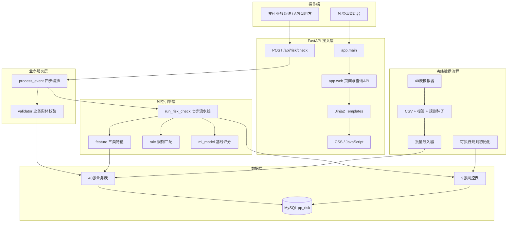
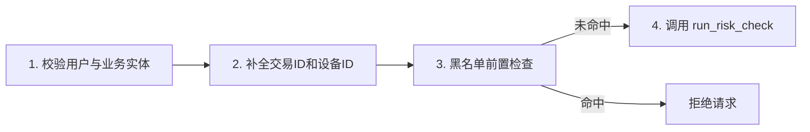
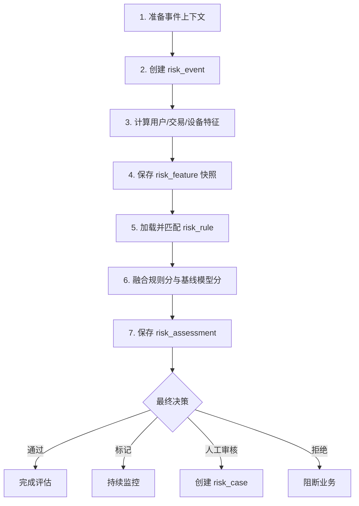
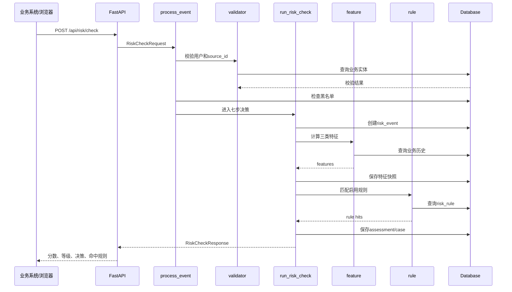
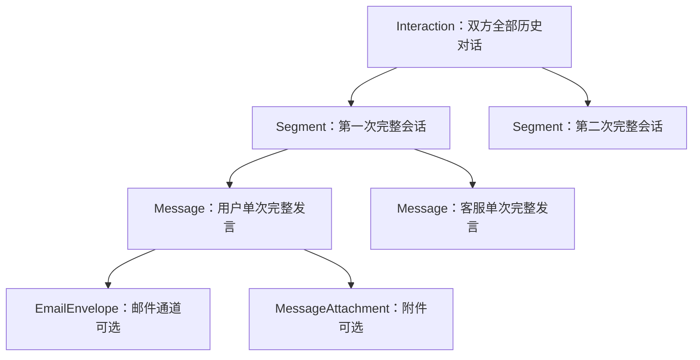
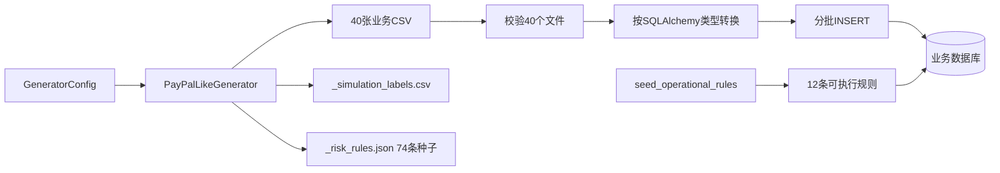

# PP_Risk

PP_Risk 是一个面向全球跨境数字钱包与支付平台的风险控制项目，业务形态参考 PayPal / 支付宝，覆盖个人账户、商户账户、多币种钱包、用户间转账、商户支付、跨境转账、充值提现、换汇、退款拒付，以及用户与客服之间的 Chat / Email 交互。

系统当前聚焦四类风险目标：

- AML/CFT：分拆交易、快速进出、资金归集、循环转账、高风险国家走廊；
- 支付与账户欺诈：盗卡、账户接管、设备农场、新设备大额交易；
- 非法主体识别：KYC/KYB异常、制裁名单、PEP、内部黑名单；
- 运营审核：将需要进一步判断的风险事件自动送入人工审核案件。

> 当前仓库是可运行的生产架构基线，不是已经满足某一国家全部监管要求的成品。国家能力、名单来源、阈值、数据保留和监管规则必须在真实部署前由法务、合规和模型风险管理团队审批。

## 1. 当前能力

| 能力 | 当前状态 | 说明 |
|---|---|---|
| 业务数据模型 | 已实现 | 40张跨境支付业务表 |
| 风控核心模型 | 已实现 | 9张通用风控表 |
| 实时风险入口 | 已实现 | `POST /api/risk/check` |
| 事件编排 | 已实现 | `process_event` 固定四步 |
| 决策流水线 | 已实现 | `run_risk_check` 固定七步 |
| 特征工程 | 基线实现 | 用户、交易、设备三类首批特征 |
| 规则引擎 | 已实现 | JSON单条件规则和12条可执行规则 |
| ML评分 | 基线实现 | 确定性基线评分，尚未接模型注册中心 |
| 人工审核 | 基线实现 | 高风险事件自动创建 `risk_case` |
| 管理后台 | 已实现 | 总览、交易、案件、风险检查、客服交互 |
| 数据模拟 | 已实现 | 40表CSV、风险标签、74条扩展规则种子 |
| 数据导入 | 已实现 | 类型转换、分批写入、空表幂等导入 |
| 监管申报 | 不在范围 | 当前只进入人工审核，不生成STR/SAR |

## 2. 技术栈

| 层级 | 技术 |
|---|---|
| API与Web | FastAPI、Starlette、Jinja2 |
| ORM | SQLAlchemy 2.x AsyncSession |
| 业务与演示数据库 | MySQL + aiomysql（与 AI_Risk 使用相同连接参数，独立 `pp_risk` 库） |
| 自动化测试数据库 | SQLite + aiosqlite（测试隔离，不写 MySQL） |
| 配置 | Pydantic Settings、`.env` |
| 前端 | Jinja2、原生CSS、原生JavaScript |
| 测试 | pytest、pytest-asyncio、HTTP TestClient |
| 数据生成 | Python标准库、流式CSV输出 |

运行环境要求：Python 3.12 或更高版本。

## 3. 整体架构



### 架构边界

1. 页面查询不能绕过数据库直接读取生成CSV；CSV只属于离线数据准备过程。
2. 业务校验由 `app/service` 负责，风险评分由 `app/engine` 负责。
3. `process_event` 只编排四个固定阶段，不在函数里堆积行业计算。
4. `run_risk_check` 只串联七步决策流程，具体特征与规则分别维护。
5. 模拟标签只写入 `_simulation_labels.csv`，不进入线上业务表和特征，避免标签泄漏。

## 4. 核心风险检查流程

### 4.1 `process_event` 四步



对应代码：`app/service/event.py`。

### 4.2 `run_risk_check` 七步



对应代码：`app/engine/decision.py`。

### 4.3 请求时序



## 5. 数据模型

数据库共注册49张应用表：40张行业业务表和9张风控核心表。

### 5.1 40张业务表

| 业务域 | 表 | 功能 |
|---|---|---|
| 用户与KYC | `user_info` | 全球个人用户主体 |
|  | `user_profile` | 职业、收入、资金来源和预期交易画像 |
|  | `user_identity_document` | 护照、身份证等证件 |
|  | `user_kyc_review` | 人脸、活体和身份一致性审核 |
|  | `user_address` | 居住地址、账单地址 |
|  | `user_contact_point` | 邮箱和手机号 |
|  | `user_consent` | 隐私和数据处理授权 |
| 商户与KYB | `merchant_info` | 全球商户主体和MCC |
|  | `merchant_beneficial_owner` | 最终受益所有人 |
|  | `merchant_kyb_review` | 企业和经营资质审核 |
|  | `merchant_store` | 网站、App、POS、QR门店 |
|  | `merchant_settlement_account` | 商户结算账户 |
|  | `merchant_risk_profile` | 拒付率、退款率和行业画像 |
| 钱包与账本 | `wallet_account` | 用户或商户钱包账户 |
|  | `wallet_balance` | 多法币/数字资产余额 |
|  | `funding_instrument` | 银行卡、银行账户等资金工具 |
|  | `bank_account` | 银行账户和IBAN类信息 |
|  | `account_limit` | 日/月交易限额 |
|  | `ledger_entry` | 双边账本明细 |
| 交易 | `payment_transaction` | 所有资金交易的统一主表 |
|  | `user_transfer` | 用户与用户转账 |
|  | `merchant_payment` | 用户向商户支付 |
|  | `cross_border_transfer` | 跨境资金流转 |
|  | `transaction_party` | 付款、收款、中间及受益方 |
|  | `transaction_status_history` | 交易状态变化 |
|  | `fx_conversion` | 换汇报价和点差 |
|  | `refund` | 退款 |
|  | `chargeback` | 拒付和支付争议 |
|  | `cash_movement` | 充值与提现 |
| 设备网络 | `device_info` | 设备指纹、Root和模拟器 |
|  | `user_device` | 用户与设备关系 |
|  | `login_event` | 登录行为和结果 |
|  | `network_observation` | IP、ASN、VPN、代理和Tor |
| 客服通信 | `interaction` | 用户与客服之间全部历史关系 |
|  | `conversation_segment` | 某一次完整Chat或Email会话 |
|  | `message` | 某一方的一次完整发言 |
|  | `email_envelope` | 邮件发件、收件和线程头信息 |
|  | `message_attachment` | 附件安全扫描和提取文本 |
| 合规配置 | `screening_result` | 制裁、PEP和名单筛查结果 |
|  | `country_risk_profile` | 国家能力与AML/欺诈风险配置 |

客服数据层级固定为：



### 5.2 9张风控核心表

| 表 | 职责 |
|---|---|
| `risk_rule` | 规则定义、条件、分数和动作 |
| `risk_event` | 每次进入风控的事件快照 |
| `risk_feature` | 事件发生时不可变的特征快照 |
| `risk_assessment` | 最终评分、等级和决策 |
| `risk_case` | 人工审核案件 |
| `risk_blacklist` | 黑名单和有效期 |
| `risk_user_profile` | 用户聚合风险画像 |
| `risk_action_log` | 操作审计日志 |
| `risk_alert` | 风险告警 |

## 6. 模块功能

### 6.1 `app/`

| 文件 | 功能 |
|---|---|
| `app/main.py` | 创建FastAPI、挂载静态资源、注册页面路由和风险检查接口 |
| `app/config.py` | 加载数据库URL和决策阈值 |
| `app/database.py` | 异步引擎、Session和建表入口 |
| `app/models_business.py` | 40张业务表的集中式SQLAlchemy注册 |
| `app/models_risk.py` | 9张风控核心表 |
| `app/models.py` | ORM统一导出入口 |
| `app/schemas.py` | 风险请求、响应和规则命中DTO |
| `app/web.py` | 页面路由、仪表盘、交易、案件、交互查询API |

### 6.2 `app/service/`

| 文件 | 功能 |
|---|---|
| `validator.py` | 校验用户、交易和业务来源是否存在 |
| `event.py` | 四步事件入口、参数补全和黑名单前置检查 |

### 6.3 `app/engine/`

| 文件 | 功能 |
|---|---|
| `feature.py` | `compute_user_features`、`compute_order_features`、`compute_address_features` |
| `rule.py` | 加载启用规则并执行条件匹配 |
| `ml_model.py` | 当前确定性基线模型评分 |
| `decision.py` | 七步决策、评估落库和人工案件创建 |

### 6.4 `scripts/`

| 文件 | 功能 |
|---|---|
| `gen_paypal_business_data.py` | 流式生成40张CSV、模拟标签和74条扩展规则种子 |
| `load_simulated_data.py` | CSV类型转换、分批导入和空表幂等处理 |
| `seed_operational_rules.py` | 初始化12条与当前特征匹配的可执行规则 |
| `init_demo.py` | 生成、导入、规则初始化的一键编排 |

### 6.5 前端与测试

| 目录 | 功能 |
|---|---|
| `templates/` | 总览、交易、案件、风险检查和客服交互页面 |
| `static/` | 设计系统CSS和公共API JavaScript |
| `tests/` | 架构、40表生成、账本平衡、页面和导入器测试 |
| `docs/` | 跨境金融风控详细设计 |

## 7. 页面与API

### 7.1 页面

| 地址 | 页面 |
|---|---|
| `/` | 全球风险总览 |
| `/transactions` | 跨境交易监控 |
| `/cases` | 人工审核案件 |
| `/risk-check` | 实时风险检查 |
| `/interactions` | 客服交互监控 |
| `/docs` | OpenAPI / Swagger文档 |

### 7.2 API

| 方法 | 地址 | 功能 |
|---|---|---|
| `GET` | `/health` | 服务健康检查 |
| `POST` | `/api/risk/check` | 执行实时风险评估 |
| `GET` | `/api/dashboard/overview` | 仪表盘聚合数据 |
| `GET` | `/api/transactions` | 交易列表和类型筛选 |
| `GET` | `/api/cases` | 人工案件列表 |
| `GET` | `/api/interactions` | Interaction/Segment/Message聚合列表 |
| `GET` | `/api/rules/summary` | 规则数量摘要 |

风险检查请求示例：

```json
{
  "event_type": "支付",
  "source_id": "TXN000000000001",
  "user_id": "USR000000000001",
  "order_id": "TXN000000000001",
  "receive_id": "DEV000000000001",
  "event_data": {
    "business_event_type": "CROSS_BORDER_TRANSFER"
  }
}
```

技术事件槽位与金融业务事件的映射：

| 技术事件值 | 金融事件族 |
|---|---|
| `下单` | 注册、KYC、KYB、登录等账户准入事件 |
| `支付` | P2P、商户支付、跨境、充值、提现、换汇 |
| `售后申请` | 退款、拒付和争议 |
| `物流投诉` | AML、名单筛查和客服内容事件 |

具体金融事件写入 `event_data.business_event_type`。

## 8. 数据生成与导入流程



生成器特性：

- 固定随机种子，可重复生成；
- 交易相关表单次遍历、多文件流式写出；
- 双边账本每笔交易生成DEBIT/CREDIT两条记录；
- 支持正常、分拆、快速进出、账户接管、制裁命中等场景；
- 输出清单 `_manifest.json` 记录每张表行数；
- 输出目录默认不允许覆盖，必须显式使用 `--overwrite`。

## 9. Quick Start

以下命令适用于 Windows PowerShell。

### 9.1 进入项目

```powershell
cd F:\pyHome\PythonProject\PP_Risk
```

### 9.2 创建独立虚拟环境

如果 `.venv` 已存在，可以跳过创建步骤。

```powershell
python -m venv .venv
```

### 9.3 安装依赖

```powershell
.\.venv\Scripts\python.exe -m pip install -e ".[dev]"
```

### 9.4 准备配置

默认运行配置读取项目目录下的 `.env`，通过 `DB_HOST / DB_PORT / DB_USER / DB_PASSWORD / DB_NAME` 连接 MySQL。正式业务与模拟数据默认写入独立数据库 `pp_risk`。

如需创建本地配置：

```powershell
Copy-Item .env.example .env
```

默认 MySQL 配置：

```text
DB_HOST=127.0.0.1
DB_PORT=3306
DB_USER=root
DB_PASSWORD=change_me
DB_NAME=pp_risk
TEST_DB_NAME=pp_risk_test
```

仅自动化测试或临时排障需要 SQLite 时，可显式覆盖：

```text
DATABASE_URL=sqlite+aiosqlite:///./pp_risk.db
```

不要把真实数据库密码提交到Git。

### 9.5 初始化Demo数据

```powershell
.\.venv\Scripts\python.exe -m scripts.init_demo
```

该命令会：

1. 根据 `.env` 连接 MySQL，并创建不存在的 `pp_risk` 数据库；
2. 通过 SQLAlchemy 创建40张业务表和9张风控表；
3. 如果 `generated/paypal_dev` 不存在，生成40表CSV；
4. 将模拟业务数据分批写入 MySQL；
5. 初始化12条当前可执行规则；
6. 保留已有非空业务表，不自动删除数据。

### 9.6 启动服务

```powershell
.\.venv\Scripts\python.exe -m app.main
```

看到以下内容表示启动成功：

```text
Uvicorn running on http://127.0.0.1:8000
```

打开：

- 首页：http://127.0.0.1:8000/
- API文档：http://127.0.0.1:8000/docs
- 健康检查：http://127.0.0.1:8000/health

如果服务已经运行但页面没有更新，请按 `Ctrl+C` 停止后重新启动。当前启动命令没有开启热重载。

### 9.7 运行测试

```powershell
.\.venv\Scripts\python.exe -m pytest -q
```

测试配置已在 `pyproject.toml` 中统一：缓存写入 `.test-artifacts/pytest-cache/`，临时测试数据写入
`.test-artifacts/pytest-tmp/`，用于避免测试文件散落在项目根目录，并规避部分 Windows 环境下系统临时目录的权限问题。

当前验证基线：

```text
18 passed
首页 HTTP 200
Demo数据：100名用户、10个商户、1,000笔交易
```

## 10. 常用命令

### v0.4 智能客服与风控运营

- `/agent`：客户智能客服，可查询本人资料、交易、案件和客服历史；提交审核需要二次确认。
- `/cases`：案件详情、通过、拒绝、拒绝并加入用户黑名单。
- `/blacklist`：有效/失效用户黑名单查询、添加和软删除。
- `/`：实时风控折线图，支持1小时、6小时、24小时和7天窗口，每15秒刷新。

LLM配置位于 `.env`：

```text
LLM_ENABLED=true
LLM_PROVIDER=dashscope
LLM_MODEL_NAME=qwen-plus
LLM_BASE_URL=https://dashscope.aliyuncs.com/compatible-mode/v1
LLM_API_KEY=your_key
LLM_TEMPERATURE=0.1
LLM_TIMEOUT_SECONDS=60
LLM_MAX_TOOL_ROUNDS=8
AGENT_SESSION_TTL_MINUTES=60
```

兼容OpenAI-compatible服务。不要提交真实API Key。缺少Key或关闭 `LLM_ENABLED` 时，Agent页面显示未配置，其他风控功能仍可运行。

Agent客户写操作采用两步执行：首次工具调用只返回确认令牌，客户点击“确认执行”后才创建人工审核案件。Agent不能审核案件、管理黑名单或修改余额。

### 10.0 监控工作台

- `/transactions`：交易全字段筛选、分页、聚合详情和提交人工审核。
- `/interactions`：Interaction → Segment → Message三级客服历史，包含Email与附件详情和提交人工审核。

交易和客服页面的ID及时间均可点击查看详情。所有筛选在MySQL服务端执行，不只过滤当前页面。

自定义规模并随机生成一套数据：

```powershell
.\.venv\Scripts\python.exe -m scripts.gen_paypal_business_data `
  --users 10000 `
  --merchants 1000 `
  --transactions 100000 `
  --interactions 12000 `
  --segments 36000 `
  --messages 180000 `
  --email-ratio 0.20 `
  --attachment-ratio 0.15 `
  --random-seed `
  --output generated\paypal_random
```

`--random-seed` 会打印实际种子并写入 `_manifest.json`，便于复现。需要完全可复现时改用 `--seed 20260811`。

### 10.1 单独生成数据

```powershell
.\.venv\Scripts\python.exe -m scripts.gen_paypal_business_data `
  --users 10000 `
  --transactions 100000 `
  --risk-ratio 0.12 `
  --seed 20260811 `
  --output generated\paypal_demo
```

### 10.2 单独导入数据

```powershell
.\.venv\Scripts\python.exe -m scripts.load_simulated_data `
  --source generated\paypal_demo
```

### 10.3 初始化可执行规则

```powershell
.\.venv\Scripts\python.exe -m scripts.seed_operational_rules
```

### 10.4 清空并重建Demo业务数据

以下命令会删除40张业务表中的现有数据，只能在确认目标数据库后执行：

```powershell
.\.venv\Scripts\python.exe -m scripts.init_demo --replace --yes
```

### 10.5 健康检查

```powershell
Invoke-RestMethod http://127.0.0.1:8000/health
```

## 11. 项目目录

```text
PP_Risk/
├── app/
│   ├── engine/                 # 特征、规则、模型和七步决策
│   ├── service/                # 业务校验和四步事件入口
│   ├── config.py               # 环境配置
│   ├── database.py             # 数据库引擎和Session
│   ├── main.py                 # FastAPI入口
│   ├── models_business.py      # 40张业务表
│   ├── models_risk.py          # 9张风控表
│   ├── schemas.py              # API DTO
│   └── web.py                  # 页面与查询API
├── docs/
│   └── paypal_global_risk_design.md
├── scripts/
│   ├── gen_paypal_business_data.py
│   ├── load_simulated_data.py
│   ├── seed_operational_rules.py
│   └── init_demo.py
├── static/
│   ├── app.css
│   └── app.js
├── templates/
│   ├── base.html
│   ├── dashboard.html
│   ├── transactions.html
│   ├── cases.html
│   ├── risk_check.html
│   └── interactions.html
├── tests/
├── .env.example
├── pyproject.toml
└── README.md
```

## 12. 当前限制与生产化路线

### 已确认的当前限制

1. 当前只实现首批基线特征，尚未达到设计目标的96个正式特征。
2. `ml_model.py` 是确定性基线评分，不是已训练和版本化的生产模型。
3. 规则引擎当前主要支持单特征比较，尚未实现复杂时间窗口和关系图规则。
4. 人工案件已有自动创建和列表展示，但缺少领取、转派、四眼复核、冻结/解冻接口。
5. 业务表由集中式schema动态注册，正式MySQL部署前应固化Alembic迁移、外键和分区策略。
6. 页面当前用于风险运营演示，尚未接认证、RBAC、CSRF和细粒度审计。
7. 国家能力矩阵是模拟配置，不能作为真实PayPal市场许可清单。
8. 当前不生成或提交STR/SAR等监管报告。

### 推荐实施顺序

1. 数据库：Alembic迁移、外键、唯一约束、索引、账本并发一致性；
2. 安全：OIDC登录、RBAC、密钥管理、字段加密、审计不可抵赖；
3. 风控：96特征、时间窗口、图关系、规则版本和灰度发布；
4. 模型：特征版本、训练数据血缘、模型注册、回滚和漂移监控；
5. 案件：分配、SLA、证据、四眼复核、冻结和解冻；
6. 平台：Kafka事件、Redis实时窗口、任务队列和可观测性；
7. 合规：按实际经营司法辖区配置KYC/KYB、名单、数据保留和报告流程。

## 13. 延伸文档

更详细的业务表、风险场景、特征规划、规则规模和数据量设计见：

- `docs/paypal_global_risk_design.md`
