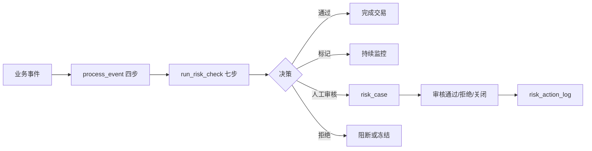

# 全球跨境数字钱包风控设计（PayPal 类业务）

## 1. 范围与边界

平台面向全球个人和商户，支持多币种余额、用户间转账、商品与服务付款、
跨境转账、充值提现、换汇、退款、拒付、订阅、在线客服和邮件。

生产实现必须使用 `country_capability` 配置控制不同国家/地区可使用的能力，
不能假定个人转账、余额、加密资产或商户能力在所有地区完全一致。

本阶段不模拟向监管机构提交 STR/SAR，只把可疑事件送入 `risk_case` 人工审核。

## 2. 对现有 AI_Risk 的兼容约束

- 9 张风控核心表不改字段。
- `process_event` 四步和 `run_risk_check` 七步不改顺序。
- 三个特征入口签名保持不变：
  - `compute_user_features`：客户、商户和历史关系特征；
  - `compute_order_features`：当前支付或资金移动特征；
  - `compute_address_features`：设备、IP和地理环境特征。
- 旧枚举作为技术槽位：
  - `下单`：账户、KYC、KYB、登录；
  - `支付`：P2P、商户付款、跨境、充值提现、换汇；
  - `售后申请`：退款、拒付、争议；
  - `物流投诉`：AML、名单筛查、客服内容。
- 真实金融事件名写入 `event_data.business_event_type`。

## 3. 会话数据粒度

```text
Interaction（双方全部历史关系）
  └─ Segment（一次完整会话）
       └─ Message（一次完整发言）
            ├─ EmailEnvelope（仅邮件）
            └─ MessageAttachment（可选）
```

语音被视为已经转写的 chat，不保存音频或语音转写表。

## 4. 40 张业务表

| 域 | 表 |
|---|---|
| 用户与 KYC（7） | `user_info`, `user_profile`, `user_identity_document`, `user_kyc_review`, `user_address`, `user_contact_point`, `user_consent` |
| 商户与 KYB（6） | `merchant_info`, `merchant_beneficial_owner`, `merchant_kyb_review`, `merchant_store`, `merchant_settlement_account`, `merchant_risk_profile` |
| 钱包与账本（6） | `wallet_account`, `wallet_balance`, `funding_instrument`, `bank_account`, `account_limit`, `ledger_entry` |
| 交易（10） | `payment_transaction`, `user_transfer`, `merchant_payment`, `cross_border_transfer`, `transaction_party`, `transaction_status_history`, `fx_conversion`, `refund`, `chargeback`, `cash_movement` |
| 设备网络（4） | `device_info`, `user_device`, `login_event`, `network_observation` |
| 客服通信（5） | `interaction`, `conversation_segment`, `message`, `email_envelope`, `message_attachment` |
| 合规配置（2） | `screening_result`, `country_risk_profile` |

## 5. 主要风险场景

1. `NORMAL`：符合主体历史画像的正常活动。
2. `STRUCTURING`：多笔略低于阈值的分拆交易。
3. `RAPID_MOVEMENT`：入金后快速转出。
4. `FUNNEL_ACCOUNT`：多个付款人向单一账户归集。
5. `CIRCULAR_FLOW`：资金经过多个账户后回到起点。
6. `ACCOUNT_TAKEOVER`：新设备/新国家登录后快速提现。
7. `CARD_TESTING`：同一资金工具短时间小额尝试。
8. `SANCTIONS_MATCH`：主体名单筛查高置信命中。
9. `IDENTITY_FRAUD`：证件、人脸、生日或姓名不一致。
10. `MERCHANT_FRAUD`：商户拒付、退款或虚假交易异常。
11. `SOCIAL_ENGINEERING`：客服消息出现验证码、远程控制或外部转账诱导。
12. `REFUND_ABUSE`：高频退款、退款后提现或多账户共用资金工具。

模拟标签只写入 `_simulation_labels.csv`，不得写入线上特征或业务表，防止训练标签泄漏。

## 6. 特征规划

首版目标 96 个特征：

| 特征域 | 数量 | 示例 |
|---|---:|---|
| KYC/KYB | 12 | 账户年龄、认证等级、证件一致性、受益所有人完整度 |
| 用户历史 | 14 | 交易次数、金额分位、对手方数量、退款拒付率 |
| AML 时序 | 18 | 分拆、快速进出、归集、循环、跨境跳数 |
| 当前交易 | 16 | 金额偏差、付款类型、币种、国家走廊、新收款人 |
| 商户 | 10 | MCC风险、拒付率、退款率、客单价偏差 |
| 设备网络 | 12 | 新设备、共享设备、VPN、Tor、国家冲突、登录失败 |
| 客服内容 | 10 | 验证码、外部支付、远程控制、威胁、非法商品 |
| 名单国家 | 4 | 制裁分、PEP分、国家AML分、国家欺诈分 |

## 7. 规则规模

`gen_paypal_business_data.py` 同时生成 `_risk_rules.json`，首版不少于 74 条：

- KYC/KYB：16；
- AML：18；
- 支付欺诈：12；
- 账户接管：8；
- 制裁/PEP：6；
- 退款拒付：6；
- 客服内容：8。

规则只作为种子配置，正式上线前必须经过法务、合规、模型风险管理和对应司法辖区负责人审批。

## 8. 规模与生成策略

| 预设 | 用户 | 交易 | 用途 |
|---|---:|---:|---|
| `dev` | 100 | 1,000 | 单元测试、本地开发 |
| `demo` | 10,000 | 100,000 | 演示、特征开发 |
| `load` | 100,000 | 5,000,000 | 压测，需独立数据环境 |

生成器使用固定随机种子、分批 CSV 写入、不可逆合成哈希值和独立风险标签。
生产量级应进一步改为 Parquet/对象存储并由批处理作业分区输出；CSV 只作为项目内可移植基线。

## 9. 人工审核闭环



## 10. 当前实现状态与下一阶段

已经实现：

1. 40张业务表 SQLAlchemy 注册模型；
2. 9张风控核心表；
3. 四步 `process_event` 和七步 `run_risk_check`；
4. 三个固定特征入口的首批查询；
5. 规则匹配、基线模型评分、人工案件落库；
6. FastAPI `/api/risk/check`；
7. 参数化模拟数据、74条规则种子和结构测试。

下一阶段：

1. 将集中式表定义固化为正式 Alembic/MySQL 迁移；
2. 完成96个特征，而不是当前首批12个基线特征；
3. 将74条规则种子映射为可直接导入的真实特征规则；
4. 增加交易幂等、并发余额控制和账本数据库约束；
5. 增加字段级加密、密钥轮换、数据分区、保留与删除策略；
6. 增加案件分配、四眼复核、冻结/解冻和完整审计接口。
