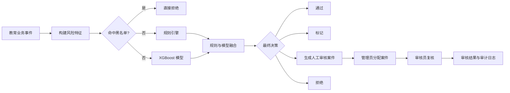

# EduGuard 智慧教育风控系统

EduGuard 是一个面向在线教育业务的风控实战项目，覆盖**课程报名、退费申请、学历认证**三类核心场景。系统将黑名单、规则引擎、XGBoost 模型和人工审核串联起来，形成从风险识别到案件处置的完整闭环。

> 本项目用于课程实战、毕业设计和答辩演示。仓库中的业务数据均为合成数据或脱敏标识，不应直接用于真实业务决策。

## 项目亮点

- 教育行业场景：围绕报名、退费、认证设计业务数据和风控规则。
- 双引擎决策：规则评分与 XGBoost 风险概率融合，兼顾可解释性和识别能力。
- 25 维风险特征：综合用户历史、当前事件和设备关联信息。
- 风控处置闭环：风险检查 → 生成案件 → 管理员分配 → 审核员复核 → 审计留痕。
- 两角色权限隔离：页面权限、接口权限和案件数据权限同时控制。
- MySQL 持久化：业务数据、评估结果、案件、规则、黑名单和后台用户统一管理。
- 可视化后台：适配桌面端和移动端的浅色极简风格。
- 可重复初始化：提供建表、演示数据、模型训练和数据库迁移脚本。

## 系统流程



## 功能模块

| 模块 | 说明 |
| --- | --- |
| 登录认证 | PBKDF2 密码哈希、签名 Cookie、账号启停控制 |
| 风险仪表盘 | 展示评估量、高风险事件、待审案件和趋势数据 |
| 风险检查 | 按业务事件构建特征并执行完整风控决策 |
| 规则管理 | 新增、编辑、启停教育行业规则及配置优先级 |
| 案件管理 | 查看案件详情、分配或改派审核员 |
| 审核工作台 | 审核员只查看并处理分配给自己的案件 |
| 评估历史 | 查询风险评分、等级、决策和命中规则 |
| 黑名单 | 管理用户、学号、身份证和设备指纹黑名单 |
| 用户管理 | 创建后台账号、分配角色、启停账号、重置密码 |
| 审计日志 | 记录规则、案件、黑名单和用户管理操作 |

## 角色权限

系统只保留两个角色，降低演示和维护成本。

| 功能 | 风控管理员 | 审核员 |
| --- | :---: | :---: |
| 全局风险仪表盘 | ✓ | — |
| 用户、规则、黑名单管理 | ✓ | — |
| 查看全部案件 | ✓ | — |
| 分配或改派案件 | ✓ | — |
| 审核工作台 | — | ✓ |
| 查看本人案件 | — | ✓ |
| 提交审核结论 | — | ✓ |
| 风险检查与评估历史 | — | ✓ |

权限不仅控制侧边栏菜单，后端接口也会再次校验。审核员无法通过直接输入 URL 访问管理员功能，也无法读取其他审核员的案件。

案件状态流转：

```text
待审核 → 审核中 → 已通过 / 已拒绝 / 已关闭
```

管理员负责分配，审核员负责给出审核结论。终态案件不能重新分配或重复审核。

## 教育行业规则

| ID | 规则名称 | 核心条件 | 默认动作 |
| --- | --- | --- | --- |
| EDU001 | 零学习高额退费 | 学习不足 5 分钟且退费金额不低于 1000 元 | 人工审核 |
| EDU002 | 连环退费 | 退费申请不少于 3 次且累计成功退费不低于 10000 元 | 人工审核 |
| EDU003 | 极高退费率 | 有效报名不少于 3 次且成功退费率不低于 50% | 拒绝 |
| EDU004 | 同设备多账号 | 当前设备关联账号数不少于 5 | 拒绝 |
| EDU005 | 新设备大额报名 | 新设备且报名金额不低于 10000 元 | 人工审核 |
| EDU006 | 凌晨大额报名 | 01:00—05:00 报名且金额不低于 5000 元 | 标记 |
| EDU007 | 身份连续认证失败 | 连续认证失败不少于 2 次 | 人工审核 |
| EDU008 | 超高金额报名 | 单笔报名金额不低于 30000 元 | 拒绝 |

所有阈值均为教学初始值。真实业务应结合误报率、召回率、人工审核能力和实际损失持续校准。

## 风险评分

命中多条规则时，系统以最高规则分为基础，并增加多规则惩罚：

```text
rule_score = min(最高规则分 + 3 × 额外命中规则数, 100)
```

规则分与 XGBoost 模型分默认等权融合：

```text
final_score = 0.5 × rule_score + 0.5 × ml_score
```

| 最终分 | 风险等级 | 默认决策 |
| ---: | --- | --- |
| 0—29 | 低 | 通过 |
| 30—59 | 中 | 标记 |
| 60—79 | 高 | 人工审核 |
| 80—100 | 极高 | 拒绝 |

极高风险规则具有优先处置能力，模型不会弱化明确的规则拒绝结果。

## 模型说明

仓库内的 XGBoost 模型使用合成教育风控样本训练，包含 25 个特征。当前教学模型记录的验证指标如下：

| 指标 | 数值 |
| --- | ---: |
| 训练样本 | 2500 |
| 验证样本 | 500 |
| Validation Accuracy | 0.9900 |
| Validation F1 | 0.9860 |
| Validation AUC | 0.9907 |
| 推荐分类阈值 | 0.60 |

较高指标主要说明模型能够学习预设的合成风险模式，不能等同于生产环境效果。生产使用前需要进行真实样本回测、时间外验证、分群公平性检查和阈值校准。

## 技术栈

| 层次 | 技术 |
| --- | --- |
| Web 框架 | FastAPI、Uvicorn、Pydantic |
| 页面 | Jinja2、HTML、CSS、JavaScript、Bootstrap、Chart.js |
| 数据库 | MySQL 8、SQLAlchemy、aiomysql、PyMySQL |
| 风控 | 特征工程、规则引擎、黑名单、评分融合 |
| 机器学习 | XGBoost、scikit-learn、pandas、NumPy |
| 登录权限 | PBKDF2、签名 Cookie、角色与数据级权限控制 |
| 测试 | pytest、pytest-asyncio、HTTPX |

## 项目结构

```text
AI_Risk_教育风控/
├─ app/
│  ├─ engine/              # 特征工程、规则、融合决策、XGBoost
│  ├─ routers/             # 页面与 REST API 路由
│  ├─ service/             # 案件、事件、审计和告警服务
│  ├─ auth.py              # 登录会话和角色权限
│  ├─ models_*.py          # SQLAlchemy 数据模型
│  ├─ schemas.py           # Pydantic 请求与响应模型
│  └─ config.py            # 环境配置
├─ data/                   # 模型指标和教学数据
├─ scripts/                # 初始化、造数、迁移和训练脚本
├─ sql/                    # MySQL 建表和基础数据脚本
├─ static/                 # JavaScript、样式和静态资源
├─ templates/              # 登录页和后台页面
├─ tests/                  # 自动化测试
├─ .env.example            # 环境变量示例
├─ requirements.txt        # Python 依赖
├─ run_app.py              # 推荐启动入口
└─ README.md
```

## 快速开始

### 1. 环境要求

- Python 3.11
- MySQL 8.x
- Git

以下命令以 Windows PowerShell 为例。

### 2. 克隆项目

```powershell
git clone https://github.com/<你的GitHub用户名>/<仓库名>.git
cd <仓库名>
```

### 3. 创建虚拟环境

```powershell
python -m venv .venv
.\.venv\Scripts\Activate.ps1
python -m pip install --upgrade pip
pip install -r requirements.txt
```

### 4. 配置环境变量

```powershell
Copy-Item .env.example .env
```

编辑 `.env`：

```env
DB_HOST=localhost
DB_PORT=3306
DB_USER=root
DB_PASSWORD=你的MySQL密码
DB_NAME=ai_risk_education
TEST_DB_NAME=ai_risk_education_test

AUTH_SECRET_KEY=请替换为随机长字符串
AUTH_COOKIE_NAME=edu_guard_session
AUTH_SESSION_HOURS=8
AUTH_COOKIE_SECURE=false

LLM_API_KEY=
LLM_BASE_URL=https://dashscope.aliyuncs.com/compatible-mode/v1
LLM_MODEL_NAME=qwen-plus

XGB_ENABLED=true
```

可使用下面的命令生成随机会话密钥：

```powershell
python -c "import secrets; print(secrets.token_urlsafe(48))"
```

`.env` 已由 `.gitignore` 排除，禁止把数据库密码、会话密钥或大模型密钥提交到仓库。

### 5. 初始化 MySQL

确保 MySQL 服务已经启动，并且 `.env` 中的账号具有创建数据库和数据表的权限。

首次安装：

```powershell
python scripts\init_db.py --reset --yes
```

这条命令会重建 `DB_NAME` 指定的数据库，并导入教育业务基础数据、8 条风控规则和两个演示账号。

> `--reset` 会删除目标数据库中的原有数据。已有数据时请使用 `python scripts\init_db.py --keep-data`，并按需执行 `python scripts\migrate_user_case_workflow.py`。

### 6. 启动项目

```powershell
python run_app.py
```

启动脚本会检查 `.env`、Python 依赖、MySQL、数据表、8000 端口和 XGBoost 模型。

浏览器访问：

```text
http://127.0.0.1:8000/login
```

### 7. 演示账号

| 角色 | 用户名 | 初始密码 |
| --- | --- | --- |
| 风控管理员 | `admin` | `Admin@123` |
| 审核员 | `reviewer` | `Reviewer@123` |

演示完成后请通过用户管理页面修改默认密码。

## 推荐演示流程

1. 使用管理员账号登录，查看风险仪表盘。
2. 进入案件管理，为待审案件分配审核员。
3. 退出管理员账号，使用审核员账号登录。
4. 在审核工作台查看本人案件并提交通过、拒绝或关闭结论。
5. 返回管理员账号，确认案件状态和审核记录已经更新。
6. 使用审核员的风险检查页面发起教育业务风控评估，查看特征、命中规则、模型分和最终决策。

推荐固定演示样例：

```text
用户 ID：RISK009
业务来源 ID：ORD00145
事件类型：课程报名
```

## 常用命令

运行核心测试：

```powershell
python -m pytest -q
```

重新训练教育模型：

```powershell
python scripts\train_education_model.py
```

生成风险演示数据：

```powershell
python scripts\gen_risk_data_with_dates.py
```

升级已有数据库的用户与案件工作流：

```powershell
python scripts\migrate_user_case_workflow.py
```

## 手机端访问

电脑与手机连接同一局域网后，在电脑上执行：

```powershell
ipconfig
```

找到电脑的 IPv4 地址，然后用手机访问：

```text
http://电脑IPv4地址:8000/login
```

如果无法访问，请确认项目使用 `0.0.0.0:8000` 启动，并允许 Windows 防火墙放行 Python 或 TCP 8000 端口。

## 上传 GitHub 前的安全检查

1. 确认 `.env` 没有被 Git 跟踪：

   ```powershell
   git check-ignore .env
   ```

2. 打开 `.env.example`，确保下面这些值为空或仅为占位符：

   ```env
   DB_PASSWORD=
   AUTH_SECRET_KEY=please-change-this-to-a-long-random-secret
   LLM_API_KEY=
   ```

3. 搜索疑似密钥和密码：

   ```powershell
   rg -n "sk-|API_KEY=.+|PASSWORD=.+" . --glob "!.env" --glob "!*.md"
   ```

4. 不要提交虚拟环境、日志、缓存、真实业务数据和本地 IDE 配置。

5. 如果密钥曾进入 Git 提交历史，只删除文件中的密钥还不够：必须立即在对应平台撤销密钥，并清理 Git 历史。

## 推送到 GitHub

在项目根目录执行：

```powershell
git init
git add .
git status
git commit -m "feat: complete education risk control system"
git branch -M main
git remote add origin https://github.com/<你的GitHub用户名>/<仓库名>.git
git push -u origin main
```

执行 `git add .` 后务必先查看 `git status`，确认 `.env`、虚拟环境和日志没有出现在待提交列表中。

## 安全说明

- 密码使用 PBKDF2-HMAC-SHA256 加盐哈希保存。
- 登录状态保存在 HttpOnly Cookie 中，并通过服务端签名防止篡改。
- 用户被停用后，已有登录会话也会失效。
- 页面权限之外，后端继续执行接口权限和案件归属校验。
- 生产部署还需要补充 HTTPS、CSRF 防护、登录限流、密码复杂度策略和密钥托管。

## 项目局限

- 当前数据、规则阈值和模型均以教学演示为目标。
- 合成数据与真实教育平台的用户分布存在差异。
- 当前只设计管理员和审核员两个角色，没有复杂组织架构和多租户能力。
- 当前工作流聚焦案件分配与审核，没有加入 SLA、抢单、批量分配和消息通知。

## License

当前仓库如果尚未添加开源许可证，默认仍保留全部权利。计划公开供他人使用、修改和分发时，可以根据需要添加 MIT、Apache-2.0 等许可证。

---

如果这个项目对你有帮助，欢迎提交 Issue 或 Pull Request。
