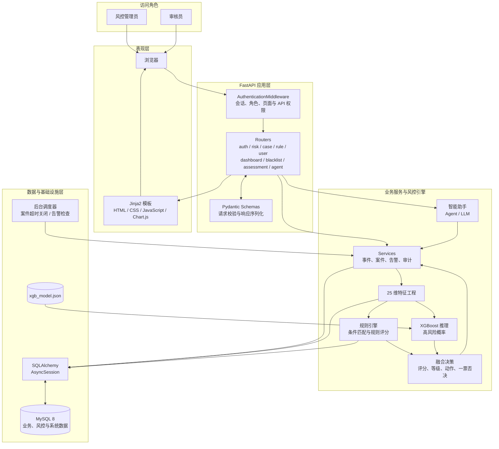
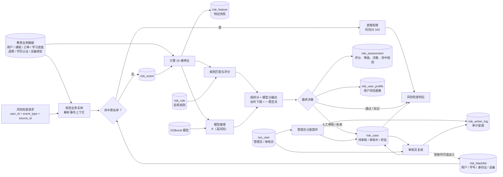
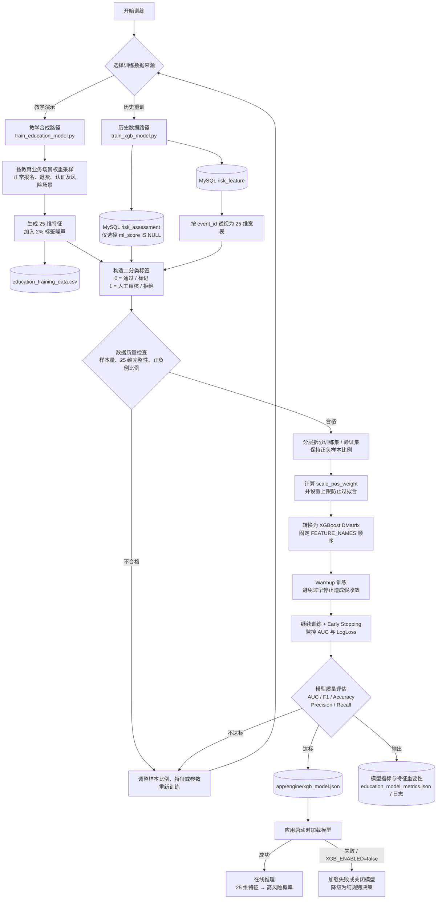
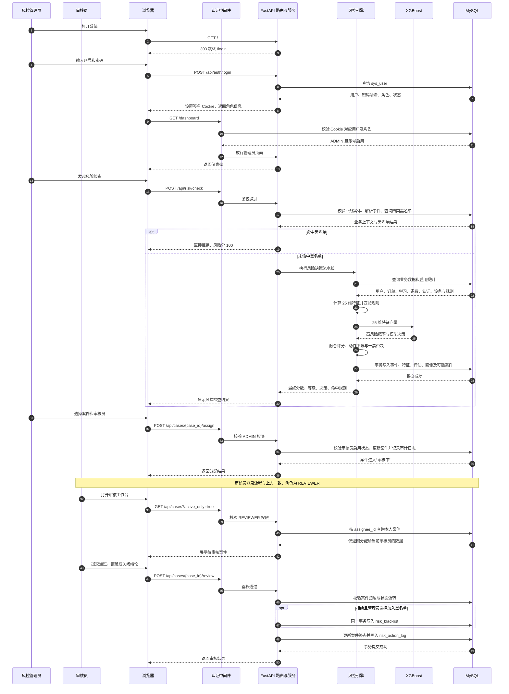

# EduGuard 项目设计图

本文档根据当前项目代码绘制，覆盖系统架构、风险数据流、XGBoost 训练流程，以及“登录—风险检查—案件分配—人工审核”的核心交互时序。

## 1. 项目架构图

该项目采用分层结构：页面请求先经过认证中间件，再进入路由层；路由调用业务服务与风控引擎；持久化统一通过 SQLAlchemy 异步会话访问 MySQL。XGBoost 无法加载时，系统可降级为纯规则模式。

## 2. 数据流图

黑名单位于流水线最前端，命中后直接短路拒绝，不写入普通风险事件和评估样本。未命中时，系统保存事件、特征快照和评估结果；只有“人工审核”或“拒绝”决策会生成案件。

## 3. XGBoost 训练流程图

项目支持两条训练路径：教学演示可使用固定随机种子生成可复现的教育场景样本；积累历史评估后，可从 MySQL 提取没有模型痕迹的数据进行重训，避免用旧模型输出反向污染标签。

## 4. 核心交互时序图

时序图同时体现了三层权限控制：认证中间件验证登录状态，路由验证角色权限，案件接口再按 `assignee_id` 验证数据归属。

## 相关代码位置

- 应用入口：`scripts/main.py`
- 登录和权限：`app/routers/auth.py`、`app/auth.py`
- 风险事件入口：`app/service/event.py`
- 特征、规则、模型与决策：`app/engine/feature.py`、`rule.py`、`ml_model.py`、`decision.py`
- 案件分配与审核：`app/routers/case.py`、`app/service/case.py`
- 数据模型：`app/models_business.py`、`app/models_risk.py`、`app/models_system.py`
- 训练脚本：`scripts/train_education_model.py`、`scripts/train_xgb_model.py`
