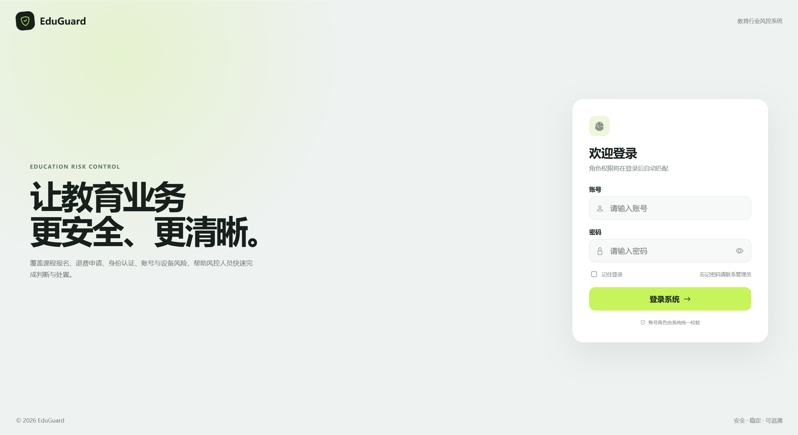
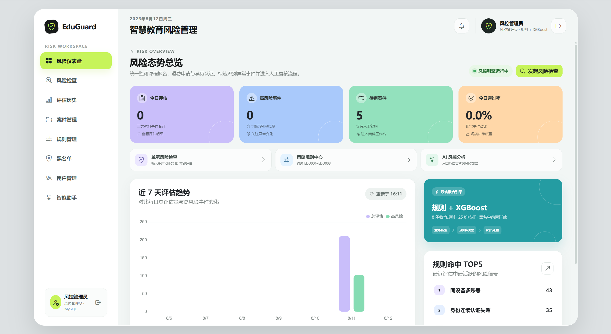
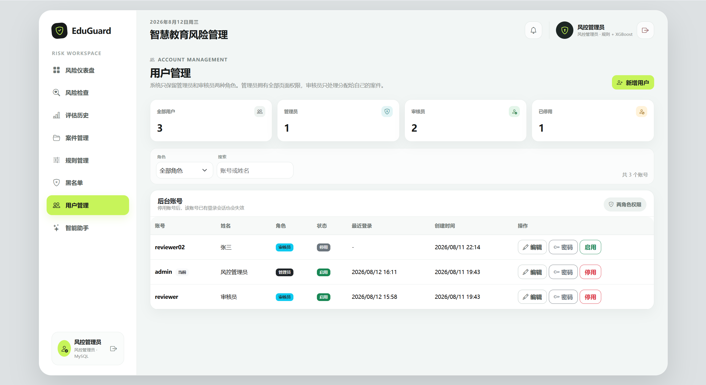
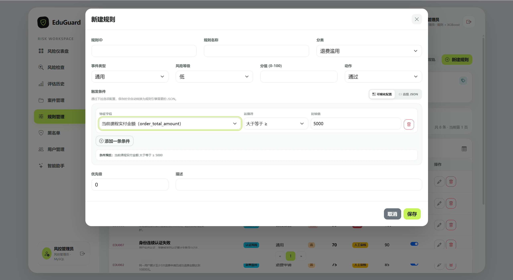
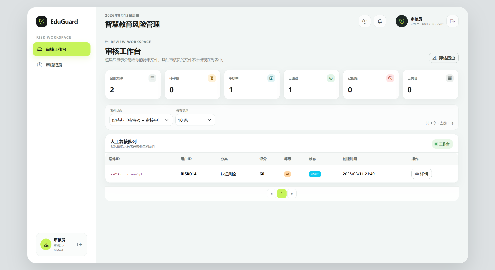
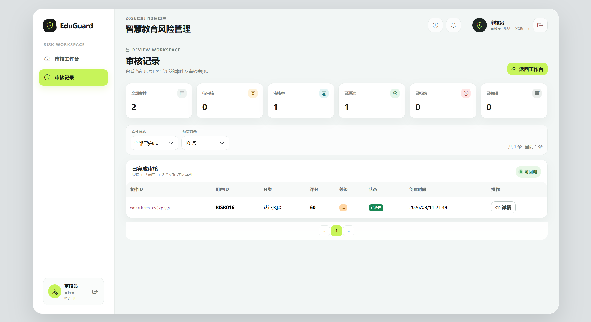

# EduGuard 智慧教育风控系统

EduGuard 是一个面向在线教育业务的风险控制项目，围绕课程报名、退费申请、身份认证、账号与设备风险等场景，实现风险识别、规则配置、案件分配和人工审核。

## 系统界面

### 1. 登录页面

采用简约的全屏登录布局，系统会根据账号自动识别管理员或审核员角色，并匹配相应权限。

### 2. 风险仪表盘

集中展示今日评估、高风险事件、待审案件和通过率，并提供近 7 天风险趋势与规则命中排行。

### 3. 用户管理

管理员可以维护管理员和审核员两类账号，完成用户新增、角色设置、启停控制及密码管理。

### 4. 可视化规则配置

通过选择特征字段、运算符和比较值快速组合触发条件，降低直接编写 JSON 规则的使用门槛。

### 5. 审核员工作台

审核员只能查看分配给自己的案件，可按状态筛选待办案件并进入详情完成复核。

### 6. 审核记录

集中展示当前审核员已处理的案件及最终状态，方便查询历史结果和追溯审核过程。

