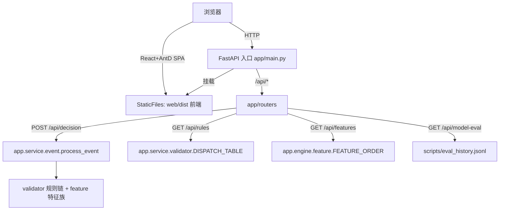

## 产品概述

为纯后端的银行风控项目 Bank-Risk 补齐可视化前端，并新增 FastAPI REST 接口层对齐基线 AI_Risk 的 `app/routers` 模式。前端采用 React + Ant Design 构建企业级金融风控后台，由 Vite 产出静态资源，FastAPI 托管。后端核心风控逻辑（process_event / validator / feature）已就绪且为纯函数，本次仅做"包装 + 展示"，不改动已有算法。

## 核心功能

- 事件决策控制台：表单录入 transfer/loan_apply/card_txn/repay/login 五类事件，调用 REST API 实时返回五级决策（pass/review/reject/freeze/report）、命中规则清单与 11 维特征向量。
- 规则命中看板：可视化 8 条反欺诈规则、按事件类型的路由关系、决策分布，并图解黑名单一票否决逻辑。
- 模型评估图表：复用 `scripts/eval_history.jsonl`，展示 XGBoost BASE vs HARD 的 AUC/F1 对比曲线与特征重要性排序。
- 特征工程展示：展示 11 维特征向量、三大特征族（用户/订单/地址）计算结果对比样例。
- FastAPI 接口层：新增 `app/routers`，包装 `process_event` 为决策 API，提供规则列表、特征说明、模型评估数据等只读接口，并托管前端静态资源。

## 技术栈选择

- 后端：FastAPI + Uvicorn（Python 3.12，Windows 验证环境），复用现有 `app.service.event.process_event` 纯函数。
- 前端：React 18 + TypeScript + Ant Design 5 + Vite 构建，产出 `dist/` 静态资源。
- 数据交互：前端 fetch 调用 FastAPI JSON 接口（同源，FastAPI 同时托管页面与 API）。
- 可视化：Ant Design 自带组件 + 轻量图表（Ant Design Charts 或 ECharts）。模型评估图直接读 `scripts/eval_history.jsonl`。

## 实现方法

在 `app/` 下新增 `routers/` 包与 FastAPI 入口，把现有纯函数风控能力暴露为 REST API；前端用 Vite 工程构建后由 `StaticFiles` 挂载。决策逻辑零改动，仅做接口编排与前端展示。

关键技术决策：

1. **API 层薄封装**：`POST /api/decision` 直接调用 `process_event(event_dict)`，不引入 DB 依赖（database.py 为 lazy，演示无需连库）。避免引入异步 ORM 复杂度，降级为同步包装。
2. **静态托管同源**：FastAPI 用 `StaticFiles` 挂载 `web/dist`，避免跨域与独立部署。开发期用 Vite dev server 代理 `/api` 到 FastAPI。
3. **模型评估走文件系统**：新增 `GET /api/model-eval` 读取 `scripts/eval_history.jsonl`（已含 train_auc/val_auc/val_f1/hard_negative_aug/特征重要性），不触发重训，O(n) 读取，无性能问题。
4. **路径注入一致性**：新增 `app/routers`、`app/main.py` 启动入口遵循现有脚本的 `sys.path.insert(0, ROOT)` 模式，支持 `python -m app` 直接运行，避免重蹈 demo_rules.py 覆辙。

## 性能与可靠性

- 决策 API 为纯内存计算（特征+规则链），单次请求毫秒级，无 IO 瓶颈。
- `eval_history.jsonl` 文件较小（历史记录条数有限），逐行读取即可，可加简单内存缓存（进程内 dict，文件 mtime 变更刷新）。
- 错误兜底：事件字段缺失或 event_type 非法时返回 422 + 结构化错误信息，前端用 Ant Design `message`/`Alert` 提示。

## 实现注意事项

- 复用 `app.config` 的 `BankEventType`、`BLACKLIST_TYPES`、`RISK_EVENT_THRESHOLDS`、`DECISION_*` 常量，前端选项与后端枚举保持一致，避免硬编码。
- 规则清单接口复用 `validator.DISPATCH_TABLE` / `dispatch_rules(txn_type)`，保证看板与真实路由逻辑同源。
- 特征说明接口复用 `feature.FEATURE_ORDER` 与三大特征族函数，避免重复定义特征元数据。
- 启动入口加 `sys.path.insert(0, ROOT)`（ROOT = 项目根），与 `train_xgb_model.py` 等保持一致。
- 不改动任何现有 `app/` 算法文件与 `scripts/`，保持向后兼容。

## 架构设计



## 目录结构

```
Bank-Risk/
├── app/
│   ├── main.py              # [NEW] FastAPI 入口: 创建 app、挂载 routers、托管 web/dist 静态资源、sys.path 注入
│   └── routers/
│       ├── __init__.py      # [NEW] 路由包导出
│       ├── decision.py      # [NEW] POST /api/decision 包装 process_event；GET /api/rules 暴露规则清单
│       ├── features.py      # [NEW] GET /api/features 暴露 11 维特征 + 三大特征族说明
│       └── model_eval.py    # [NEW] GET /api/model-eval 读取 eval_history.jsonl 返回评估数据
├── web/                     # [NEW] React + Vite + Ant Design 前端工程
│   ├── package.json         # [NEW] 依赖与脚本 (dev/build/preview)
│   ├── vite.config.ts       # [NEW] 构建配置 + dev 代理 /api -> FastAPI
│   ├── tsconfig.json        # [NEW] TS 配置
│   ├── index.html           # [NEW] SPA 入口
│   └── src/
│       ├── main.tsx         # [NEW] React 渲染入口
│       ├── App.tsx          # [NEW] 布局 + 侧边菜单路由 (4 页面)
│       ├── api.ts           # [NEW] fetch 封装 (decision/rules/features/model-eval)
│       ├── pages/
│       │   ├── DecisionConsole.tsx   # [NEW] 事件决策控制台
│       │   ├── RuleBoard.tsx         # [NEW] 规则命中看板
│       │   ├── ModelEval.tsx         # [NEW] 模型评估图表
│       │   └── FeatureView.tsx       # [NEW] 特征工程展示
│       └── components/               # [NEW] 复用组件 (决策标签、规则卡片等)
├── README.md                # [MODIFY] 补充前端启动与构建说明
└── 5-运行说明.md            # [MODIFY] 补充 FastAPI + 前端运行步骤
```

## 关键代码结构

```python
# app/routers/decision.py (接口签名, 不含实现)
from fastapi import APIRouter
from pydantic import BaseModel

class RiskEventIn(BaseModel):
    txn_id: str | None = None
    txn_type: str
    cust_id: str
    amount: float = 0.0
    counterparty_id: str | None = None
    device_fingerprint: str | None = None
    ip_addr: str | None = None
    geo_province: str | None = None
    geo_city: str | None = None
    txn_time: str | None = None
    blacklist: list[list[str]] | None = None  # [[type,id],...]

router = APIRouter(prefix="/api")

@router.post("/decision")
def post_decision(event: RiskEventIn) -> dict: ...

@router.get("/rules")
def get_rules() -> dict: ...
```

## 设计风格

采用企业级金融风控后台风格，基于 Ant Design 5 的 Pro 视觉语言。整体布局为左侧固定导航 + 顶部标题栏 + 内容区卡片网格，深色顶栏搭配浅灰内容背景，体现专业、可信的风控系统气质。决策结果用五级语义色标签（通过绿/复核蓝/拒绝红/冻结紫/报送橙）直观区分。图表区使用平滑渐变与微动效（hover 高亮、数字滚动），提升演示观感。

## 页面规划（4 个核心页面，共用顶栏+侧边栏）

1. 事件决策控制台：顶部事件类型切换 Tabs（转账/贷款/卡片/还款/登录）；中部表单卡片（金额、对手、设备指纹、IP、地理、时间）；右侧实时决策结果卡片（大号语义色决策徽标 + 命中规则时间线 + 特征向量折叠面板）。
2. 规则命中看板：8 条规则卡片网格（按事件类型着色），决策分布饼图，黑名单一票否决逻辑用流程箭头组件图解（severity=4 强制冻结、ML 不可推翻）。
3. 模型评估图表：BASE vs HARD 双线 AUC 趋势图（读 eval_history），F1 对比柱状图，特征重要性横向条形图 Top-N。
4. 特征工程展示：11 维特征向量表格（名称/含义/示例值），三大特征族（用户/订单/地址）对比卡片，附计算口径说明。

## Agent Extensions

### Skill

- **brainstorming**
- 用途：在动手实现前梳理前端四页面交互与信息架构，对齐用户已确认的范围与技术栈
- 预期结果：确认页面结构、组件拆分与 API 契约，避免实现返工

### SubAgent

- **code-explorer**
- 用途：在实现 API 层与前端调用前，精准定位 `process_event` / `DISPATCH_TABLE` / `FEATURE_ORDER` / `eval_history.jsonl` 的字段契约与调用方式
- 预期结果：输出准确的接口输入输出结构，供 routers 与前端 api.ts 直接对齐