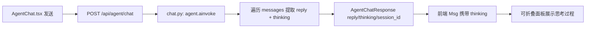

## 用户需求

在银行风控 AI 助手对话页中，为 LLM 模型的回复增加「思考过程」展示。

## 产品概述

当前 AI 助手仅展示最终回复。本次需将模型在生成回复前的推理/规划内容，以及调用工具的具体步骤，以可折叠面板的形式呈现给用户，提升回答的可解释性。

## 核心功能

- 后端从 DeepAgents/LangChain 消息流中提取思考过程：包含模型中间的规划思考文本，以及每一步工具调用的名称与入参。
- 前端在 AI 回复气泡上方新增「思考过程」可折叠面板，默认收起，点击展开；无思考内容时不显示。
- 思考内容同时涵盖「模型推理/规划」与「工具调用步骤」两类信息。

## 技术栈

- 前端：React + TypeScript + Ant Design + Tailwind CSS（沿用现有 `AgentChat.tsx` 技术栈）
- 后端：FastAPI + LangChain + DeepAgents（`app/agent/chat.py`）
- 模型：阿里云百炼 qwen-plus（非推理模型，思考过程即 DeepAgents 中间 AIMessage 规划文本与 tool_calls，无需换模型）

## 实现方案

### 总体策略

后端在 `chat()` 中遍历 `agent.ainvoke` 返回的 `messages` 列表，分离「最终回复」与「思考过程」：最终回复取最后一条 AIMessage 的 content；思考过程由两部分拼接——(1) 非最终 AIMessage 中带有实质文本的规划内容；(2) 所有 AIMessage 的 `tool_calls`（工具名 + 参数）。思考过程通过新增的 `thinking` 字段经 API 返回前端，前端用可折叠面板渲染。

### 关键技术决策

- **提取位置**：在 `app/agent/chat.py` 的 `chat()` 内做提取，复用已有的 `messages` 变量，不引入新依赖，保持与现有会话历史管理（`_sessions`）一致。
- **content 兼容解析**：LangChain AIMessage.content 可能是 `str` 或 `list[dict]`（含 `text`/`tool_use` 块）。统一封装一个 `_extract_text(content)` 函数，字符串直接返回，列表则拼接 `text` 块并跳过 `tool_use` 块，避免把工具调用占位文本误当思考。
- **思考 vs 回复边界**：最后一条 AIMessage 视为最终回复；其余 AIMessage 的文本内容作为「规划思考」。tool_calls 从所有 AIMessage 收集，格式化为 `→ 调用 {name}({args})`，args 用 `json.dumps` 紧凑输出。
- **空值处理**：思考内容为空字符串时后端返回 `thinking=None`，前端不渲染面板，兼容无 LLM key 的友好提示分支。
- **性能**：思考提取为单次 O(n) 遍历（n=消息数，通常 <20），无额外 IO/计算开销；前端面板默认收起，不影响首屏与渲染性能。

## 实现注意事项

- 复用现有 `read_lints` 检查与 `npm run build` 流程，不新增构建配置。
- 后端改动保持向后兼容：`thinking` 为可选字段，旧前端不读取也不会报错。
- 日志：提取异常不应中断主流程，思考提取失败时可降级为 `thinking=None` 并记录 warning，不影响 `reply` 返回。
- 重启服务使用 `python -m app`（8010 端口），前端构建产物由 FastAPI 托管。

## 架构设计



数据流仅在既有链路上新增 `thinking` 字段的透传，不改动会话/工具/数据库层。

## 目录结构

```
app/
├── schemas.py          # [MODIFY] AgentChatResponse 新增 thinking: Optional[str] = None
├── routers/agent.py    # [MODIFY] api_agent_chat 返回补充 thinking=thinking
└── agent/chat.py       # [MODIFY] chat() 提取 thinking；新增 _extract_text 与 _build_thinking 辅助函数

web/src/
├── api.ts              # [MODIFY] AgentChatResponse 接口新增 thinking?: string
└── pages/
    └── AgentChat.tsx   # [MODIFY] Msg 接口加 thinking?; 发送时存 thinking; 渲染可折叠思考面板
```

## 关键代码结构

后端 `app/agent/chat.py` 提取函数签名（供实现参考）：

```python
def _extract_text(content: Any) -> str:
    """统一解析 AIMessage.content 为纯文本，兼容 str 与 list[dict]"""

def _build_thinking(messages: list) -> str | None:
    """遍历消息，拼接规划思考文本与 tool_calls 步骤，返回 None 表示无思考"""
```

## 设计风格

沿用现有银行风控系统的 Ant Design 浅色专业风格，不引入新的视觉语言。思考过程面板作为 AI 回复气泡的附属块，采用低对比度、可收起的折叠形态，与主体回复形成清晰层次。

## 页面区块设计（AI 回复消息块，自上而下）

1. 头像与气泡行：左侧紫色机器人头像，右侧白色边框气泡展示最终回复（沿用现有样式）。
2. 思考过程折叠块：位于气泡正上方（同一消息行下方或气泡内顶部），标签为「思考过程」，默认收起；展开后显示带序号的规划步骤与工具调用（如 `→ 调用 risk_check(...)`），文本使用浅灰、等宽感排版、小字号。
3. 折叠交互：点击标签展开/收起，带平滑高度过渡，hover 时标签变色提示可点击。
4. 无思考时不渲染该块，保持原有布局。