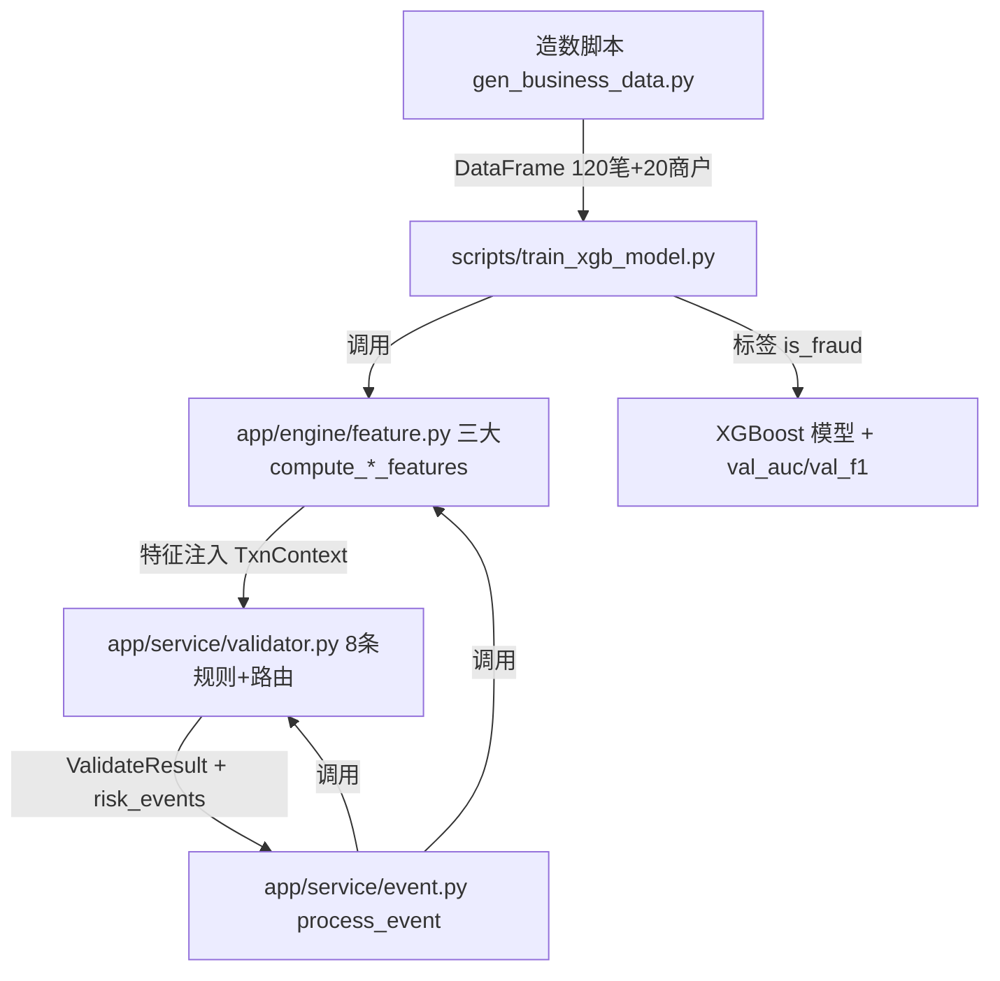

## 用户需求

基于银行风控业务数据表（merchant_info / txn_flow / settlement_log / user_behavior_log / risk_event_biz / relation_graph）完成风控模型建设，交付特征工程、规则引擎、事件处理与 XGBoost 训练评估四大模块。

## 产品概述

为银行风控系统提供一套可离线运行的风控建模能力：三大特征族量化用户信用风险与交易异常度，8 条反欺诈规则按事件类型路由给出五级决策，事件适配层统一接入 5 种银行业务事件，XGBoost 二分类模型在造数脚本产出的强标注数据上完成训练并输出评估指标。

## 核心功能

- 三大特征族计算：compute_user_features（多头借贷指数、过度查询频次、登录撞库频控、历史风险等级）、compute_order_features（大额转账标记≥20万、分散转入对手数、交易时间异常度、金额偏离度）、compute_address_features（地理偏离度、IP异常评分、设备指纹一致性），结果写入 f_ext_json 及现有列。
- 8 条反欺诈规则：黑名单冻结、大额转账报送、分散转入集中转出、地理IP偏离、多头借贷预警、过度查询拦截、登录撞库封控、异常时段交易；按 event_type 路由，决策语义复用 pass/review/reject/freeze/report 五级。
- 事件适配层：app/service/event.py 实现 process_event，兼容银行 5 种事件枚举（transfer/loan_apply/card_txn/repay/login），串联特征计算与规则校验。
- XGBoost 训练评估：离线复用造数脚本产出 120 笔交易+20 商户数据，以三大特征族构造训练矩阵，is_fraud 作标签，训练二分类模型并输出 val_auc、val_f1。
- 运行交付：5-8 张真实运行截图（特征计算、规则命中、模型训练结果、风险事件分发、评估历史）。

## 技术栈

- 语言/运行：Python 3.12，SQLAlchemy ORM（已用 Base 注册 6 张业务表），pandas/numpy 处理训练矩阵。
- 机器学习：XGBoost 二分类（pip 联网安装），scikit-learn 提供 train_test_split / 指标计算。
- 数据来源：离线方案——train 脚本 import gen_business_data 造数函数，在内存构造 DataFrame，不依赖独立 MySQL 实例（对齐用户"参考基线类似"且开箱即跑的诉求）。

## 实现方案

### 总体策略

以现有 app/config.py 的 `BANK_EVENT_TYPES`、`RISK_EVENT_THRESHOLDS`、`DECISION_*` 常量为唯一真相源，统一特征层（新建 app/engine/feature.py）、规则层（扩展 app/service/validator.py）、事件层（新建 app/service/event.py）、训练层（新建 scripts/train_xgb_model.py）。四个层级解耦：特征函数纯函数化（输入输出 dict），规则函数纯函数化（输入 TxnContext），事件层编排两者并负责入库无关的风险事件产出，训练层离线消费造数脚本与特征函数。

### 关键技术决策

1. **规则层合并扩展**：用户已确认不新建 app/engine/rule.py，直接在 app/service/validator.py 末尾追加 `rule_transfer_disperse`（分散转入集中转出，复用已有 `peer_cnt_1h`/`f_counterparty_cnt` 语义）与 `rule_abnormal_hour`（异常时段交易，基于 txn_time 小时段 0-6 点标记），并把两条接入 DISPATCH_TABLE（transfer/card_txn 路由追加 rule_transfer_disperse；login/transfer/card_txn 路由追加 rule_abnormal_hour）。保留现有 6 条规则与决策聚合逻辑不变，零回归。
2. **特征映射对齐现有列**：特征函数读取 TxnFlow（amount/f_speed/channel/txn_time）、UserBehaviorLog（login_fail/ip_addr/device_fingerprint/geo_province/geo_city/f_ext_json）、TxnFlow.f_ext_json（peer_cnt/amount_mean），计算结果按字段回填到 `f_ext_json`（JSON 扩展位）及可落库列（如 SettlementLog.f_counterparty_cnt）。字段名严格复用现有 ORM 列。
3. **离线训练管线**：train 脚本调用 gen_business_data 的造数入口得到 120 笔交易 DataFrame（含 is_fraud）；对每笔交易调用 compute_user_features/compute_order_features/compute_address_features 得到定长特征向量；按 is_fraud 二分类标签，80/20 stratify 拆分，XGBoost 训练 + early_stopping + 输出 val_auc/val_f1。样本缺少时友好提示退出。
4. **事件适配层**：process_event 接收银行事件 dict/对象，补齐 TxnContext 所需字段（inject 特征计算结果），调用 validator.validate_txn 得到 ValidateResult，并产出待写库 risk_events（对应 RiskEventBiz）。不依赖 ORM 模型实例化，仅复用 validator 与 feature 两个纯模块，降低耦合。

### 性能与可靠性

- 特征函数为 O(1) 单笔计算，规则链为 O(k)（k≈4-6 条/事件），训练矩阵构造 O(N)（N=120），XGBoost 训练复杂度 O(N·d·T)（d≈特征维数，T≈200 轮）对 120 样本可忽略。
- 造数脚本已含 seed 保证可复现；训练脚本固定 stratify 与 random_state。
- 决策聚合复用 validator 已有 veto>reject>report>review>pass 顺序，保证一票否决语义。

## 实现注意事项

- 不改动 validator.py 现有 6 条规则函数体与 DISPATCH_TABLE 既有路由，仅在文件末尾追加并保证 dispatch 覆盖完整 5 种事件。
- 特征回填 f_ext_json 时用 dict merge，避免覆盖造数脚本已写入的扩展位。
- train 脚本 sys.path 注入项目根（参考基线 AI_Risk/scripts 写法），以支持 `import app.*`。
- 依赖安装：仅当缺失时 `pip install xgboost scikit-learn pandas numpy`；用 `python -c "import xgboost"` 先行探测。
- 截图必须真实运行产出：先跑 feature/rule 演示函数 → 跑 train 脚本 → 跑 event 演示，分别截终端输出。

## 架构设计



## 目录结构

```
Bank-Risk/
├── app/
│   ├── engine/
│   │   └── feature.py        # [NEW] 三大特征族。实现 compute_user_features / compute_order_features / compute_address_features，纯函数，输入输出 dict，字段映射 f_ext_json 与现有 ORM 列（amount/f_speed/channel/peer_cnt/login_fail/ip_addr/device_fingerprint/geo）。
│   └── service/
│       ├── validator.py      # [MODIFY] 在文件末尾追加 rule_transfer_disperse（分散转入集中转出）、rule_abnormal_hour（异常时段交易）两条纯函数规则；并将两条接入 DISPATCH_TABLE（transfer/card_txn 追加 rule_transfer_disperse；login/transfer/card_txn 追加 rule_abnormal_hour），保持现有 6 条规则与决策聚合不变。
│       └── event.py          # [NEW] 事件适配层。process_event 接收银行事件，注入特征值构造 TxnContext，调用 validator.validate_txn，产出 ValidateResult 与待写库 risk_events；内置 __main__ 演示 5 种事件枚举的分发与命中。
└── scripts/
    └── train_xgb_model.py    # [NEW] 离线训练脚本。import gen_business_data 造数入口 → 内存 DataFrame → 调用 feature 三大函数构造特征矩阵 → is_fraud 作标签 → 80/20 stratify 拆分 → XGBoost 训练 + early_stopping → 输出 val_auc/val_f1 + 特征重要性。样本不足时友好提示。
```

## 关键代码结构

```python
# app/engine/feature.py 核心接口（纯函数）
def compute_user_features(ctx: dict) -> dict:
    """返回 {multi_loan_index, over_query_freq, login_brute_freq, hist_risk_level}"""
def compute_order_features(ctx: dict) -> dict:
    """返回 {large_amt_flag, disperse_peer_cnt, txn_time_anomaly, amount_deviation}"""
def compute_address_features(ctx: dict) -> dict:
    """返回 {geo_deviation, ip_risk_score, device_fp_consistency}"""
```