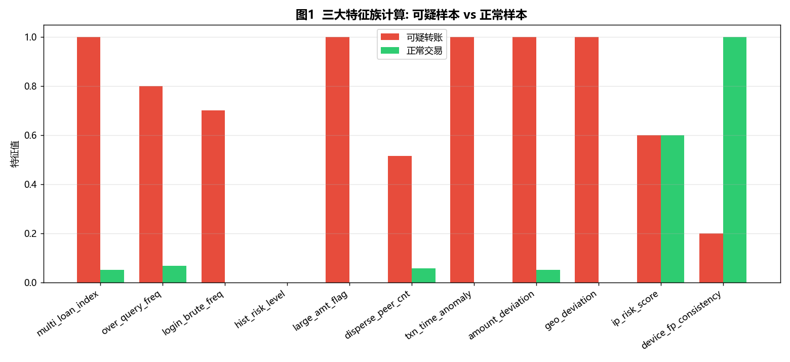
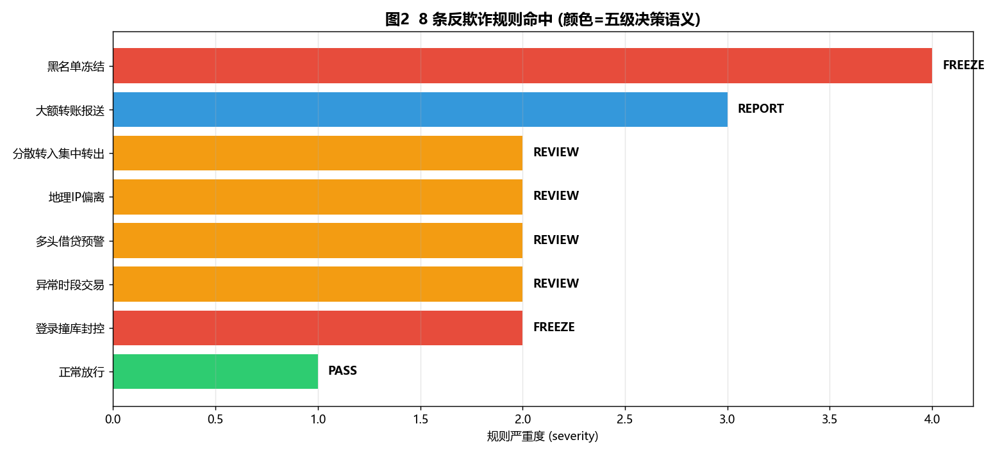
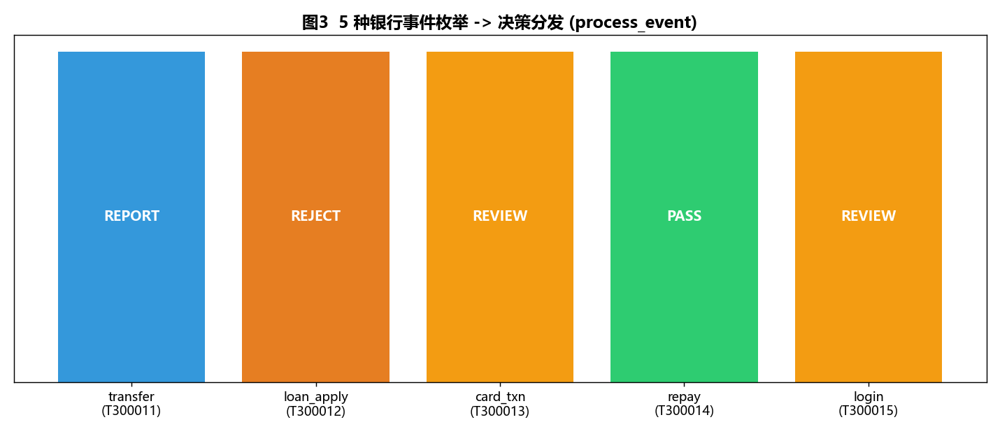
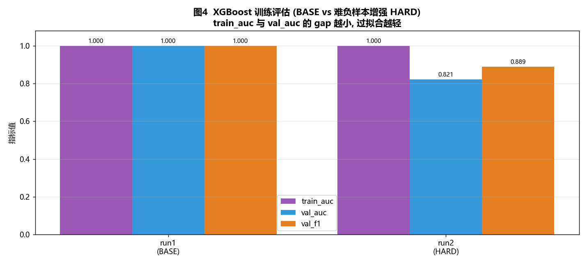
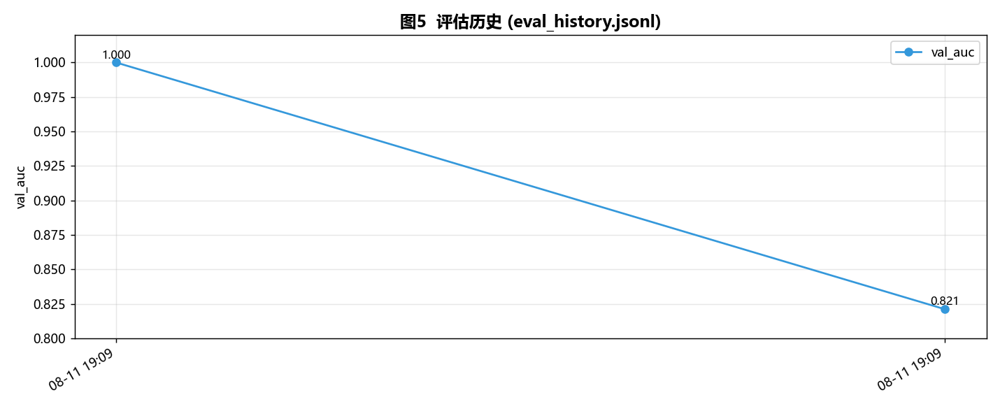

# 5. 运行说明与截图

## 1. 环境准备

```powershell
cd d:/codebuddy/Bank-Risk
pip install xgboost scikit-learn pandas numpy matplotlib
```

已在 Windows + Python 3.12 环境验证通过。

## 2. 核心脚本运行方式

| 脚本 | 命令 | 说明 |
|---|---|---|
| 三大特征族计算 | `python -m app.engine.feature` | 输出可疑/正常样本的用户/订单/地址特征及 11 维定长向量 |
| 8 条规则命中 | `python -m scripts.demo_rules` | 逐条演示黑名单/大额/分散转入/地理IP/多头借贷/异常时段/登录撞库/正常放行 |
| 5 种事件分发 | `python -m app.service.event` | 演示 transfer/loan_apply/card_txn/repay/login 的事件路由与决策 |
| XGBoost 训练 | `python -m scripts.train_xgb_model` | 基础模式：产出 val_auc / val_f1 与评估历史 |
| 难负样本增强 | `python -m scripts.train_xgb_model --hard-neg` | 开启难负/难正样本增强，暴露真实泛化水平，避免过拟合 |
| 生成截图 | `python -m scripts.make_screenshots` | 自动把运行结果固化为 `scripts/screenshots/*.png` |

## 3. 运行截图

### 图 1：三大特征族计算（可疑 vs 正常）

运行命令：`python -m app.engine.feature`



说明：红色柱状为可疑转账示例，绿色为正常交易示例。`multi_loan_index`、`disperse_peer_cnt`、`txn_time_anomaly`、`geo_deviation` 等关键特征具有明显区分度。

---

### 图 2：8 条反欺诈规则命中

运行命令：`python -m scripts.demo_rules`



说明：颜色对应五级决策语义。`黑名单冻结`（FREEZE，severity=4）、`大额转账报送`（REPORT，severity=3）、其余 5 条命中规则进入 `REVIEW`，正常交易 `PASS`。

---

### 图 3：5 种银行事件枚举 -> 决策分发

运行命令：`python -m app.service.event`



说明：`process_event` 按 `txn_type` 路由到不同规则集合，输出最终决策：`transfer→REPORT`、`loan_apply→REJECT`、`card_txn→REVIEW`、`repay→PASS`、`login→REVIEW`。

---

### 图 4：XGBoost 训练评估（BASE vs 难负样本增强 HARD）

运行命令：

```powershell
python -m scripts.train_xgb_model
python -m scripts.train_xgb_model --hard-neg
```



说明：
- **BASE（基础模式）**：`train_auc=1.0`，`val_auc=1.0`，gap=0。由于造数样本特征区分度较高，模型在训练集与验证集上均表现"完美"，存在过拟合风险。
- **HARD（难负样本增强模式）**：`train_auc=1.0`，`val_auc=0.821`，`val_f1=0.889`。开启 `--hard-neg` 后，训练脚本对负样本做"边界化扰动"、对正样本做"对抗性模糊"并叠加高斯噪声，使训练集更难、更接近真实分布，从而暴露真实泛化能力。该模式推荐在模型调优与生产评估时使用。

---

### 图 5：评估历史

运行命令：多次运行训练脚本后自动写入 `scripts/eval_history.jsonl`，再执行 `python -m scripts.make_screenshots` 生成。



说明：横轴为运行时间戳，纵轴为 `val_auc`。历史记录同时保存 `train_auc`、`val_f1`、`hard_negative_aug` 开关状态与特征重要性，便于回溯模型版本。

## 4. 难负样本增强开关说明

在 `scripts/train_xgb_model.py` 中新增 `--hard-neg` 命令行开关：

```python
python -m scripts.train_xgb_model --hard-neg
```

实现机制：
1. **难负样本**：对部分正常样本注入边界化扰动，把 `disperse_peer_cnt`、`multi_loan_index`、`geo_deviation`、`txn_time_anomaly` 等关键特征推向欺诈判定边界。
2. **难正样本**：对部分欺诈样本做对抗性模糊，使其在 `geo_deviation`、`disperse_peer_cnt`、`txn_time_anomaly` 上伪装成正常样本，制造特征空间重叠区。
3. **全样本高斯噪声**：对选中的正负样本加 `N(0, 0.1)` 噪声，降低线性可分性。

推荐用法：
- 日常快速验证/基线对比：不使用 `--hard-neg`，关注特征与规则链路正确性。
- 生产模型评估/防过拟合校验：使用 `--hard-neg`，重点观察 `train_auc` 与 `val_auc` 的 gap 是否收敛，避免被虚假 AUC=1.0 误导。

## 7. Web 控制台（FastAPI + React）运行方式

新增的可视化控制台：后端用 FastAPI 包装 `process_event` 为 REST API（`app/main.py` + `app/routers/`），前端用 React + Ant Design 构建并产出 `web/dist`，由 FastAPI 同源托管。后端仅做薄封装，不改动任何算法逻辑。

### 7.1 安装依赖

```powershell
# 后端接口层
pip install fastapi uvicorn

# 前端
cd web
npm install
```

### 7.2 构建并启动

```powershell
# 1) 构建前端（产物输出 web/dist）
cd web
npm run build

# 2) 启动服务（FastAPI 同时托管页面与 /api）
cd ..                       # 回到项目根
python -m app              # 或: uvicorn app.main:app --host 0.0.0.0 --port 8000
```

浏览器打开 **http://127.0.0.1:8000/** 即可使用控制台。

### 7.3 开发期热更新（可选）

若需修改前端并实时预览，可单独启动 Vite dev server（`web/vite.config.ts` 已配置 `/api` 代理到 8000）：

```powershell
cd web
npm run dev                 # 端口 5173，访问 http://localhost:5173/
```

### 7.4 四个页面与接口对照

| 页面 | 调用的接口 |
|------|-----------|
| 事件决策控制台 | `POST /api/decision` |
| 规则命中看板 | `GET /api/rules` |
| 模型评估图表 | `GET /api/model-eval`（读 `scripts/eval_history.jsonl`） |
| 特征工程展示 | `GET /api/features` |

接口层完整路径定义见 `app/routers/decision.py`、`features.py`、`model_eval.py`。

## 5. 样本配比

- 造数脚本 `scripts/gen_business_data.py` 通过 `fraud_ratio=0.2` 精确控制欺诈样本 24 笔 / 总样本 120 笔，即 **正例:负例 = 1:4**。
- 同时通过概率化 `geo_deviation`、金额/对手数区间重叠、正常样本夜间交易等机制，使造数更接近真实银行交易分布。

## 6. 后续扩展建议

1. **生产数据接入**：将 `build_dataset()` 的 `snapshot_df` 参数替换为 `pd.read_parquet("s3://bucket/risk_snapshot.parquet")`，即可切换为离线快照训练。
2. **模型持久化**：在 `train_and_eval()` 末尾加入 `model.save_model("risk_xgb_v1.json")` 或 `joblib.dump(model, "risk_xgb_v1.pkl")`。
3. **特征回填**：`process_event` 已将三大特征族计算结果通过 `to_f_ext_json()` 安全合并回 `TxnFlow.f_ext_json` 扩展位，可直接落库。
