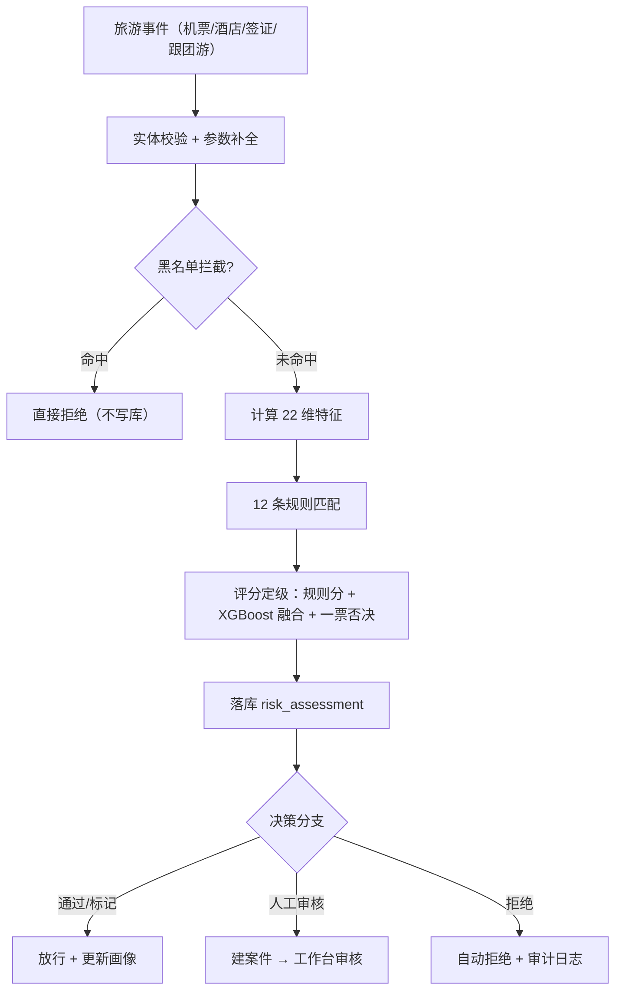

# 旅游风控系统 AI_Risk Travel（OTA 风控）

> 基于 **AI_Risk 风控框架**落地的**在线旅游（OTA）风控系统**。
> 覆盖机票 / 酒店 / 签证 / 跟团游 4 大预订场景，采用「规则引擎 + XGBoost 双轨融合 + AI Agent」架构。
> 风控核心 9 张表与 7 步决策流水线复用基线，业务层（表 / 特征 / 规则 / 事件 / 黑名单）按旅游行业完全重写。

---

## 目录

1. [项目背景](#1-项目背景)
2. [功能特性](#2-功能特性)
3. [技术栈](#3-技术栈)
4. [目录结构](#4-目录结构)
5. [快速开始](#5-快速开始)
6. [业务模型与事件](#6-业务模型与事件)
7. [风控规则（12 条）](#7-风控规则12-条)
8. [特征体系（22 维）](#8-特征体系22-维)
9. [决策流程](#9-决策流程)
10. [AI Agent](#10-ai-agent)
11. [配置说明](#11-配置说明)
12. [演示截图](#12-演示截图)
13. [常见问题 FAQ](#13-常见问题-faq)
14. [部署与运维](#14-部署与运维)
15. [学习材料](#15-学习材料)

---

## 1. 项目背景

OTA 平台（对标携程 / 飞猪 / 去哪儿）的交易链路天然存在欺诈与滥用风险：

- **黄牛囤票**：同一支付账号 / 设备短时间内大量预订同航班、占座不支付后倒卖；
- **签证欺诈**：90 天多次被拒仍反复申请、短期申请多国签证、假护照 / 挂失护照；
- **退改签滥用**：凌晨突击下单 + 短行程、利用免费取消窗口反复订退；
- **账户盗用 / 批量注册**：新设备异地大额下单、同一设备注册多个新账号薅羊毛；
- **大额代付与洗钱**：同一支付账号代多人付款、大额跨境游资金异常。

本系统在**预订到出行前**的关键环节对每笔业务事件实时评估风险，输出 4 档决策：
**通过 / 标记 / 人工审核 / 拒绝**，并联动黑名单拦截、案件人工审核、告警监控、AI Agent 辅助分析。

业务说明详见 [`1-业务说明.md`](./1-业务说明.md)。

---

## 2. 功能特性

| 能力 | 说明 |
|---|---|
| 风控检查 | `POST /api/risk/check`，4 类旅游事件实时评分定级 |
| 规则引擎 | 12 条旅游规则（R001-R012），JSON 条件表达式、可嵌套 and/or |
| 机器学习 | XGBoost 双轨融合（规则 0.65 + ML 0.35），22 维特征 |
| 黑名单 | 用户 / 护照号 / 设备指纹 / 支付账号 4 类，前置拦截 |
| 案件管理 | 待审核工作台、审核通过/拒绝/关闭，状态机约束 |
| 用户画像 | 每次评估后 upsert 用户综合风险画像 |
| 评估历史 | 全量评估列表 + 详情（命中规则 + ML 评分） |
| 仪表盘 | 今日统计 / 近 7 天趋势曲线 / 规则命中 TOP5 |
| 告警 | 案件积压、规则命中率、撞黑比例监控 |
| AI Agent | 自然语言对话，8 个工具（风控检查/案件/画像/黑名单/统计/业务查询） |
| 审计日志 | 规则/案件/黑名单变更全部留痕 |

---

## 3. 技术栈

| 层面 | 技术 |
|---|---|
| Web | FastAPI 0.115 + Uvicorn（生产 Gunicorn） |
| 前端 | Jinja2 模板 + 原生 JS + Chart.js |
| 数据库 | MySQL 8.0 + SQLAlchemy 2.0（async）+ aiomysql |
| 校验/配置 | Pydantic 2 + pydantic-settings（`.env`） |
| 机器学习 | XGBoost 2.1 + scikit-learn（stratify 拆分 / 早停 / AUC/F1） |
| AI Agent | LangChain 1.2 + DeepAgents + 阿里云百炼 qwen-plus |
| 环境 | uv + Python 3.12（依赖锁定 `uv.lock`） |
| 测试 | pytest + pytest-asyncio + httpx |

---

## 4. 目录结构

```
travel_risk/
├── run_app.py                  # 一键启动（6 步自检 + uvicorn）
├── 1-业务说明.md                # 旅游风控业务说明（任务1交付物）
├── app/
│   ├── api.py                  # 10 个路由 re-export
│   ├── config.py               # 全局配置（.env）
│   ├── database.py             # 异步引擎 / Session / 依赖注入
│   ├── models*.py              # ORM：7 张业务表 + 9 张风控表
│   ├── schemas.py              # Pydantic 请求/响应模型
│   ├── engine/                 # 特征(22维) / 规则 / XGBoost / 决策引擎
│   ├── service/                # 事件管道 / 案件 / 黑名单 / 告警 / 审计 / 校验
│   ├── agent/                  # AI Agent（chat + 8 个工具）
│   └── routers/                # 10 个路由
├── scripts/
│   ├── init_db.py              # 建库建表 + 种子数据 + 12 条规则
│   ├── gen_business_data.py    # 业务造数（用户/订单/乘客/签证/航班/酒店）
│   ├── gen_risk_data.py        # 批量跑风控检查生成评估（训练数据）
│   ├── gen_risk_data_with_dates.py  # 跨天评估数据（仪表盘趋势曲线用）
│   ├── train_xgb_model.py      # XGBoost 训练
│   ├── backfill_ml_score.py    # 回填 ml_score
│   ├── smoke_test.py           # 端到端冒烟测试
│   └── main.py                 # FastAPI 应用本体
├── sql/                        # 业务表/风控表 DDL + 数据 + 规则
├── templates/ static/          # 前端页面与静态资源
├── docs/screenshots/           # 演示截图
└── docker/                     # Docker 模板（尚未适配旅游版，见 §14）
```

> ⚠️ `scripts/` 里仍保留部分电商基线脚本（`gen_10w_data.py` / `gen_risky_users.py` / `gen_train_dataset.py` / `one_command.py` / `train_demo_model.py` / `migrate_2026_08_07.py`），**尚未适配旅游版，请勿运行**。

---

## 5. 快速开始

### 5.1 环境准备（依赖与基线一致）

```bash
# 方式一（推荐）：uv 同步（已有 uv.lock，从本地缓存安装，不重复下载）
cd travel_risk
uv sync

# 方式二：手动
python -m venv .venv
uv pip install -r requirements.txt
```

### 5.2 数据库初始化

先确认 MySQL 8.0 在 `localhost:3306` 运行（用户名/密码在 `.env` 配置，默认 root/dan123）。

```bash
uv run python scripts/init_db.py --reset --yes
```

执行顺序：

1. 创建数据库 `travel_risk`
2. `init_business_tables.sql` → 7 张旅游业务表
3. `init_business_data.sql` → 100 用户种子业务数据（订单/乘客/签证/航班/酒店/黑名单）
4. `init_risk_tables.sql` → 9 张风控表
5. `init_risk_data.sql` → 12 条旅游规则（R001-R012）

### 5.3 造数据（可选，可重复运行）

```bash
# 重新生成业务数据（插入前自动清空，幂等）
uv run python scripts/gen_business_data.py --users 100

# 批量跑风控检查生成评估（训练数据用，ml 痕迹自动置 NULL）
uv run python scripts/gen_risk_data.py

# 跨天评估数据（仪表盘近 7 天趋势曲线用；--clean 先清空旧评估）
uv run python scripts/gen_risk_data_with_dates.py --days 14 --per-day 25 --clean
```

### 5.4 训练 XGBoost

```bash
uv run python scripts/train_xgb_model.py
uv run python scripts/backfill_ml_score.py   # 用训好的模型回填 ml_score
```

- 数据源：`risk_assessment`（`ml_score IS NULL` 的干净样本）JOIN `risk_feature` 宽表；
- 标签：通过/标记 → 0，人工审核/拒绝 → 1；
- 输出：AUC / F1 / 验证集指标 + 特征重要性 TOP10，模型保存到 `app/engine/xgb_model.json`；
- 模型缺失/未训练时自动降级为纯规则模式，不影响业务。

### 5.5 启动服务

```bash
uv run python run_app.py
# 或直接
uv run python scripts/main.py
```

启动前自动 6 步自检（.env / 依赖 / MySQL / 库初始化 / 端口 / 模型）。

| 地址 | 用途 |
|---|---|
| http://localhost:8001/ | 仪表盘（含近 7 天趋势曲线） |
| http://localhost:8001/docs | Swagger API 文档 |
| http://localhost:8001/risk-check | 风控检查页 |
| http://localhost:8001/cases | 案件工作台 |
| http://localhost:8001/assessments | 评估历史 |
| http://localhost:8001/chat | AI Agent 对话 |

试一个风控检查：

```bash
curl -X POST http://localhost:8001/api/risk/check \
  -H "Content-Type: application/json" \
  -d '{"event_type": "机票预订", "source_id": "O101", "user_id": "U001"}'
```

---

## 6. 业务模型与事件

### 6.1 业务事件类型（4 种）

| 事件类型 | source_id | 说明 |
|---|---|---|
| 机票预订 | order_id | 订单主表(order_type=机票) + booking_flight 明细 |
| 酒店预订 | order_id | 订单主表(order_type=酒店) + booking_hotel 明细 |
| 签证申请 | visa_id | 签证申请表，无订单，只算用户特征 |
| 跟团游预订 | order_id | 订单主表(order_type=跟团游)，金额大、决策要求高 |

### 6.2 业务表（7 张）

| 表 | 说明 |
|---|---|
| `user_info` | 用户（实名状态 / 会员等级 / 注册天数） |
| `order_info` | 订单主表（订单类型 / 金额 / 目的地 / 出行日期 / 乘客数 / 支付状态） |
| `passenger_info` | 乘客（1 单 N 乘客，证件号 / 国籍） |
| `visa_application` | 签证申请（目的地 / 签证类型 / 拒签次数） |
| `booking_flight` | 机票明细（航班号 / 机场 / 舱位 / 起飞时间） |
| `booking_hotel` | 酒店明细（入住离店 / 房间数 / 是否可取消） |
| `blacklist_extra` | 扩展黑名单（护照号 / 证件号 / 设备指纹 / 支付账号） |

### 6.3 黑名单类型

`用户` / `护照号` / `设备指纹` / `支付账号`（替代电商版的 用户/地址/手机号）。

---

## 7. 风控规则（12 条）

| 编号 | 规则 | 场景分类 | 事件 | 关键特征 | 等级 | 动作 |
|---|---|---|---|---|---|---|
| R001 | 拒签历史拦截 | 签证欺诈 | 签证申请 | user_visa_reject_count ≥ 2 | 极高 | 拒绝 |
| R002 | 短期多国签证 | 签证欺诈 | 签证申请 | user_country_count ≥ 3 | 高 | 人工审核 |
| R003 | 黄牛囤票 | 机票囤积 | 机票预订 | same_flight_booking_count ≥ 5 | 极高 | 拒绝 |
| R004 | 凌晨突击下单 | 机票囤积 | 通用 | order_is_night=1 且 order_days_to_depart<7 | 中 | 标记 |
| R005 | 大额跨境游 | 行程风险 | 跟团游预订 | order_total_amount ≥ 50000 | 高 | 人工审核 |
| R006 | 新用户大单 | 账户风险 | 通用 | account_age_days<7 且 total_amount≥10000 | 中 | 标记 |
| R007 | 黑护照拦截 | 签证欺诈 | 通用 | user_blacklist_hit = 1 | 极高 | 拒绝 |
| R008 | 乘客国籍与目的地不符 | 行程风险 | 机票预订 | passenger_nationality_match = 0 | 中 | 标记 |
| R009 | 多次取消订单 | 账户风险 | 通用 | user_cancel_count ≥ 3 | 高 | 人工审核 |
| R010 | 节假日囤房 | 酒店滥用 | 酒店预订 | order_is_holiday=1 且 order_hotel_rooms ≥ 3 | 高 | 人工审核 |
| R011 | 高舱位大额订单 | 支付风险 | 机票预订 | order_cabin_class ≥ 1 且 total_amount ≥ 20000 | 高 | 人工审核 |
| R012 | 目的地高风险国家 | 行程风险 | 通用 | dest_is_high_risk = 1 | 高 | 人工审核 |

规则条件以 JSON 存储，支持 `> >= < <= == != in not_in between` 与 `and/or` 嵌套，可通过 API 或 SQL 增改。

---

## 8. 特征体系（22 维）

| 族 | 特征 |
|---|---|
| 用户（11） | account_age_days, user_total_orders, user_orders_7d, user_orders_30d, user_total_amount, user_avg_order_amount, user_visa_reject_count, user_country_count, user_cancel_count, user_passport_count, user_blacklist_hit |
| 订单（9） | order_total_amount, order_passenger_count, order_days_to_depart, order_is_night, order_is_holiday, order_cabin_class, order_is_cross_border, same_flight_booking_count, order_hotel_rooms |
| 目的地（2） | dest_is_high_risk, passenger_nationality_match |

特征命名前缀决定 `risk_feature.entity_type` 分类（`user_*` → 用户，`order_*` → 订单，其余 → 目的地/地址），训练与推理共用固定顺序 `FEATURE_COLUMNS`。

---

## 9. 决策流程



- **评分公式**：`max(命中规则分) + 3 × (额外命中数)`，封顶 100；
- **双轨融合**：`final = 0.65 × 规则分 + 0.35 × ML分`（权重在 `.env` 可调）；
- **一票否决**：命中「极高」规则强制拒绝并抬到 90 分，融合后二次校验，ML 低分不能推翻；
- **4 档决策**：`<30 通过 / <60 标记 / <80 人工审核 / ≥80 拒绝`。

---

## 10. AI Agent

基于 LangChain DeepAgents + 阿里云百炼 `qwen-plus`，8 个工具：

- **风控决策（4）**：实时风控检查 / 案件查询 / 用户画像 / 黑名单管理；
- **数据分析（4）**：仪表盘统计 / 风险趋势 / 规则效果 / 业务数据查询（订单/签证/乘客/订单详情/最近订单/大额订单）。

在 `.env` 配置 `LLM_API_KEY` 后，打开 http://localhost:8001/chat 用自然语言提问，例如"查一下 U001 的风险画像"、"分析近 7 天风险趋势"。

---

## 11. 配置说明（.env）

| 配置 | 默认 | 说明 |
|---|---|---|
| DB_HOST / DB_PORT / DB_USER / DB_PASSWORD / DB_NAME | localhost / 3306 / root / dan123 / **travel_risk** | 数据库（独立库，不影响电商 risk 库） |
| LLM_API_KEY / LLM_BASE_URL / LLM_MODEL_NAME | - / dashscope / qwen-plus | AI Agent 大模型 |
| XGB_ENABLED | True | False = 纯规则模式 |
| ML_WEIGHT_RULE / ML_WEIGHT_XGB | 0.65 / 0.35 | 规则与 ML 融合权重（和=1） |
| CASE_TIMEOUT_HOURS | 0（演示） | 待审核案件超时自动关闭；0 = 关闭 |
| RISK_PASS/MARK/REVIEW_THRESHOLD | 30 / 60 / 80 | 4 档决策阈值 |
| ALERT_* | - | 告警阈值与调度间隔 |

---

## 12. 演示截图

`docs/screenshots/`（用无头浏览器对运行中的服务截图）：

| 截图 | 说明 |
|---|---|
| 01-仪表盘.png | 今日统计 + 近 7 天评估趋势曲线 |
| 02-风险检查.png | 风控检查页面 |
| 03-案件管理.png | 待审核案件工作台 |
| 04-评估历史.png | 全量评估列表（含 ML 评分） |
| 05-规则管理.png | 12 条旅游规则 |
| 06-黑名单.png | 黑名单管理 |

---

## 13. 常见问题 FAQ

**Q1. 仪表盘没有近 7 天曲线？**
评估数据必须跨天分布。先 `init_db` 再跑 `gen_risk_data_with_dates.py --days 14 --per-day 25 --clean`，刷新仪表盘即可。

**Q2. 训练报"样本不足"或"拉取 0 条"？**
训练只取 `ml_score IS NULL` 的干净样本。先 `gen_risk_data.py`（或 `gen_risk_data_with_dates.py`）生成评估，确认决策分布里有"人工审核/拒绝"再训练。

**Q3. 案件工作台是空的？**
两种可能：① 融合权重让模型把所有高风险都判成"拒绝"自动结案 → 调低 `ML_WEIGHT_XGB`（如 0.35）；② 调度器自动关案把待审核案件关了 → 演示环境设 `CASE_TIMEOUT_HOURS=0`。

**Q4. `import app` 指向了电商项目？**
基线 `ai_risk` 以 editable 方式装进了 venv。在 `travel_risk` 下请用 `uv run python ...` 或 `./.venv/Scripts/python.exe` 运行（脚本已自带项目根路径引导）。

**Q5. 生成大数据时内存不足（OpenBLAS 报错）？**
先停掉运行中的服务，再设置 `OPENBLAS_NUM_THREADS=1` 运行生成脚本。

**Q6. 想加一条新规则？**
用 `POST /api/rules` 或直接往 `risk_rule` 插一行 JSON 条件即可，无需改代码（注意 `rule_category` / `event_type` 取值要符合 ENUM）。

---

## 14. 部署与运维

### 14.1 本地/裸机

```bash
uv sync
uv run python scripts/init_db.py --reset --yes
uv run python scripts/gen_business_data.py --users 100
uv run python scripts/gen_risk_data_with_dates.py --days 14 --per-day 25 --clean
uv run python scripts/train_xgb_model.py
uv run python run_app.py
```

### 14.2 日志

所有日志同时输出到终端与 `logs/app.log`（50MB 轮转，保留 5 份），覆盖业务 logger、uvicorn.access、uvicorn.error。

### 14.3 Docker

`docker/` 目录是**基线电商版的部署模板**（MySQL + App + Nginx），**尚未适配旅游版**：
- `sql/init_all.sql` 仍是电商版 DDL（含 `USE ecs`），需替换为旅游版 7+9 张表；
- compose 里 `MYSQL_DATABASE` 需改为 `travel_risk`。

如需 Docker 部署，建议先把上述 SQL 与库名适配后再 `cd docker && docker compose up -d`。

### 14.4 测试

`tests/` 为基线电商版用例，**尚未适配旅游版**（规则/特征/事件已变，多数用例会失败）。旅游版回归建议先用 `uv run python scripts/smoke_test.py` 做端到端冒烟。

---

## 15. 学习材料

- [`1-业务说明.md`](./1-业务说明.md)：旅游风控业务说明（欺诈场景 / 业务字段 / 事件类型 / 术语 / 监管合规）
- [`docs/screenshots/`](./docs/screenshots/)：演示截图
- 电商基线 README：`C:\learn\np_code\fengkong\README.md`（可对照理解框架层设计）

---

## 一句话总结

```bash
cd travel_risk && uv sync
uv run python scripts/init_db.py --reset --yes
uv run python scripts/gen_risk_data_with_dates.py --days 14 --per-day 25 --clean
uv run python scripts/train_xgb_model.py
uv run python run_app.py
# → http://localhost:8001
```